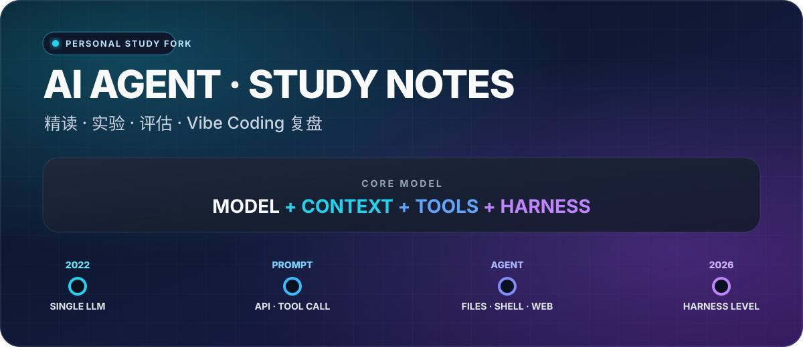
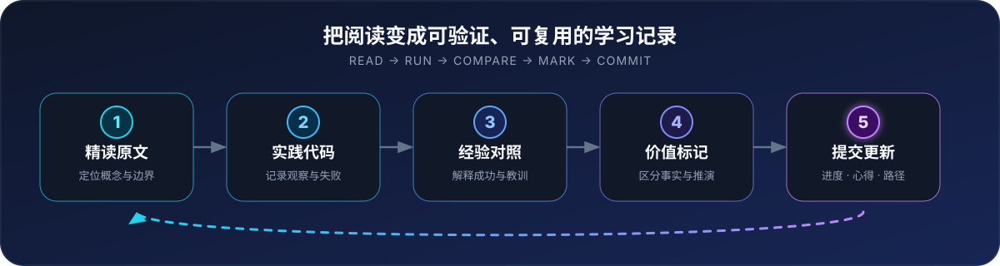

<div align="center">



# AI Agent 精读、实验与 Vibe Coding 复盘

**从读懂一个概念，到跑通一段代码，再到形成可复用的 Agent 工程判断。**

[](https://github.com/bojieli/ai-agent-book)
[](#-当前精读进度)
[](studydocs.md)
[](LICENSE)

[原作仓库](https://github.com/bojieli/ai-agent-book) ·
[在线阅读](https://bojieli.github.io/ai-agent-book/) ·
[当前学习笔记](studydocs.md) ·
[第 1 章正文](book/chapter1.md) ·
[第 1 章实验](chapter1/README.md)

</div>

> [!IMPORTANT]
> 这是一个**个人精读与实践 fork**。书籍正文、配套代码及原始工程归功于原作者 [李博杰（bojieli）](https://github.com/bojieli) 与上游贡献者；本 fork 新增的是学习进度、个人解读、实践记录和经验复盘。需要获取最新版正文、电子书或参与原项目，请优先访问[原作仓库](https://github.com/bojieli/ai-agent-book)。

## 📖 原作为什么值得系统学习

《深入理解 AI Agent：设计原理与工程实践》用一个清晰的核心公式串起全书：

> **Agent = LLM + 上下文 + 工具**

原作不是只介绍某个框架或一组零散技巧，而是沿着 **Agent 基础 → 上下文工程 → 记忆与知识库 → 工具 → Coding Agent → 评估 → 模型后训练 → 持续进化 → 多模态 → 多 Agent 协作** 的主线，组织了 10 章正文和 94 个配套实验。

| 📚 10 章系统正文 | 🧪 94 个配套实验 | 🌐 10 种语言 |
| :---: | :---: | :---: |

| 系统维度 | 原作覆盖的关键问题 | 学习价值 |
| --- | --- | --- |
| 🧠 模型 | LLM、后训练、强化学习怎样影响 Agent 行为 | 理解能力从哪里来，以及模型能力的边界 |
| 🧩 上下文 | 提示、记忆、RAG、压缩和结构化知识怎样进入推理 | 理解“模型这一次究竟看见了什么” |
| 🛠️ 工具 | 工具接口、MCP、感知、执行、异步与主动发现 | 把回答能力扩展为可操作外部世界的能力 |
| 🧪 工程 | Harness、验证、纠正、评估和持续进化 | 从“偶尔有效”走向可观察、可约束、可恢复 |
| 🤝 系统 | Coding Agent、多模态、实时交互与多 Agent 协作 | 建立面向真实复杂任务的整体视角 |

在我看来，它是当下 AI Agent 领域少见的**系统性梳理与总结级教程**：既适合准备进入 AI 领域、需要建立完整地图的学习者，也适合已经使用模型和 Agent 工具、希望回到基础原理校准工程判断的实践者。

<details>
<summary><b>查看原作 10 章学习地图</b></summary>

| 章 | 主题 | 正文 | 配套实验 | 我的精读状态 |
| :---: | --- | :---: | :---: | :---: |
| 1 | Agent 基础知识 | [阅读](book/chapter1.md) | [实践](chapter1/README.md) | 🟡 进行中 |
| 2 | 上下文工程 | [阅读](book/chapter2.md) | [实践](chapter2/README.md) | ⚪ 未开始 |
| 3 | 用户记忆和知识库 | [阅读](book/chapter3.md) | [实践](chapter3/README.md) | ⚪ 未开始 |
| 4 | 工具 | [阅读](book/chapter4.md) | [实践](chapter4/README.md) | ⚪ 未开始 |
| 5 | Coding Agent 与代码生成 | [阅读](book/chapter5.md) | [实践](chapter5/README.md) | ⚪ 未开始 |
| 6 | Agent 的评估 | [阅读](book/chapter6.md) | [实践](chapter6/README.md) | ⚪ 未开始 |
| 7 | 模型后训练 | [阅读](book/chapter7.md) | [实践](chapter7/README.md) | ⚪ 未开始 |
| 8 | Agent 的持续进化 | [阅读](book/chapter8.md) | [实践](chapter8/README.md) | ⚪ 未开始 |
| 9 | 多模态与实时交互 | [阅读](book/chapter9.md) | [实践](chapter9/README.md) | ⚪ 未开始 |
| 10 | 多 Agent 协作 | [阅读](book/chapter10.md) | [实践](chapter10/README.md) | ⚪ 未开始 |

</details>

<details>
<summary><b>上游外部实验仓库获取清单</b></summary>

第 6、7、9、10 章有 20 个因体积或版权原因未内置的外部仓库。以下命令保留自原作 README；实际复现前仍应阅读对应实验说明，并按其要求固定 commit。

```bash
# 第 6 章 · 评测基准
git clone https://github.com/google-research/android_world.git         chapter6/android_world
git clone https://huggingface.co/datasets/gaia-benchmark/GAIA          chapter6/GAIA
git clone https://github.com/xlang-ai/OSWorld.git                      chapter6/OSWorld
git clone https://github.com/SWE-bench/SWE-bench.git                   chapter6/SWE-bench
git clone https://github.com/sierra-research/tau2-bench.git            chapter6/tau2-bench
git clone https://github.com/laude-institute/terminal-bench.git        chapter6/terminal-bench

# 第 7 章 · 训练框架
git clone https://github.com/bojieli/minimind.git                      chapter7/MiniMind-pretrain/minimind
git clone https://github.com/bojieli/minimind-v.git                    chapter7/MiniMind-pretrain/minimind-v
git clone https://github.com/bojieli/AdaptThink.git                    chapter7/AdaptThink-original
git clone https://github.com/bojieli/AWorld.git                        chapter7/AWorld
git clone https://github.com/bojieli/SFTvsRL.git                       chapter7/SFTvsRL
git clone https://github.com/bojieli/verl.git                          chapter7/verl
git clone https://github.com/bojieli/SandboxFusion.git                 chapter7/SandboxFusion
git clone https://github.com/thinking-machines-lab/tinker-cookbook.git chapter7/tinker-cookbook
git clone https://github.com/19PINE-AI/rlvp.git                        chapter7/RLVP/rlvp
git clone https://github.com/PRIME-RL/SimpleVLA-RL.git                 chapter7/SimpleVLA-RL/SimpleVLA-RL

# 第 9 章 · 浏览器自动化与 Claude 示例
git clone https://github.com/browser-use/browser-use.git               chapter9/browser-use
git clone https://github.com/anthropics/claude-quickstarts.git         chapter9/claude-quickstarts

# 第 10 章 · 双 Agent 架构与生成式 Agent
git clone https://github.com/19PINE-AI/TalkAct.git                     chapter10/use-computer-while-calling
git clone https://github.com/joonspk-research/generative_agents.git    chapter10/generative_agents
```

</details>

## 🔬 这个 fork 在做什么

这个仓库不是对原作内容做简单摘抄，而是把阅读变成一条可以持续审查的个人学习链：

| 工作层 | 我会做什么 | 形成的记录 |
| --- | --- | --- |
| 🔍 精读 | 回到原文定位概念、论证和边界，不用二手摘要替代正文 | 带原文路径的引用与章节笔记 |
| 🧪 实践 | 亲手运行配套代码，记录环境、输入、观察、失败与恢复 | 可复现的实验记录与代码改动 |
| 🧭 经验对照 | 用自己的 Agent 与 Vibe Coding 经历检验书中的工程判断 | “符合经验 / 修正旧认知 / 仍待验证”的标记 |
| 📝 自评估 | 判断内容是否高价值、适用条件是什么、能否迁移到真实项目 | 个人解读、反例、行动项和复盘 |

我的经验坐标从 2022 年开始：最初主要把 AI 当作单一语言模型来问答，随后经历提示词、API 与工具调用，再进入能读写文件、执行命令、操作浏览器和协作完成任务的 Agent 工作流。现在的重点是 Harness 级 Vibe Coding：不只看模型能不能生成答案，更关注上下文是否充分、工具接口是否清楚、权限是否受控、结果是否验证、失败能否纠正。

因此，这份精读会持续追问三个问题：

1. 书中的概念解释了我过去遇到的哪些成功或失败？
2. 配套代码在真实环境里能否复现，成立条件和失败边界是什么？
3. 哪些知识值得固化为今后的提示、Skill、规则、验证器或项目流程？

## 🔁 学习与提交方法

<div align="center">
  
</div>

每次学习提交遵循同一条最小闭环：

1. **精读原文**：引用必须指向仓库内的正文或图片路径。
2. **实践代码**：能运行时记录真实环境、命令和观察；尚未运行时明确写“待实践”。
3. **经验对照**：区分原作事实、个人理解、推演和未知，不把感受写成书中结论。
4. **价值标记**：使用 `高价值`、`经验对照`、`待实践`、`待验证` 等状态说明。
5. **提交前更新**：先更新下方进度、阶段心得和笔记入口，再形成 commit。

> [!NOTE]
> README 只承担全局导航和阶段摘要；逐条原文、个人心得及补充理解保存在 [`studydocs.md`](studydocs.md)。实验开始后，README 会继续链接到相应的实践记录，而不会用“测试通过”替代真实学习验收。

## 📍 当前精读进度

**最后更新：2026-07-30 · 当前阶段：第 1 章《Agent 基础知识》进行中**

| 进度项 | 当前状态 | 直达入口 |
| --- | --- | --- |
| 章节 | 第 1 / 10 章，进行中；尚不代表第 1 章已完成 | [第 1 章正文](book/chapter1.md) |
| 已记录主题 | 7 组：工具设计、Harness、学习机制、上下文组成、ReAct、Harness 方法论、ACI | [打开学习笔记](studydocs.md) |
| 代码实践 | 尚未在本次提交中形成新的实验验收记录 | [第 1 章实验目录](chapter1/README.md) |
| 本轮记录 | 学习进度未前移；完成 GitHub 原生笔记结构、个人实践时间线和五角学习闭环重构 | [查看 `studydocs.md`](studydocs.md) |

### 本阶段心得

- **强模型不会让 Harness 消失。** 模型越能自主决定工具调用，工程层越要提供充分上下文、清晰接口、权限约束、结果验证和失败纠正。
- **强化学习内化的是决策策略，不是外部工具本身。** 搜索、代码沙盒和文件系统仍由外部环境提供；模型学习的是何时调用、怎样调用以及何时停止。
- **可靠性来自完整链条。** ReAct 轨迹让过程可观察，ACI 让工具更难被误用，验证与纠正则把一次生成变成可恢复的任务执行。
- **推演必须与事实分开。** 关于“模型最终能否生成一切工具”等远期判断，目前只作为个人假设保留，后续需要用章节内容和实践继续检验。

### 学习更新记录

| 日期 | 阶段 | 本次变化 | 心得文件 |
| --- | --- | --- | --- |
| 2026-07-30 | 第 1 章进行中 | 学习内容未前移；将笔记改为 GitHub 原生的“原文—来源—心得”结构；把 2022—2026 个人实践改为连续时间线，并将当前 Agent 架构独立展示；把学习流程改为顺时针五角闭环 | [`studydocs.md`](studydocs.md) |
| 2026-07-30 | 第 1 章进行中 | 建立精读 fork 首页；整理 7 组主题；补充 RL、神经网络与工具调用的边界说明；同步上游最新的 94 个实验、10 种语言和 20 个外部仓库信息 | [`studydocs.md`](studydocs.md) |

## 🏷️ 笔记标记

| 标记 | 含义 | 何时使用 |
| --- | --- | --- |
| `高价值` | 值得长期保留并迁移到其他项目 | 已理解其机制和适用条件 |
| `经验对照` | 与 2022—至今的模型 / Agent / Vibe Coding 经历相互印证 | 有具体经验可对照，但不等于普遍规律 |
| `待实践` | 已读到，尚未通过配套代码或真实项目观察 | 不写成“已掌握”或“已验证” |
| `待验证` | 推演、疑问或暂时无法从来源确认的判断 | 后续寻找反例、实验或权威资料 |

## 🧭 如何使用这个仓库

如果你想系统学习原作，建议从[官方在线版](https://bojieli.github.io/ai-agent-book/)或[原作 README](https://github.com/bojieli/ai-agent-book#readme)开始；这个 fork 更适合作为一份“别人怎样把教程读进工程实践”的旁注。

```bash
command git clone https://github.com/wiFy909/ai-agent-book_studynotes.git
cd ai-agent-book_studynotes
```

克隆后可以直接阅读 [`studydocs.md`](studydocs.md)，再沿每条“来源”链接回到正文。要运行实验，请进入对应的 `chapterN/<experiment>/` 目录，先阅读该实验自己的 README；各实验依赖不同，不应从仓库根目录一次性安装全部依赖。

查询或阅读本仓库不会改变系统状态，无需回滚；结束时关闭页面或终端即可。运行具体实验可能创建虚拟环境、缓存、日志或输出文件，应以实验 README 的退出和清理说明为准。

## 🔄 与上游的关系

```text
bojieli/ai-agent-book                 原作与内容主线
        │
        └── wiFy909/ai-agent-book_studynotes
              ├── 同步上游正文与配套代码
              └── 维护个人精读、实践与复盘记录
```

- 原作内容与勘误：回到 [`bojieli/ai-agent-book`](https://github.com/bojieli/ai-agent-book)。
- 本 fork 的学习记录：在本仓库持续更新。
- 同步上游时保留个人学习提交，不向原作者仓库直接推送。
- 许可证继续遵循仓库内的 [Apache License 2.0](LICENSE)；子项目如有独立许可证，以子项目说明为准。

---

<div align="center">

**读懂概念只是起点。真正的进度，是能解释、能运行、能判断边界，也能在下一次项目里复用。**

[开始读原作](https://bojieli.github.io/ai-agent-book/) · [查看当前笔记](studydocs.md) · [进入第 1 章实验](chapter1/README.md)

</div>
