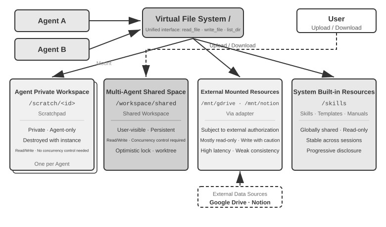
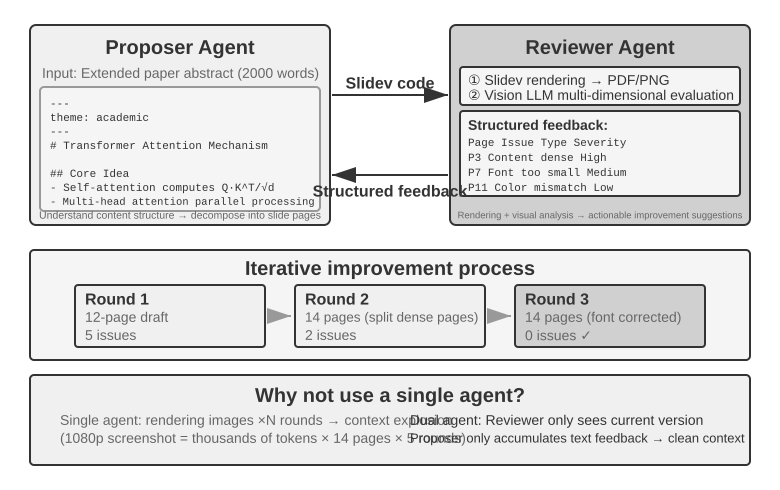
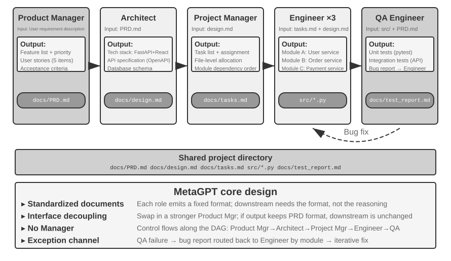

# Multi-Agent Collaboration

OpenAI once proposed a five-level scale of AI capabilities: Level 1, Conversationalists; Level 2, Reasoners; Level 3, Agents; Level 4, Innovators; and Level 5, Organizations. Multi-agent collaboration is often presented as one path to Level 5. Here, however, "Organizations" denotes a capability level—AI that can do the work of an entire organization—rather than an architectural requirement. A sufficiently powerful single Agent could, in principle, reach it as well. In today's engineering reality, however, a single Agent remains constrained by its model's capabilities and context window.

Getting multiple Agents to work together is about far more than letting specialists with different expertise "cover each other's gaps." The more fundamental point is this: **the intelligence of a group can exceed that of any individual.** Human civilization is the proof—one person's intellect is limited, yet through division of labor, collaboration, debate, and the accumulation of knowledge across generations, human society as a whole exhibits intelligence far beyond any single genius. Agent groups may give rise to the same kind of collective intelligence: even if each Agent is only as capable as a human expert, a well-organized group could surpass the combined capabilities of all human experts. In *From AGI to ASI*, Google DeepMind lists "large-scale multi-agent collectives" as a key pathway toward superintelligence (ASI)—just as human general intelligence aggregates into societies and organizations that transcend individuals, the collective intelligence of many AGI-level Agents working together may exhibit cognitive capabilities far beyond the simple sum of its members[^agi-asi]. Multi-agent collaboration, then, is not merely an engineering workaround for a single model's context window and capability limits—it may be a fundamental path from "expert-level AI" toward "surpassing humanity as a whole."

[^agi-asi]: On "large-scale multi-agent collectives" as a key pathway from AGI to ASI, see Google DeepMind, *From AGI to ASI.* arXiv:2606.12683, 2026.

## A Classification Framework for Multi-Agent Collaboration

Building a multi-agent system starts with two core design dimensions, which together determine its basic architecture and implementation.

### Dimension 1: Shared vs. Non-Shared Context

This is the most fundamental architectural decision, determining how information is passed between multiple Agents.

**Shared context** means that a subsequent Agent receives the complete conversation history and trajectory (as defined in Chapter 1) of the preceding Agent. When the system prompt and tool set change at each stage, the system treats the new stage as a different Agent because its identity, responsibilities, and capabilities have changed, even though it retains all the memory of its predecessor. For example, after a requirements analyst writes a requirements document, the developer receives not only the document but also the full record of communication between the analyst and the user. The developer assumes a new role while retaining all prior context. The advantage is that no information is lost; each Agent can review details from any previous stage. The challenge is that the context can expand rapidly.

**Non-shared context** means that each Agent maintains an independent context and conversation history and cannot directly access the other Agents' work traces. This is like collaboration between different departments: everyone works independently at their own desk, exchanging information through shared documents and meeting minutes rather than constantly watching each other's screens. This model offers better modularity and isolation; each Agent only needs to focus on information relevant to its own responsibilities. The system is also easier to extend and maintain—adding a new Agent does not require modifying the internal logic of existing Agents, only defining interfaces and data formats.

Since Agents do not share context, information must be passed through explicit communication mechanisms. Classic distributed systems settled this question long ago: operating-systems textbooks tell us that inter-process communication (IPC) ultimately comes in just two paradigms—**shared memory** (one side writes and the other reads the same block of storage) and **message passing** (data is explicitly sent to the other side). Communication mechanisms between Agents fall within these same two paradigms. There are three common methods:

- **Tool call parameters**: The upstream Agent passes structured data as parameters to the downstream Agent's tool, suitable for scenarios requiring well-typed, clearly structured data.
- **Shared file system**: Agents exchange information by reading and writing intermediate artifacts (documents, code, etc.) in a shared directory, suitable for scenarios with large artifacts or where persistence is needed.
- **Message bus**: A dedicated intermediary that passes messages between Agents. Agents do not call each other directly but send messages to the bus, which forwards them to the target Agent.

Mapped onto the two IPC paradigms, the shared file system corresponds to "shared memory," while tool call parameters and the message bus are forms of "message passing." Tool parameters are delivered synchronously with a call; messages on a bus are delivered asynchronously through an intermediary. Each paradigm has its trade-offs. Go has a widely quoted maxim: "Do not communicate by sharing memory; instead, share memory by communicating." Shared memory is fast, but developers must manage concurrency hazards; message passing requires more orchestration code but keeps data ownership clear and traceable. This trade-off recurs throughout the later discussions of status queries and concurrency conflicts.

The message bus naturally supports **asynchronous communication**—the sender and receiver do not need to be online simultaneously. This is like an internal company email system: when you email a colleague, you don't need them to be at their computer at that moment; the email is stored on the server and processed when the colleague comes online. This approach is particularly suitable for scenarios where multiple Agents work in parallel and need to coordinate with each other (see the "Parallel Coordination" section later in this chapter).


To be clear, both architectures are genuine multi-agent systems because the system prompt and tool set differ at each stage, making them different Agents. The difference lies in the coordination method. **Shared context** relies on implicit coordination: subsequent Agents inherit the complete context history of preceding Agents, can review their visible interaction histories and work traces, and receive information through the context itself. **Non-shared context** relies on explicit coordination: Agents exchange information through files, messages, or structured data interfaces, and each Agent sees only the content relevant to its own work.

By analogy: the former is a team around one table, where everyone hears everything; the latter is departments collaborating by email and documents, each with its own workspace.

Readers familiar with operating systems may find a useful analogy: shared-context Agents resemble threads, while non-shared-context Agents resemble processes. Threads share an address space, which makes switching and communication inexpensive but provides little isolation; memory corruption in one thread can crash the entire process. Each process has its own address space, providing stronger isolation and safer parallelism, but communication must use explicit IPC. The criteria in Table 10-1 follow from these trade-offs.

Table 10-1 summarizes the selection criteria for the two architectures from five perspectives: number of subtasks, context window, parallelism, information isolation, and cost budget. It can serve as a checklist for early architectural selection.

Table 10-1 Selection Criteria for Shared vs. Non-Shared Context

| Selection Criterion | Shared Context | Non-Shared Context |
|---------------|-----------------------------------|--------------------------------------------|
| Number of subtasks | Few (2-3 roles) | Many (parallel processing needed) |
| Context window | Can accommodate information for all roles | Single window is insufficient |
| Parallelism | Primarily serial (roles take turns along the same trajectory) | Can scale massively in parallel (contexts are independent, non-blocking) |
| Information isolation | Not needed (all roles share information) | Needed (e.g., security review should not receive other Agents' internal context) |
| Cost budget | A single trajectory relayed across stages; tokens accumulate stage by stage | Multiple Agents work independently; total tokens are typically several times to an order of magnitude higher |

**Simple rule of thumb**: If the expected cumulative context exceeds 50% of the window (a heuristic, not an exact threshold), don't share. If zero information loss is a hard requirement for task correctness, share. Most real-world systems use different approaches at different stages: the first few Agents share context, but once the shared history becomes too large, the system switches to non-shared contexts and uses an explicit handoff in which the upstream Agent selects what to pass downstream.

### Dimension 2: Collaboration Topology

The second dimension is collaboration topology: the structure through which control and information flow among Agents. Topology and context sharing are conceptually distinct but related in practice. Shared-context systems still have a topology; for example, the `transfer_to_agent` pattern in Experiment 10-2 forms a handoff chain. However, because every handoff carries the complete history, there is usually no need to decide what information to pass, so the topology often becomes a simple sequence of role switches. Group-chat-style collaboration is an exception discussed later in the decentralization section. With non-shared context, by contrast, designers must explicitly decide how information flows and who coordinates it.

> **Terminology: Graph Engineering.** The term "Graph Engineering," which became popular in July 2026, generally refers in today's Agent context to explicitly designing an execution graph: nodes are Agents, ordinary programs, or human decisions; edges define task dependencies, conditional routing, and failure paths; and structured state flows between nodes.[^ch10-graph-engineering] The "collaboration topology" discussed in this chapter is the multi-agent subset of that idea—peer collaboration, manager orchestration, and decentralized handoffs are different graph topologies. Because the name is still new and is easily confused with knowledge graphs, GraphRAG, and execution traces, this book continues to use the more stable terms "collaboration topology" and "orchestration" as its primary vocabulary.

[^ch10-graph-engineering]: For an early discussion of the name, see Josh C. Simmons, *We Are Entering the Graph Engineering Phase*, 2026. Mainstream frameworks generally call the same engineering structure a graph-based workflow or orchestration rather than a wholly new technology. See https://www.drjoshcsimmons.com/writing/we-are-entering-the-graph-engineering-phase, https://docs.langchain.com/oss/python/langgraph/overview, https://learn.microsoft.com/en-us/agent-framework/workflows/, and https://adk.dev/workflows/.

In other words, the two dimensions form, in principle, a 2×3 matrix (shared/non-shared × three topologies)—but in the shared-context row, the topology mostly degenerates into a sequence of role switches with little left to decide (the form discussed later in "Multi-Stage Role Switching"). This chapter therefore elaborates only on the three non-shared cells. Here are the three typical topologies under non-shared context, in order of increasing complexity:

- **Peer Collaboration Pattern**: A small number of Agents (typically 2-3) interact as equals, forming an iterative improvement loop—like writing a paper where one person drafts it and another annotates and revises it, with the quality after several rounds far exceeding what one person could achieve alone.
- **Manager Pattern** (Orchestration Pattern): A centralized Manager Agent is responsible for task planning and scheduling, while multiple sub-agents each handle specific subtasks—like a project manager leading several specialized engineers on a project.
- **Decentralized Pattern**: There is no runtime central controller; Agents communicate with each other like humans to collaborate on tasks.

The detailed design and applicable scenarios for each pattern will be discussed in dedicated subsections later.

## When Is Multi-Agent Truly Better Than a Single Agent?

Before diving into specific collaboration architectures, let's answer a more fundamental question: **When are multiple Agents truly needed, and when is one enough?** The answer will serve as a reference point for every engineering approach that follows. A series of recent studies converges on a clear framework—and the core criterion is a single question: **Does the collaboration provide information that a single Agent could not obtain while producing its answer?**

Table 10-2 shows which collaboration modes introduce new information and helps assess whether multi-agent collaboration offers substantive value over a single Agent.

Table 10-2 Information Gain Comparison of Multi-Agent Collaboration Modes

| Collaboration Mode | Introduces New Information? | Effect |
|---------------------------------------|---------------------|-----------------------------------|
| Self-review by the same model (re-reading its own output) | No | Usually ineffective or even harmful |
| Different Agents debating the same text | No | Comparable to a single Agent with equal compute |
| Reviewer uses test execution results to review code | Yes (execution feedback) | Significant improvement |
| Reviewer uses rendered screenshots to review frontend/PPT code | Yes (visual feedback) | Significant improvement |
| Reviewer uses external tools to verify facts | Yes (tool feedback) | Significant improvement |

The 2025 RLEF paper (Reinforcement Learning from Execution Feedback)[^rlef-2025] found that training a model via reinforcement learning to use code-execution feedback for iterative improvement significantly outperformed independently sampling the model multiple times. The key is that each iteration introduces **real execution results** (compilation errors, test failures, runtime exceptions)—information that did not exist when the model wrote the code. For webpage-generation tasks, the 2025 WebGen-Agent study[^webgen-agent-2025] reported that multi-level visual feedback, combining screenshots with vision-language-model descriptions, improved Claude 3.5 Sonnet's benchmark performance from 26.4% to 51.9%, nearly doubling it.

[^rlef-2025]: Gehring, J., et al. *RLEF: Grounding Code LLMs in Execution Feedback with Reinforcement Learning.* arXiv:2410.02089, 2025.
[^webgen-agent-2025]: Lu, Z., et al. *WebGen-Agent: Enhancing Interactive Website Generation with Multi-Level Feedback and Step-Level Reinforcement Learning.* arXiv:2509.22644, 2025.

This framework helps resolve an apparent contradiction: some academic studies find that a single Agent is sufficient, while multi-agent systems often perform better in engineering practice. The studies often test multiple Agents that inspect and discuss the same text, as in debate, whereas effective engineering systems commonly add external feedback from code execution, visual rendering, or tools. Only the latter introduces new information. Nearly all effective uses of the three architectures discussed later—peer collaboration, orchestration, and decentralization—can be understood through this criterion.

**Step Budget and Agent Performance.** A related question is how an Agent's step budget—the number of tool calls or iteration rounds it may use—affects performance. More steps might seem certain to help: with 30 steps, an Agent may have time only to implement core functionality, whereas 300 steps allow it to plan, implement, test, and refine. However, the 2025 Google paper *Budget-Aware Tool-Use Enables Effective Agent Scaling* reached a counterintuitive conclusion: **simply giving an Agent more steps does not guarantee better performance.** Standard Agents lack "budget awareness"; even with 300 steps, they tend to conduct shallow searches and quickly reach a plateau. To use additional steps effectively, Agents need a mechanism that adapts their strategy to the remaining resources, exploring broadly at first and narrowing their focus later. The 2026 BAVT (Budget-Aware Value Tree Search) approach further introduced step-level value evaluation, adjusting the balance between exploration and exploitation according to the proportion of the budget remaining. As the budget decreases, the Agent shifts from broad exploration to deeper investigation.

These findings have direct implications for multi-agent system design. For example, in the orchestration pattern, the Manager Agent should not simply distribute tasks to sub-agents and wait for results. Instead, it should **dynamically allocate step budgets** based on task complexity—simple subtasks get fewer steps; complex subtasks get ample steps. It should also guide sub-agents to use these budgets wisely (plan first, then implement, then test, then improve), rather than diving straight in.

One more consideration must come before any design decision: **cost.** Parallel exploration and iterative refinement cost money—Anthropic has disclosed that its multi-agent research system consumes about 15 times the tokens of a normal conversation, and that token usage alone explains about 80% of the performance difference. The gains from a multi-agent system must therefore be large enough to justify costs that may be several times, or even an order of magnitude, higher; otherwise, a well-tuned single Agent is usually the better bargain.

## Multi-Agent Collaboration with Shared Context

In multi-agent collaboration with shared context, each stage is an independent Agent (with its own system prompt and tool set), but it inherits the complete trajectory of the preceding Agent—much like a colleague taking over a shift who can leaf through every work log the predecessor left behind. The core advantage of this inheritance-based collaboration is zero information loss: every Agent can review details from any previous stage. The challenge is keeping the current Agent focused on its own responsibilities rather than distracted by the mass of inherited history.

### Multi-Stage Role Switching

Let's put a definitional dispute on the table first: in the language of Chapter 1, multi-stage role switching is a **workflow-style orchestration**—the execution path (e.g., requirements clarification → implementation → review) is predefined. From a process perspective, a single process executes the different stages in sequence while retaining the same memory throughout. The claim that this is "not really multi-agent" therefore has merit. This chapter nevertheless treats it as a multi-agent pattern because that framing has practical benefits: each stage can have its own system prompt, tools, and focus, while stage boundaries can serve as quality gates.

In complex tasks, an Agent's role and responsibilities may change significantly across stages. If a single static system prompt is used throughout, it will either be too general to provide stage-specific guidance or too long because it includes instructions for every stage. Multi-stage role switching instead changes the system prompt and tool set according to the current stage, allowing the Agent to work in the most appropriate role. This switching does not require creating new instances or starting new processes; it merely changes the system prompt and tool set within the same execution session. Although the role changes, the conversation history and task state remain shared, so the Agent in its new role can still access all information accumulated in previous stages.



> **Experiment 10-1 ★★: Determining System Prompts Based on Execution Stage**
>
> This experiment demonstrates how stage-specific system prompts can improve performance across a complete Coding Agent workflow.
>
> **Task Scenario**: A user submits a software development request, and the Agent proceeds through three stages: requirements clarification, code implementation, and quality review.
>
> **Stage 1: Requirements Clarification** (Role: Requirements Analyst)
>
> The system prompt emphasizes:
> - "Your responsibility is to fully understand the user's needs. Ask questions to clarify ambiguities, ensuring you fully comprehend the expected functionality, usage scenarios, and performance requirements."
> - "Do not rush into implementation. At this stage, your task is to ask questions and confirm, not to write code."
> - "Once you confirm that all key requirements are clear, call the `complete_requirements_analysis()` tool to end this stage."
>
> The tool set is limited: `ask_clarifying_question(question)` to ask the user clarifying questions, `save_requirement(key, value)` to record confirmed requirements, and `complete_requirements_analysis()` to mark the stage as complete.
>
> The Agent asks the user what types of files the script needs to process, whether it should process subfolders recursively, and whether it should preserve the original filenames after moving the files. These exchanges help it build and record a structured set of requirements. Once the requirements are sufficiently clear, it calls `complete_requirements_analysis()`. This completion signal tells the system to load the next stage's configuration.
>
> **Stage 2: Code Implementation** (Role: Software Engineer)
>
> The new system prompt emphasizes:
> - "Your responsibility is to write high-quality Python code based on the confirmed requirements."
> - "Follow best practices: make the code modular, handle errors appropriately, and include comments where they are useful."
> - "After completing the code and passing basic tests, call `submit_for_review()` to enter the review stage."
>
> The tools also change: the requirements-clarification tools are replaced with development tools such as `write_file(path, content)`, `read_file(path)`, and `execute_code(code)`. Using the requirements recorded in the first stage, the Agent writes the core logic, adds error handling, and creates tests. It can still consult the earlier conversation for requirement details, but it now focuses solely on implementation rather than asking further questions. When finished, it calls `submit_for_review()`.
>
> **Stage 3: Code Review** (Role: Code Reviewer)
>
> The new system prompt emphasizes:
> - "Review the code for functional correctness, adherence to coding standards, error handling, performance, and security."
> - "Take a critical approach and identify potential problems and opportunities to improve the code."
> - "If serious issues are found, call `request_revision(issues)` to return to the implementation stage for modification; if the quality is acceptable, call `approve_code()` to complete the task."
>
> The tool set changes again: it is replaced by code quality analysis tools such as `run_linter(file)`, `run_tests(file)`, and `analyze_complexity(file)`. The Agent re-examines the code from a reviewer's perspective, runs static analysis, and checks for potential bugs, performance issues, or security risks.
>
> This three-stage design allows the Agent to focus on the core task at each stage. More importantly, clear stage transitions ensure that every stage is completed: the Agent cannot skip requirements analysis and begin coding immediately, or deliver the result without review.
>
> **Experiment Requirements**:
> 1. Implement three-stage system prompts, each with a clear role definition and behavioral guidance
> 2. Configure matching tool sets for each stage
> 3. Implement a stage transition trigger mechanism (via specific tool calls)
> 4. Ensure context continuity between stages
> 5. Handle rollback scenarios—when code review finds issues, return to the implementation stage
> 6. Record activity from each stage to demonstrate how different prompts produce different behavior
>

### Cross-Domain Role Switching

Multi-stage role switching demonstrated staged execution within a single task type (software development). Cross-domain role switching goes further: the Agent dynamically changes roles as a task moves across domains. Instead of following a predefined linear process, it chooses which professional role to adopt in response to the user's changing needs.

> **Experiment 10-2 ★★: Multi-Role Switching**
>
> **Prerequisites**: It is recommended that readers first review the Agent Skills mechanism in Chapter 2.
>
> **System Architecture**: Five roles are defined:
>
> - **triage (front desk; default entry point)**: Identifies the user's overall needs, breaks the work into sequential subtasks, routes each subtask to the appropriate specialist, and performs a final check when all subtasks are complete. Its only tool is `transfer_to_agent`.
> - **research (information retrieval expert)**: Uses `web_search` to find data, facts, and materials.
> - **coding (programming expert)**: Uses `execute_python` to write and run code for programming and scripting tasks.
> - **data_analysis (data analysis expert)**: Uses `calculate` / `descriptive_stats` for quantitative calculations and statistics (e.g., year-over-year growth rate, compound annual growth rate (CAGR), mean).
> - **writing (writing expert)**: Turns retrieved data and analytical results into a clear draft tailored to the audience (and can use `count_characters` for a rough length check).
>
> **Core Mechanism: transfer_to_agent Tool**
>
> All roles have the `transfer_to_agent(target_role, reason)` tool. When a role calls it, the system saves the current conversation history, loads the target role's prompt and tool set, passes the history to that role, and resumes execution.
>
> **Experiment Scenario**: The system starts in the `triage` role by default. The user submits a task spanning several domains: "I'm preparing materials for investors. Help me look up China's new energy vehicle sales for 2021, 2022, and 2023, calculate the compound annual growth rate for these three years, and then write a summary in Chinese for investors, no more than 120 characters." `triage` breaks it down into "look up data → calculate metrics → write draft" and first hands it to `research`:
>
> ```python
> transfer_to_agent(target_role="research", reason="Find annual new-energy vehicle sales figures for 2021-2023")
> ```
>
> `research` uses `web_search` to find the sales figures, adds the key data to the conversation, and hands the task to `data_analysis`:
>
> ```python
> transfer_to_agent(target_role="data_analysis", reason="The data is ready; calculate CAGR from 2021 to 2023")
> ```
>
> `data_analysis` uses `calculate` to compute the growth rate. It then hands the task to `writing`, which drafts the summary and returns it to `triage` for final confirmation. The complete chain is `triage` → `research` → `data_analysis` → `writing` → `triage`. Each role can see the complete conversation history, so the next role naturally knows what has already been done.
>
> The decision to switch roles depends on guidance in the system prompts. The `triage` prompt explicitly lists routing rules: look up data or source material → `research`; write and run code → `coding`; perform quantitative calculations and statistics → `data_analysis`; polish material into a draft → `writing`. A task should be handed off when it requires deep domain expertise or specialized tools. Each specialist's prompt also identifies the next appropriate role or instructs the specialist to return the task to `triage`.
>
> **Experiment Requirements**:
> 1. Implement system prompts and specialized tool sets for at least three professional roles
> 2. Implement the `transfer_to_agent` tool, supporting dynamic switching
> 3. Ensure context continuity after role switching
> 4. Prevent circular handoffs that cause the Agent to switch repeatedly between roles
> 5. Design complex task flows spanning multiple domains to demonstrate the value of role switching
>

## Multi-Agent Collaboration Without Shared Context

In an architecture without shared context, each Agent operates as an independent entity with its own context, trajectory, and state. Agents cannot directly access one another's internal context; collaboration relies entirely on explicit, structured data transfers through the three communication mechanisms introduced at the beginning of this chapter: tool call parameters, a shared file system, and a message bus.

Earlier in this chapter, we compared the communication mechanisms to forms of inter-process communication and shared versus isolated context to threads versus processes. This analogy can be extended further (Table 10-3):

Table 10-3 Correspondence Between Multi-Agent Systems and Operating Systems

| Operating System | Multi-Agent System |
|----------|----------------|
| Program (executable file) | Static prefix (system prompt + tool definitions) |
| Process memory | Trajectory |
| CPU | LLM |
| Kernel | Agent runtime |
| System call | Tool call |
| fork (create child process) | spawn_subagent |
| kill (send signal) | cancel_subagent |
| ps (list processes) | list_agents |
| Exit code and wait() | Structured summary returned by the sub-agent |
| Shared memory / message passing | Shared file system / message passing |

A program is static code; a process is one running instance of a program. Likewise, the static prefix determines who the Agent is, while the trajectory records how far it has progressed. The LLM plays the role of the CPU: it holds no state of its own and is time-shared across many Agents by loading different contexts—the very term "context switch" was borrowed from operating systems. And for the same reason, swapping in a faster CPU keeps the program running as before; swapping in a stronger model keeps the Agent the same Agent—its identity and memory live in the prefix and the trajectory, not in the model weights.

This abstraction is nothing new: private state, asynchronous messages, and the ability to create new members are precisely the basic setup of the 1970s Actor model[^actor-model]. A multi-agent system can therefore be viewed as an LLM-based version of the Actor model, and much of the accumulated knowledge from operating systems and distributed systems applies directly. The analogy breaks down in one important place: processes pass bytes faithfully, bit for bit, whereas Agents pass meaning, and every retelling can distort it. This is the new problem addressed in this chapter's "Failure Modes" section.

[^actor-model]: Hewitt, C., Bishop, P., Steiger, R. *A Universal Modular ACTOR Formalism for Artificial Intelligence.* IJCAI 1973.

This process-style isolation brings several practical engineering benefits: each Agent can be developed and tested independently, new capabilities can be added without touching existing code, a failing Agent does not automatically propagate its errors to the others, and multiple Agents can execute concurrently without contention over shared context.

However, not sharing context also has costs. The most obvious is the information synchronization problem: how do Agents maintain a consistent understanding of the task state? Will information be lost or duplicated during transfer? Debugging also becomes more difficult—when problems arise, logs from multiple Agents must be reviewed to piece together the complete execution process. These issues make the design of interface specifications, data formats, and communication protocols critically important.

Explicit collaboration without shared context relies on two topology-independent infrastructures. The first is the **shared file system**, the persistent medium through which Agents exchange artifacts with one another and with the user, forming the data plane of collaboration. The second is the **communication and control mechanism**, which supports message passing, status queries, execution termination, and resource scheduling between Agents, forming the control plane of collaboration. The three topologies below are all built on these two foundations.

### The File System from an Agent's Perspective

At the beginning of this chapter, the "shared file system" was listed as one of the three communication mechanisms for architectures without shared context. In a real system, the file system an Agent accesses is not a single storage system but a **virtual file system** in which storage systems with different sources, lifecycles, and permissions are mounted under one directory tree. The Agent accesses them through unified `read_file`/`write_file`/`list_dir` interfaces, while the underlying layers may be local temporary disks, persistent object storage, third-party cloud drive APIs, or read-only system resource packages. Clearly defining the composition of this directory tree—the visibility and lifecycle of each area—is a prerequisite for designing multi-agent collaboration: a significant portion of concurrency conflicts and information leaks stem from mixing areas that should be isolated. This directory tree amounts to the Agent's address space, and the four types of areas are memory segments with different permissions: some private and writable, some shared among multiple parties, and some read-only. The operating system's protection philosophy applies here as well: isolate by default and declare sharing explicitly. In a mature multi-agent system, the file system typically consists of the following four types of areas:

**I. Agent-Specific Workspace (Scratchpad)**. A private directory exclusive to each Agent instance, storing intermediate artifacts, temporary files, drafts, and debug logs. Its lifecycle is tied to the instance and is invisible to other Agents and users. Isolating the scratchpad serves two purposes: preventing temporary files from multiple Agents from overwriting each other, and keeping the main Agent's context lean—the trial-and-error process of sub-agents remains in their own workspace, with only the final artifact submitted to the shared space. This is the storage-level counterpart of Chapter 4's principle that sub-agents return structured summaries rather than full trajectories.

**II. Multi-Agent Shared Workspace**. A collaboration area that multiple Agents can read and write, and that is **visible to the user**. It is the primary medium for exchanging artifacts between Agents in architectures without shared context: the Glossary Agent writes the term list, and the Translation Agent reads from it; users can also upload source files and download final deliverables here. Its lifecycle is tied to the entire task and requires persistence. As an area for concurrent reads and writes by multiple parties, it is a hotspot for concurrency conflicts—mechanisms such as optimistic locking and worktree isolation operate here, as detailed under "Failure Mode One" later in this chapter. Chapter 4's use of a volume mount at `/workspace/shared` to connect the main Agent, virtual computer, and virtual phone is a typical implementation of this layer.

**III. Mounted External Resources.** Third-party information sources authorized by the user—Google Drive, Notion, Dropbox, enterprise wikis, etc.—are mapped to mount points in the file system (e.g., `/mnt/gdrive`) via adapters. An Agent accesses a Notion document by reading a file; the underlying adapter calls the corresponding API. Three characteristics distinguish this layer from local storage and must be explicitly handled during design: **access is constrained by external permissions** (the user's permissions in the source system determine the Agent's visibility), **latency is higher and consistency is weaker** (each read involves a network round trip, and external changes may not be immediately visible, so the data should be treated as eventually consistent), and **access is primarily on-demand and read-only** (writing back to external sources must be done cautiously, as erroneous writes could contaminate the user's real data). The unified file interface means the Agent does not need a custom tool for each data source, but it also masks these performance and security differences. Therefore, read-only/writable status, timeouts, and credential boundaries must be explicitly managed at the mount level.

**IV. Built-in System Resources.** A resource package pre-installed by the system and shared read-only with all Agents. Typical examples are the **Skills** introduced in Chapters 2 and 4—knowledge documents and scripts organized as files, mounted at paths like `/skills`, accessed via progressive disclosure (index first, then expand on demand). Other examples include reference manuals, template libraries, and shared tool definitions. This layer is globally shared, read-only, stable across sessions, and can be read concurrently by all Agents without concurrency control.

Figure 10-3 illustrates how these four area types are uniformly mounted under a single directory tree: the Agent accesses the entire tree through a unified interface, users upload and download files from the shared space, external data sources are mounted via adapters, and built-in system resources are provided read-only.



Table 10-4 compares these four area types across four dimensions—visibility, lifecycle, read/write permissions, and concurrency control—serving as a checklist for file system layout design.

Table 10-4 Four area types of the Agent Virtual File System

| Area | Visibility | Lifecycle | Read/Write | Concurrency Control |
|--------------|-----------------|------------------------|---------------------|-------------------|
| Agent-Specific Workspace | The owning Agent only | Destroyed with the Agent instance | Read/Write | Not needed (private) |
| Multi-Agent Shared Workspace | All collaborating Agents and the user | Persists for the task duration | Read/Write | Required (optimistic lock / worktree) |
| Mounted External Resources | Depends on external authorization | Determined by the external source | Mostly read-only, writes require caution | Managed by the external source |
| Built-in System Resources | All Agents | Stable across sessions | Read-only | Not needed (read-only) |

The value of the **"file path as a universal interface"** lies in treating a path as the unit of exchange. Whether Agents exchange artifacts, a main Agent hands input to a sub-agent, or organizations collaborate through A2A, they pass a lightweight path string rather than loading the file's contents into the context window (Chapter 4). This aligns with Chapter 5's concept of "the file system as the Agent's hub," which describes how a single Agent uses the file system to host memory and capabilities. Here, the same abstraction extends to multiple Agents: a virtual directory tree mounting private, shared, external, and built-in storage provides the storage foundation for multi-agent collaboration.

### Communication and Control Between Agents

While the file system solves the problem of **artifact exchange** between Agents, collaboration also requires a **control plane**. This is exactly where the lifecycle rows of Table 10-3 come into play: the tool primitives given in Chapter 4—creating (`spawn_subagent`), sending messages (`send_message_to_subagent`), canceling (`cancel_subagent`), and discovering (`list_agents`)—correspond to fork, message, kill, and ps in the process world. This section does not repeat the interface definitions but focuses on four often-overlooked capabilities essential for multi-agent collaboration.

**I. Message Passing.** The simplest form is point-to-point: Agent A directly calls `send_message_to_agent_b(content)`. This is suitable for scenarios with a fixed topology and a small number of Agents (e.g., the phone + computer dual-agent setup of Experiment 10-4 in this chapter). When the number of Agents increases and asynchronous parallelism is required, the number of point-to-point connections grows quadratically with the number of Agents, and both sender and receiver must be online simultaneously. In such cases, a **message bus** should be used (detailed later in this chapter under "Parallel Coordination Pattern"): Agents publish messages to the bus, which forwards them based on subscriptions, so the sender does not need to know the subscribers. Whether point-to-point or via a bus, messages should typically carry a structured **envelope**: sender ID, target (specific Agent or broadcast), message type (e.g., `task_assigned`/`status_update`/`result`/`terminate`), and a JSON payload. A unified envelope format ensures reliable routing and parsing by the receiver and makes the collaboration chain traceable—a key aspect of debugging multi-agent systems.

**II. Status Query.** This is the most underestimated part of the control plane. Once a main Agent has dispatched a sub-agent, it needs visibility into the sub-agent's progress; otherwise, it can neither decide whether to keep waiting nor intervene when the sub-agent gets stuck. An intuitive approach is to borrow from RPC and define a `get_subagent_status(agent_id)` query interface that returns "running/completed/failed" plus a progress percentage. But such a pull interface turns out to be far less useful than expected: a sub-agent starts executing the moment it is created and runs until it completes or fails. It does not cycle through a series of queued states the way jobs in a traditional batch system do, just as Unix programming rarely needs to poll another process by its PID for running status. Polling also carries an inherent dilemma: poll too often and you waste tokens; poll too rarely and you react late. A more natural way to obtain status is to return to the two communication paradigms introduced at the beginning of this chapter.

**Getting status via message passing.** The main Agent simply sends the sub-agent a message: "How's it going?" The sub-agent replies at an opportune moment. Everything is asynchronous: sending the message does not block the main Agent's own execution, and when—or whether—the other side replies is a separate matter, just as a manager asks a subordinate for progress via instant messaging without requiring them to drop everything on the spot. Conversely, the sub-agent can also proactively send a message to report when it reaches a milestone; if the system already has a message bus, this is simply publishing a `status_update` to the bus (the "real-time monitoring" of Experiment 10-6 is this form). Whether status is requested explicitly or reported proactively, the status carried in the message should adopt a uniform state-machine vocabulary (executing, needs input, completed, failed)—the A2A protocol later in this chapter standardizes the task lifecycle into exactly such a set of states.

**Getting status via the shared file system.** The most thorough form is **trajectory persistence**: as it executes, the sub-agent serializes each trajectory event to JSON and appends it to a filesystem log file—usually one file per session, one event per line, i.e., JSONL. The trajectory, defined in Chapter 1, is the complete sequence of user messages, model replies, tool calls, and results. The main Agent needs no status-reporting protocol; by reading this file directly, it can inspect the sub-agent's entire execution: which tool it is calling, what happened in its most recent step, and whether it is stuck in a loop of repeated failed retries. In process terms, this resembles reading another process's memory directly. It does not occupy the sub-agent's context, does not depend on its cooperation, and offers the finest observation granularity.

Such exhaustive detail is also a burden. A trajectory can easily run to tens of thousands of tokens, and the main Agent must distill it after reading, consuming both time and tokens. In most scenarios, an **agreed-upon progress file** is more practical: when starting the sub-agent, the main Agent instructs it to update `progress.md` as it completes each item. The main Agent can read this lightweight file at any time to gauge progress. This resembles two processes reserving a small block of shared memory with an agreed format, exposing distilled progress rather than the entire memory state.

The progress file also enables **stuck detection**. If the last-modified time of `progress.md` or the trajectory file has not changed for more than N minutes, the system can treat the sub-agent as inactive and trigger a timeout safety net (echoing the Heartbeat and `monitor_shell` mechanisms from Chapter 4). This prevents a stalled sub-agent from dragging down the entire system.

The value of trajectory persistence goes well beyond monitoring. Recall the conclusion of Chapter 1: "an Agent's context = static prefix + trajectory." The static prefix (system prompt, tool definitions) is determined by code, and the Agent itself has no runtime state beyond the trajectory (working artifacts already live in the file system)—**the trajectory is the Agent's entire state**. Persisting the trajectory to a file in real time is equivalent to holding a complete checkpoint at all times: whether the Agent process crashes, the machine loses power, or the user actively closes the session, simply reloading the trajectory file and prepending the static prefix lets execution resume from where it stopped—this is exactly how the session resume feature of coding Agents like Claude Code and Codex CLI is implemented. This is the same idea as a database's write-ahead log (WAL): every event is first appended to an append-only log, and state can always be replayed from the log (Chapter 3's "fact log + periodic checkpoint" memory design is the same idea applied to memory systems). For a multi-agent system, this means sub-agents are naturally **recoverable, auditable, and easy to hand off**: the Manager can restart a sub-agent from its last valid state after a crash, replay the trajectory event by event afterward to locate the cause of a failure, and even hand the trajectory together with the task off to another Agent to continue.

**III. Execution Termination.** In parallel collaboration, a common scenario is "one succeeds, the rest become irrelevant"—multiple Agents search separately, and once one finds the target, the others should stop immediately (the cascading termination in Experiment 10-6 of this chapter). There are two levels of termination, and Unix users will recognize them as the distinction between SIGTERM and SIGKILL. **Graceful termination** is preferred: the main Agent sends a `terminate` signal, the sub-agent responds at a safe point in its current step, cleans up resources (closes browser sessions, writes pending files, releases locks), sends an acknowledgment (ack), and then exits. **Forced termination** is a fallback: directly terminating the process, used only when the sub-agent does not respond to the graceful signal, at the cost of potentially leaving dangling resources and incomplete writes. Two engineering points need attention. First, graceful termination requires the sub-agent to check periodically for the termination signal in its loop (similar to the interrupt mechanism in Chapter 4); otherwise, it cannot receive the signal. Second, cascading termination has a race condition: multiple sub-agents might report success nearly simultaneously. The main Agent must use a lock or idempotent design to ensure that only one success is accepted and that the termination signal is broadcast once. See the discussion of race conditions in Experiment 10-6.

One loose end remains: after the main Agent terminates, what happens to sub-agents still running? The cleanest engineering approach borrows from Go's context—termination cascades down the creation relationship: cancel one Agent and all the sub-agents it spawned are canceled with it, preventing orphaned child Agents from being left behind. The "sub-agent checks for the termination signal at a safe point" above corresponds precisely to polling `ctx.Done()` in Go. Conversely, if you genuinely need a long-running background Agent detached from the main Agent (like Unix's `nohup`), let it start from a new lifecycle tree (corresponding to `context.Background()`), explicitly declaring that it does not terminate with its parent.

**IV. Resource Management and Scheduling.** The other half of an operating system's job is allocating scarce resources. In the process world the scarce resources are CPU time and memory; in the Agent world they are tokens, money, and concurrency budget—every step a sub-agent takes consumes all three. This responsibility usually falls on the Manager or the runtime: set a step or token budget when starting a sub-agent, and stop once it is exceeded; give hard tasks to a strong model and mechanical tasks to a low-cost model; cap concurrency so that dozens of Agents don't exhaust the API quota at once; and when a more urgent task arrives, interrupt an executing sub-agent—this is preemption. Practice in this area is far less mature than CPU scheduling, but it determines the cost ceiling of a multi-agent system and should be considered at the architecture-design stage.

Artifact exchange (the data plane) and message passing, status query, execution termination, and resource scheduling (the control plane) together support multi-agent systems that do not share context. The three collaboration topologies below are, at bottom, different choices—built on these two planes—about who holds control and how information flows.

Based on the collaborative relationships and control flow characteristics between Agents, collaboration without shared context can be divided into three main architectures—the peer collaboration pattern, the manager pattern, and the decentralized pattern—each suited to different types of tasks.

### Peer Collaboration Pattern: Mutual Checks and Iterative Improvement

Peer collaboration typically involves 2-3 Agents of equal standing giving each other feedback across multiple rounds of iteration. Its core value is cognitive diversity: different Agents examine the same problem from different angles, balancing innovation against robustness to produce a result better than any single Agent could.

Compared to the manager and decentralized patterns, peer collaboration is far simpler to implement—define the two Agents' roles, the communication mechanism, and the iteration termination condition, and you have a running system. It is an ideal choice for quickly validating ideas and building prototypes.

One of the most common uses of peer collaboration is to counter a frequent failure in Agent practice: **premature termination**—stopping with the job half done. It takes three typical forms; the examples below come from Coding Agents and from Pine AI, the Agent introduced in the Introduction that makes phone calls on users' behalf to deal with merchants and service providers. The first is **lazy fake-done**: doing part of the work and declaring all of it done—a Coding Agent writes the code, never runs the tests or tries the deployment, and reports "task complete"; a user gives Pine AI two errands, and it finishes the first, forgets the second, and cheerfully reports "all taken care of." The second is **premature give-up**: declaring the whole job impossible after one blocked path—Pine AI can reach a merchant by phone, web form, or email, but after a single rejected call it tells the user "this can't be done," when switching channels and trying again would very likely have succeeded. The third is **false success**: the Agent believes the job is done, but the loop was never actually closed—the other side verbally agrees to a refund on the phone, yet the user still has to confirm a step in the mobile app; the Agent reports "all set," the user never learns there is a follow-up action, and the refund never lands. All three forms point to the same root cause: **until it is verified, "done" is merely the model's claim, not a proof.**

Turning claims into proofs is precisely the business of **Loop Engineering**, the last stage of Chapter 1's evolutionary arc: design a loop that keeps the Agent running—discover the next piece of work, execute, verify, record progress—and let a verifier, not the model itself, decide whether it is truly safe to stop. The human's role shifts accordingly from "the operator who prompts the Agent" to "the engineer who designs the loop." The term was coined in June 2026 by Addy Osmani[^loop-engineering-2026]; Boris Cherny, head of Claude Code at Anthropic, put it more bluntly: "I don't prompt Claude anymore. My job is to write loops." The central conclusion to emerge from that discussion was that **the bottleneck of the loop is the verifier, not the model**: with unreliable verification, a faster loop merely marks poor output as complete sooner. And as the Introduction says, practice comes first, naming comes later. Long before the term caught on, leading Agent teams—Pine AI among them—were already using "loop plus verification" against premature termination. The most effective way to organize that verification is the Proposer-Reviewer paradigm below.

[^loop-engineering-2026]: Osmani, Addy. "Loop Engineering: Designing Loops that Prompt Coding Agents", 2026. https://addyosmani.com/blog/loop-engineering/

**Proposer-Reviewer Paradigm.**


Proposer-Reviewer is the canonical peer-collaboration paradigm. Chapter 5 already covered its design principles and practical applications in three experiments: PPT generation, video editing, and log visualization. The Proposer Agent generates code, while the Reviewer Agent renders the execution results, evaluates their quality using a vision-language model, and provides structured suggestions for improvement. The two iterate until the result meets the required standard.

This paradigm is also applicable to scenarios like security review (Proposer generates an action plan, Reviewer checks compliance and potential risks), content moderation (Proposer drafts a reply, Reviewer checks business rules and language norms), and code review (Proposer writes code, Reviewer checks security and best practices).

**Why can't a single Agent generate and then review its own work?** This is exactly where the criterion from "When Is Multi-Agent Truly Better Than a Single Agent?" earlier in this chapter applies—if the review does not introduce new information, it is just "asking the model to think again." Related research provides a clear answer. In their ICLR 2024 paper "Large Language Models Cannot Self-Correct Reasoning Yet," Huang et al. found that asking GPT-4 to review and correct its own answers without external feedback actually decreased accuracy—the model changed correct answers to incorrect ones more often than it changed incorrect answers to correct ones.

A 2024 survey paper published in TACL, "When Can LLMs Actually Correct Their Own Mistakes?" (arXiv:2406.01297), further confirmed this conclusion: unless reliable external feedback is provided (e.g., test case execution results, verification output from external tools), relying solely on the model's own "self-correction" is largely ineffective.

The CRITIC paper at ICLR 2024 provides an intuitive comparative experiment. CRITIC had the model use external tools (search engine, Python interpreter) to verify its own answers, leading to significant performance improvements. However, when the experimenters removed the tool verification step and only kept the model's self-assessment, most of the improvement disappeared. This indicates that the value of review lies not in "asking the model to think again," but in **introducing new information that was not available during the model's generation**—test results, rendered screenshots, compilation errors, external search results.

This is the core design principle of the Proposer-Reviewer paradigm. In the PPT generation experiment of Chapter 5, the value of the Reviewer Agent was not "using the same model to look at the code again," but **rendering the PPT and taking a screenshot**—a screenshot containing visual information that the Proposer Agent could not obtain when generating the code. Similarly, in code generation scenarios, the pass/fail results from executing test cases are new signals that did not exist when the code was written—the independent value of the Reviewer stems precisely from its access to this external feedback unavailable to the Proposer.

Viewed through the lens of Loop Engineering, the loop patterns catalogued by the industry map onto patterns in this book. A closed loop with human approval corresponds to Chapter 4's pre-approval, in which the human is the final reviewer. An open loop with a budget or round cap corresponds to Chapter 5's multi-round PPT iteration, which allows at most five rounds. Orchestrated sub-agents correspond to the manager pattern in the next section. Loop Engineering therefore describes not a new architecture but a common framework—loop + verification + stop conditions—that unifies these collaboration patterns. The Proposer-Reviewer paradigm fills the verification role within that framework.

**Extensions: Other Peer Collaboration Patterns.**

**Debate**: Multiple Agents hold different positions, exploring the problem space through adversarial dialogue. For example, when evaluating a technical solution, Agent A plays the "supporter," listing the solution's advantages and opportunities, while Agent B plays the "opponent," pointing out risks and limitations. Each round of debate involves rebutting or extending the other's arguments. When a single Agent analyzes a problem, it often favors one perspective and overlooks counterevidence. Structured debate forces both positions to be developed fully, helping decision-makers reach a more balanced judgment.

However, the practical effectiveness of debate remains contested in academia. A 2026 study by Tran and Kiela [^single-agent-2026] compared a single Agent with five multi-agent architectures (sequential, debate, ensemble, parallel roles, subtask-parallel) on multi-hop reasoning tasks. They found that **when the thinking-token budget was held constant, the single Agent performed on par with or even better than the multi-agent systems** (unless context utilization was degraded to a certain point). The researchers provided an explanation based on the data processing inequality in information theory: multiple Agents in a debate process the exact same textual information, and each serial transmission of intermediate conclusions between Agents can only lose information, not create it. The benefits of the debate mode in some academic papers likely stem from multiple Agents consuming more total computation. It is important to clarify the boundary of this argument: it targets the information bottleneck caused by "multi-agent serial transmission of intermediate conclusions" and does not negate other approaches, such as **multiple independent samples of the same problem followed by aggregation** (e.g., self-consistency, majority voting), or leveraging the **asymmetry in difficulty between generation and verification** (writing an answer is hard, verifying it is easy) for a generation-verification division of labor. These scenarios either introduce additional independent sampling or exploit the asymmetric structure of the task itself, and are not within the scope of the data processing inequality.

[^single-agent-2026]: Tran, D., Kiela, D. *Single-Agent LLMs Outperform Multi-Agent Systems on Multi-Hop Reasoning Under Equal Thinking Token Budgets.* arXiv:2604.02460, 2026.

**Brainstorm**: Multiple Agents independently generate ideas, then share them with each other, inspiring one another. For example, in a product innovation task, Agent 1 proposes "adding social sharing features," Agent 2 is inspired to suggest "not just sharing to social networks, but also generating personalized sharing posters," and Agent 3 synthesizes the first two to propose "user-customizable poster templates forming a template marketplace." Different Agents have different "thinking preferences" (achieved through different prompts or models), and by stimulating each other, they explore a broader solution space to find creative combinations that a single Agent would struggle to conceive.

**Panel Discussion**: Multiple Agents each represent the perspective of a specific professional domain, jointly discussing an interdisciplinary problem. For example, when evaluating the feasibility of a new product, an Engineer Agent analyzes the implementation difficulty from a technical standpoint, a Product Agent assesses market appeal from a user experience perspective, and an Operations Agent analyzes business viability from a cost and resource perspective. These Agents are not adversarial but complementary, together piecing together the full picture of the problem and identifying cross-domain constraints and opportunities.

### Manager Pattern: Centralized Coordination

When a task involves more than five subtasks, needs dynamic scheduling, or has complex dependencies among subtasks, peer collaboration is out of its depth, and the manager pattern is needed. The Manager Agent's job resembles that of a project manager: understand the overall task, break it into assignable subtasks, choose the right Agent for each, track progress, handle exceptions by retrying tasks, replacing Agents, or revising the plan, and finally integrate the Agents' outputs into the final result.

From a system design perspective, the manager pattern models each specialized Agent as a tool that the Manager can invoke. The Manager's tool set includes not only traditional external tools, such as search and file operations, but also interfaces for invoking other Agents. The Manager invokes the appropriate Agent through a tool call, passes the task parameters and necessary context, waits for completion, and receives the result. From the Manager's perspective, calling an Agent is essentially no different from calling a regular tool: both involve sending a request and receiving a response. This unified abstraction makes the manager pattern easy to extend. Adding a capability requires only developing the corresponding Agent and registering it as a tool, without modifying the Manager's core logic. It also naturally supports heterogeneity: different Agents can use different models, prompts, tool sets, and even hardware environments.

The abstraction of "Agents as tools for each other" was established in the "Collaboration Tools" section of Chapter 4: the interface design of `spawn_subagent / send_message_to_subagent / cancel_subagent / list_agents` applies directly to the Manager's invocation of sub-agents here. As for what is passed in the "Manager → sub-agent" direction, see the handoff-package design later in this chapter (task description, confirmed facts and constraints, references to structured artifacts). The corresponding question is what the sub-agent returns in the "sub-agent → Manager" direction. The answer is **structured summaries rather than full trajectories**: the sub-agent should return the task conclusion, key findings, file paths of the artifacts, and problems encountered, leaving the complete execution trajectory in its own logs. Only in this way can the Manager's context grow slowly and linearly with the number of subtasks, rather than exploding. This is also why the Manager in Experiment 10-3 below maintains only file indexes and does not store translation content.

The manager pattern has inherent challenges, though. The Manager becomes the system's single-point bottleneck: it must understand the nature of every subtask, choose the right Agent, and pass context accurately; any misjudgment ripples through the whole flow. It must also maintain the global context of the entire task, which can balloon as the task deepens and Agent calls accumulate. The Manager therefore requires a carefully designed prompt, an effective context-management strategy, and appropriately granular task decomposition.

The 2025 Plan-and-Act paper [^plan-and-act-2025] provides an empirical analysis of this: in a Planner-Executor dual-agent architecture, **a weak planner is the most critical bottleneck of the entire system**. When the Planner's planning quality is high enough, good results can be achieved even with a relatively simple Executor. Conversely, if the Planner's task decomposition is wrong, all subsequent Executor work is built on a faulty premise. The study achieved a 54% success rate on the WebArena-Lite benchmark, and its core contribution was improving the Planner's planning ability, not the Executor's execution. The lesson: give the strongest model and the most carefully crafted prompt to the Manager (the planner), rather than spreading resources evenly across all Agents.

This does not conflict with an argument from Chapter 4. In discussing the proposal model and the review model, Chapter 4 held that their capabilities should be similar—but that concerns the **review scenario**: a reviewer must keep up with the reasoning of the party under review to spot its flaws. If the reviewer is much less capable than the party under review, it may be unable to follow the reasoning closely enough to identify flaws. The manager pattern concerns something else: **the division of labor between planning and execution**. Once the planner decomposes the task incorrectly, no executor, however strong, can recover. Hence the strongest model and the most careful prompt go to the planner first. Whether the executors need balanced capabilities depends on how tightly the subtasks are coupled. When their outputs must ultimately be assembled into one whole, the weakest link often drags down the overall quality.

[^plan-and-act-2025]: Erdogan, L. E., et al. *Plan-and-Act: Improving Planning of Agents for Long-Horizon Tasks.* arXiv:2503.09572, 2025.

**Sequential Coordination Pattern.**


The Manager calls specialized Agents sequentially. Each Agent returns results upon completion, and the Manager decides the next step. The control flow is linear, simple, and clear, making it suitable for scenarios where subtasks have clear sequential dependencies.

> **Experiment 10-3 ★★: Book Translation Agent**
>
> Book translation is a complex task well suited to multi-agent collaboration. Translating a technical book involves not just converting text from one language to another, but also ensuring consistent specialized terminology, contextual accuracy, and overall fluency. For example, an English book about large language models may use many recurring terms with several conventional translations. Consistency must be maintained throughout the book: if `agent` is rendered as "智能体" ("intelligent entity," the standard Chinese term) in Chapter 1, the book cannot switch to the alternative rendering "代理" ("proxy") later.
>
> Using a single Agent creates serious context-management problems. As the Agent processes the book chapter by chapter, its context accumulates the full-book glossary, translated chapters, the current paragraph, translation work traces, and tool results. A technical book several hundred pages long, together with these intermediate materials, can easily exceed the context window. More critically, an Agent working with an overly long context is prone to "getting lost": it may forget earlier terminology conventions and use a different translation in Chapter 8 than in Chapter 2, waste resources on redundant checks during proofreading, or even "remember" terminology rules that do not exist because its attention is spread too thin.
>
> The manager pattern addresses these issues through task decomposition and responsibility separation:
>
> - **Glossary Agent**: Receives the full book, identifies recurring specialized terms, consults specialist dictionaries and translation guidelines, and generates a structured glossary (JSON/CSV format, including the English term, Chinese translation, part of speech, and usage context). When finished, it writes the glossary to the shared file system, and the Agent can be destroyed to release resources.
> - **Translation Agent**: Receives the current chapter, the glossary, and translation guidelines (target reader level, language style), and translates it into fluent Chinese. It strictly uses the specified translations for terms in the glossary, and for new terms, it infers a translation and marks it for review. Each instance works in an independent context without interference. The translated text is written to the file system (e.g., `chapter1_zh.md`). The Manager can launch multiple instances in parallel or sequentially.
> - **Proofreading Agent**: Receives all translated texts and the glossary, performs consistency checks—verifying whether term translations are uniform, identifying inconsistencies, and checking overall fluency and readability. It generates a proofreading report written to the file system.
> - **Manager Agent**: Its context mainly stores the task description, execution plan, call records for each Agent, and progress status. It does not store the complete translated text, which remains in the file system; instead, it maintains only an index of the files. Based on the proofreading report, the Manager can send specific chapters back to the Translation Agent for revision.
>
> As a result, the Manager's context remains manageable even as the number of translated chapters grows.
>
> The key advantage is **context isolation**: the Glossary Agent sees only the content needed for term extraction, the Translation Agent sees only the current chapter and glossary, and the Proofreading Agent, while needing access to the full text, focuses only on consistency checks. This keeps each Agent's context lean and focused, improving efficiency and reducing errors caused by information overload.
>
> **Experiment Requirements**:
> 1. Choose a heavily illustrated technical book containing code as the source text
> 2. Implement four types of Agents: Manager, Glossary, Translation, Proofreading
> 3. Record each Agent's context usage to verify how effectively the manager pattern controls context growth
> 4. Compare a single Agent with the manager pattern in terms of translation quality, execution efficiency, and resource consumption
>
>
> 
>
>

**Parallel Coordination Pattern.**


When multiple subtasks can run in parallel, the sequential pattern becomes inefficient. Parallel coordination allows multiple Agents to work simultaneously, significantly increasing throughput. The Manager Agent must plan the parallel tasks, monitor all running Agents in real time, coordinate their communication, and make system-wide decisions when Agents succeed or fail. This typically requires a **message bus** as infrastructure—think of it as a "public bulletin board" where Agents can publish messages and subscribe to the message types that interest them, enabling asynchronous, non-blocking communication. Two common implementations, from simpler to more complex, are **Redis Pub/Sub** and message queues such as **RabbitMQ**. Redis Pub/Sub is lightweight and delivers messages immediately, but it does not persist them, so a receiver that is offline will miss them. RabbitMQ and similar systems persist messages to disk, preserving them while a receiver is temporarily offline. Messages typically use a JSON envelope containing the sender ID, target Agent (or a broadcast marker), message type, and payload.

**Lingtai: A Productized Instance of the Manager Pattern.** Lingtai is a local, file-based home for long-lived agents[^lingtai]. Its three roles map closely onto the concepts in this section. The **main agent** is the persistent hub with which the user interacts; it holds the plan and memory and spawns the other roles, occupying the position of the Manager Agent. A **daemon** is a short-lived parallel worker spawned for a noisy, bounded task and discarded afterward; only its conclusions are retained. This productizes both the principle that sub-agents return structured summaries rather than full trajectories and the parallel coordination pattern. An **avatar** is a persistent, specialized teammate with its own memory, mailbox, and responsibilities, designed for specialties worth retaining across sessions.

The rest of Lingtai's design also echoes earlier sections. Knowledge lives in each agent's durable, private memory files, while skills are Markdown playbooks shared by all agents—the built-in system resources described in "The File System from an Agent's Perspective." When an agent's context window fills, it **molts**: it writes a careful summary, then starts with a fresh context while retaining that summary and its durable memory, following the context-compression approach from Chapter 2. The underlying model can be replaced without changing the agent because its identity, memory, and capabilities all live as plain files in the project directory. In this sense, the agent is its files. This productizes the first two rows of Table 10-3: both program and memory reduce to files, so the process can be rebuilt at any time.

[^lingtai]: Lingtai official tutorial: https://lingtai.ai/en/tutorial/

> **Experiment 10-4 ★★★: Agent Talking on the Phone While Using a Computer**
>
> **Prerequisites**: This experiment integrates the Computer Use and Voice Agent technologies from Chapter 9. It is recommended that readers complete the relevant Chapter 9 experiments first.
>
> Many real-world tasks require several capabilities to operate concurrently rather than sequentially. A human assistant, for example, might talk with a client while looking up documents and taking notes. Asking one Agent to manage both real-time conversation and computer interaction requires continual task switching, which can interrupt either activity. A multi-agent system instead assigns each latency-sensitive task to a specialized Agent and coordinates them through asynchronous messages. The Phone Agent requires low-latency speech recognition and synthesis, while the Computer Agent requires strong visual understanding and action-planning capabilities.
>
> **Scenario**: An AI Agent helps a user fill out a complex flight-booking form. It must operate a web page while asking the user for and confirming personal information (name, ID number, flight preferences, etc.) over the phone. Both the phone conversation and the web interaction must remain responsive, making this a classic case in which a single Agent struggles but a dual-agent system allows each Agent to focus on one role.
>
> **Dual-Agent Architecture**:
>
> **Phone Agent**: A voice Agent built with ASR, an LLM, and TTS. It interprets the user's natural-language responses, extracts key information, and sends that information to the Computer Agent through the messaging system. It also receives messages from the Computer Agent (e.g., "Need the user's ID number," "Page loading error") and responds appropriately to the user.
>
> **Computer Agent**: Uses a browser-automation framework such as Anthropic Computer Use or `browser-use` to interpret the page, identify and fill form fields, and request help from the Phone Agent when necessary.
>
> **Communication Mechanism**: Two options:
> - **Simple Solution**: Point-to-point communication via tool calls, e.g., `send_message_to_computer_agent(message)` / `send_message_to_phone_agent(message)`
> - **Complete Solution**: Message bus + Manager Agent, with a unified message format including sender, receiver, type, and content
>
> **Parallel Collaboration Mechanism** (shared by the two "Phone + Computer" experiments in this chapter): The two Agents run in separate threads or processes, each maintaining an independent ReAct loop. The Phone Agent repeatedly receives audio, transcribes it with ASR, generates a response with the LLM, synthesizes the response with TTS, plays it, and checks for messages from the Computer Agent. The Computer Agent repeatedly captures a screenshot, interprets the page with a vision-language model, plans and executes an action, and checks for messages from the Phone Agent. Both must run in parallel: while the Computer Agent locates elements and enters text, the Phone Agent must remain online and converse with the user ("Okay, I'm filling in your name... May I ask what your ID number is?"). Messages from the other Agent can be included in the receiving Agent's context with labels such as `[FROM_COMPUTER_AGENT] Cannot find the 'Next' button; user confirmation might be needed` and `[FROM_PHONE_AGENT] User said name is 'Zhang San'; ID number is 123456`.
>
> **Experiment Requirements**:
> 1. Implement a dual-agent architecture based on ASR/TTS APIs and a browser operation framework
> 2. Implement an efficient bidirectional communication mechanism
> 3. Ensure truly parallel operation, with information collection and form filling happening simultaneously
> 4. Handle exceptions and error cases
>
> **Experiment 10-5 ★★★: Autonomously Orchestrated Phone and Computer Agents**
>
> In Experiment 10-4, the dual-agent collaboration was designed in advance. This experiment goes a step further by exploring **autonomous Agent orchestration**: the Agent itself decides when to launch a collaborator rather than following a flow planned by a human.
>
> **Scenario**: The user requests, "Help me complete the registration on this website," providing the URL but not specifying what information needs to be filled in. The Manager Agent launches a Computer Use Agent to access the website and load the registration page.
>
> During the operation, the Computer Use Agent discovers that the registration form is very complex, containing numerous required fields: basic personal information (name, gender, date of birth), contact details (phone number, email, mailing address), identity verification information (ID type, ID number), preference settings, etc. After checking its context, the Agent realizes it doesn't have this information—the user only said "help me register" without providing any specific data.
>
> A conventional Agent would ask the user to enter the information in chat. This is inefficient for large amounts of data and increases the risk of formatting errors or omissions. A smarter Agent should recognize that **this scenario is better suited to collecting information by phone**. A phone conversation supports sequential questions and confirmations and makes it easier to clarify ambiguous answers.
>
> The key innovation is that this decision is not preprogrammed, but **made autonomously by the Agent**. The Computer Use Agent's prompt states: "When you need to collect a large amount of structured information from the user, and this can be done progressively through conversation, consider calling the Phone Agent as an assistive tool." The tool set includes `initiate_phone_call_agent(purpose, required_info)`.
>
> Invoking the tool creates a Phone Agent with a clear task context that identifies the form-filling goal, the information to collect, and the formatting requirements for each field.
>
> The two Agents then enter the real-time, asynchronous collaboration mode from Experiment 10-4. The Phone Agent initiates a browser WebRTC audio session with the user and asks one question at a time: "Hello, I am helping you fill out the registration form. First, may I have your name?" After the user responds, it immediately sends `{"type": "info_collected", "field": "Name", "value": "Zhang San"}` to the Computer Agent, which locates and fills the corresponding field. The Phone Agent continues with the next question without waiting for the computer operation to finish. This **ask-one, fill-one** workflow keeps operational delays from blocking the conversation. After collecting all required information, the Phone Agent sends `{"type": "task_completed"}`, and the Computer Agent submits the form. Here, “phone” means real-time audio interaction; neither PSTN access nor an E.164 number is required. A local WebRTC page is sufficient for the experiment, while a remote deployment can add signaling and TURN as required by its network environment.
>
> **Experiment Requirements**:
> 1. Implement a Computer Use Agent capable of autonomously deciding to launch a Phone Agent
> 2. Implement real-time bidirectional communication and true parallel work
> 3. Handle exceptions by providing feedback and asking again when information is in an incorrect format
> 4. Log timestamps for exchanged messages and record the Agents' key decisions
>
>
> 
>
>
> **Experiment 10-6 ★★★: Agent Collecting Information from Multiple Websites Simultaneously**
>
> **Prerequisites**: It is recommended that readers first review the event-driven and interrupt mechanisms from Chapter 4.
>
> This experiment explores the application of multi-agent parallel execution in information collection scenarios. Unlike Experiments 10-4 and 10-5, which focus on the collaboration of two heterogeneous Agents, this experiment focuses on **parallel search by multiple homogeneous Agents** and how to achieve efficient task completion and resource optimization through central coordination.
>
> **Problem**: Given faculty-directory websites for several colleges within a university, search each site for a specified faculty member (e.g., "Zhang Wei"). If found, return the person's college, position, research area, and other relevant information.
>
> **Core Challenges**:
>
> **1. Parallel Launch**: The Manager Agent dynamically creates 10 Computer Use Agent instances, one for each college website. Each instance should be an independent process or thread with its own browser session, capable of running without blocking the others. Parameters passed at launch include the target website URL, faculty name to search for, and task identifier for message routing.
>
> **2. Real-time Monitoring**: Each Agent periodically sends status updates during execution ("Loading website," "Parsing faculty directory," "Target not found; task complete," "Match found; details below"). The Manager Agent receives these updates through a message bus, maintains a task-status table, and tracks in real time which Agents are running, have completed, or are in an error state.
>
> **3. Cascading Termination**: Suppose the Agent assigned to the Computer Science college finds the faculty member. It sends `{"type": "target_found", "agent_id": "agent_3", "data": {...}}` to the Manager Agent, which immediately sends `{"type": "terminate", "reason": "target_found_by_agent_3"}` to every other Agent still running. Each Agent must be able to receive this message at any time, stop gracefully, release its resources, and acknowledge termination. The Manager Agent waits for all acknowledgments, or until a timeout, before aggregating the results. The implementation must also handle race conditions.
>
> **Concept Supplement: What is a Race Condition?** Suppose Agent A and Agent B find the target faculty member within the same millisecond and both report "I found it!" to the Manager Agent. If the Manager handles this poorly, it might begin aggregating results after receiving Agent A's report, then start a second aggregation when Agent B's report arrives. This could produce duplicate results or contradictory states. The usual solution is a lock: the first report locks the state, and later reports are recognized as duplicates and ignored.
>
> **4. Failure Handling**: Various exceptions can occur during operation: a college website might be inaccessible because of a network error or outage, or its structure might prevent the Agent from parsing it correctly. All Agents may also complete their searches without finding the target. The Manager Agent should set a timeout for each Agent (e.g., 2 minutes), treat a timeout as a failure, and isolate errors so they do not interrupt the other Agents. After all Agents finish, return the information if any Agent found the target; otherwise, report "Target faculty member not found" and summarize any failures.
>
> **Experiment Requirements**:
> 1. Implement a Manager Agent capable of dynamically launching multiple parallel Agents
> 2. Implement a Computer Use Agent based on open-source projects like browser-use
> 3. Implement a message bus supporting bidirectional communication between the Manager Agent and multiple child Agents
> 4. Implement a cascading termination mechanism upon success, ensuring all other Agents stop quickly once the target is found
> 5. Handle various exception scenarios (website access failure, parsing errors, target not found by any Agent)
> 6. Measure and compare serial and parallel execution times to quantify the speedup from parallelization
>
>
> 
>
>

### Decentralized Pattern: Peer-to-Peer Handoff


The manager pattern provides a clear control structure and global visibility, but the decentralized pattern is not simply a remedy for its shortcomings. The motivation for removing the central controller is chiefly to emulate the way human society organizes itself: letting multiple peer roles divide labor and check one another, each examining the problem from its own professional perspective and deciding on its own whom to talk to, rather than funneling every judgment to a single Manager. The microservices field calls this pair of choices **orchestration** and **choreography**: the former has a conductor scheduling everything centrally, the latter relies on each dancer sensing for itself when to enter.

The decentralized pattern takes a different architectural approach: **there is no single central controller; Agents collaborate as peers**. Each Agent, drawing on its own professional judgment, decides for itself when to reach out to another—to hand off a task ("My part is done, over to you"), request feedback ("Is this plan technically feasible?"), or report a problem ("The requirements you gave me are contradictory; we need to talk this over again").

The following cases progress from partial to full decentralization. MetaGPT uses a fixed pipeline and decentralizes only communication. AutoGen combines shared conversation history with centralized scheduling. OpenAI Swarm distributes control-flow decisions directly among peer Agents.

**What is passed during a handoff without shared context?** Figure 10-10 contrasts two kinds of handoff. In Experiment 10-2, `transfer_to_agent` uses shared context, so the new role automatically inherits the complete history. In the handoff-chain pattern, context is not shared, so the sending Agent must explicitly assemble the information the receiving Agent needs.

In practice, an effective "handoff package" typically contains three parts: **Task Description** (what the receiver needs to do and the acceptance criteria), **Confirmed Facts and Constraints** (user preferences, business rules, and decisions made in previous stages), and **References to Structured Artifacts** (file paths rather than file contents, which the receiver reads as needed). The package deliberately excludes the full trajectory—the sending Agent's trial-and-error process, intermediate work, and failed attempts—which is mostly noise for the receiver.

This is the essential difference between the two handoff types. A handoff with shared context retains the complete history, preserving all information but continuously expanding the context. A handoff without shared context passes a refined package, accepting some information loss so that each Agent can work in a clean, focused context. No Agent needs to understand another Agent's work process; it needs only the format and meaning of the handoff package and its output artifacts. This interface-based collaboration draws on the software-engineering principle of design by contract.

**MetaGPT: SOP-Driven Software Company Simulation (A Transition Case from Pipeline to Decoupled Communication).**


MetaGPT's core insight is that the **Standard Operating Procedures** (SOPs) developed and refined by software companies can serve as collaboration protocols for multi-agent systems. Encoding these SOPs allows each role, like a specialized worker on an assembly line, to produce standardized deliverables, and those deliverables naturally become the communication interfaces between roles.

In MetaGPT, roles work in a fixed sequence (Product Manager → Architect → Project Manager → Engineer → QA), with each role outputting structured deliverables:

- **Product Manager Agent**: Receives requirement descriptions, generates a structured PRD (Product Requirements Document, including feature list, user stories, acceptance criteria, priority ranking)
- **Architect Agent**: Reads the PRD, makes architectural decisions (technology stack selection, module division, interface definition, data model design), outputs a design document
- **Project Manager Agent**: Reads the architectural design, decomposes the system into specific task lists and file-level assignments, clarifies the dependency order of modules, and then assigns tasks to engineers
- **Engineer Agents**: Read the design document, implement their assigned modules, produce code. Multiple instances can work in parallel.
- **QA Engineer Agent**: Reads the code and PRD, generates test cases, executes tests, records bugs, outputs a test report

MetaGPT's true contribution to decentralized communication lies in its information-passing mechanism: **Shared Message Pool + Subscription by Role**. Each role publishes structured messages to a pool visible to all roles. Based on their subscription configuration, other roles consume only the messages relevant to their responsibilities rather than communicating point to point. The publisher does not need to know who will consume its output. To add a role, declare the message types to which it subscribes; existing roles need not change. This creates genuine decoupling: for example, replacing the Product Manager with a more powerful model requires no changes to other Agents, as long as its PRD still conforms to the specification.

MetaGPT's iterative improvement occurs primarily in the engineering phase through **executable feedback**. The Engineer runs its code and tests, uses errors and failures to guide a debugging loop, and continues until the tests pass. Corrections are driven by deterministic execution results rather than another Agent's opinion.

To be clear, MetaGPT is **not** decentralized in terms of **control flow**—the role sequence is predetermined by the SOP, making the overall system closer to an assembly line (a workflow in the language of Chapter 1). It is discussed in this section because the message pool plus subscription communication mechanism demonstrates the most critical design element of a decentralized system: decoupling. As for multi-directional dynamic feedback like "QA directly contacting the Product Manager to clarify requirements" or "Engineer discussing alternative solutions with the Architect," these are natural extensions envisioned for this architecture but were not implemented in the original MetaGPT.

**AutoGen Group Chat: Shared Conversation History + Centralized Scheduling.** AutoGen's group chat allows multiple Agents to participate in the same conversation. In each round, a "speaker selector" decides which Agent speaks next. The selector can follow a simple round-robin rule or use an LLM to determine which Agent is best suited to respond based on the conversation so far. Every Agent's contribution is visible to all participants.

This is not fully decentralized in terms of control flow: a `GroupChatManager` selects the speaker centrally, and deciding whose turn it is constitutes a control-flow decision. A more accurate classification is therefore **shared conversation history + centralized scheduling**. All Agents see the same public history, but each retains an independent system prompt and tool set, while the selector holds scheduling authority.

This model suits tasks that require discussion from several perspectives and whose speaking order cannot be determined in advance, such as plan review or cross-domain analysis. However, the conversation can drift: every Agent may keep speaking without the group making progress, a form of livelock. Clear termination conditions are therefore essential. On the dimensions used in this chapter, AutoGen is a hybrid: scheduling is centralized, while context is partially shared. This illustrates that topology and context sharing are independent design dimensions.

**OpenAI Swarm and Agents SDK: Handoff Network.** In contrast, OpenAI's Swarm and its successor, the Agents SDK, represent peer-to-peer decentralization in control flow. Each Agent has several handoff options and can transfer control to another Agent in the network at any time. A customer-service triage Agent that determines an issue involves a refund hands the task to the Refund Agent; if that Agent discovers a technical fault, it can hand the task to the Technical Support Agent. There is no central scheduler. Control passes like a baton between peer Agents, and each Agent makes its own routing decisions. This is the engineering implementation of the handoff-chain pattern in Figure 10-10. The risk is cycles: A hands off to B, and B hands back to A, leaving the task spinning in a loop. A guard such as a maximum handoff count is needed to break it.

> **Terminology: Agent Swarm.** Since 2025, "Agent Swarm" has become a buzzword across vendors, but it does not correspond to a single architecture. Industry usage falls roughly into two camps. The first is the OpenAI Swarm-style handoff network (LangGraph's swarm library and Microsoft Agent Framework's handoff orchestration follow the same idea)—the decentralized pattern discussed in this section. The second, found in some mainstream commercial products, is the Manager Pattern at scale: the Agent Swarm debuted with Kimi K2.5 has the main Agent dynamically create hundreds of sub-agents to execute in parallel, with the orchestration decisions of "when to split, and into how many" trained directly into the model through parallel-Agent reinforcement learning; K3 continues this as a dedicated model tier, and the accompanying parallel-Agent training sandbox, AgentEnv, has been open-sourced.[^ch10-kimi-swarm] Anthropic's multi-agent research system and Manus's Wide Research both belong to the same orchestrator-worker star topology. Our hope is that after reading this book, you can see through the concepts to their essence and analyze multi-agent systems from first principles.

[^ch10-kimi-swarm]: Moonshot AI, *Kimi Agent Swarm: 100 Sub-Agents at Scale*, 2026, https://www.kimi.com/blog/agent-swarm. At GTC 2026, the upper limit on parallel sub-agents was disclosed as expanded to 300. AgentEnv is an Agent training sandbox open-sourced by Moonshot AI in collaboration with KVCache.ai, released alongside Kimi K3 in July 2026.

### Cross-Organization Collaboration: The A2A Protocol

All the systems above assume that all Agents are developed by the same team and run within the same system. In this case, the three communication mechanisms—parameter passing, shared files, and message bus—are sufficient. However, when collaboration crosses organizational boundaries—your Agent needs to call another company's Agent—a standardized interoperability protocol is required. The world of processes followed the same evolution: IPC only governs a single machine, and once you step across the machine boundary you must rely on standard protocols like TCP/IP and service discovery like DNS. A2A is to Agents what network protocols are to processes. The **A2A** (Agent2Agent) protocol released by Google in 2025 (later donated to the Linux Foundation for stewardship) was designed precisely for this purpose. It has three core elements:

- **Agent Card**: A metadata document describing an Agent's capabilities (published at a designated public address), declaring what the Agent can do, which input/output modalities it supports, and how to authenticate with it—essentially an Agent's "business card" that solves cross-organizational capability discovery.
- **Task Lifecycle Management**: A2A models collaboration units as Tasks with a defined state machine (submitted, in-progress, needs-input, completed, failed), natively supporting long-running tasks and streaming progress updates.
- **Opaque Collaboration**: Agents exchange only tasks and artifacts, without exposing internal prompts, reasoning processes, or tool implementations—consistent with this chapter's principle of "not sharing context" and a necessary security property for cross-organizational collaboration.

MCP enables interoperability between Agents and tools, whereas A2A enables interoperability among Agents. A2A does not replace the three communication mechanisms introduced in this chapter; it standardizes communication across trust boundaries. A message bus may be sufficient within one organization, but when collaborating parties do not trust one another and cannot inspect one another's implementations, they need a public protocol such as A2A.

## Failure Modes of Multi-Agent Collaboration

Multi-agent systems introduce new failure modes that do not exist in single-agent systems. The 2025 paper "Why Do Multi-Agent LLM Systems Fail?" proposed the MAST failure-mode taxonomy through a systematic study. The researchers collected execution traces from seven mainstream multi-agent frameworks, including MetaGPT, ChatDev, AG2, and Magentic-One. Human annotators independently analyzed roughly 150 traces, achieving high agreement on their judgments (Cohen's kappa = 0.88). The study identified **14 unique failure modes** in three groups:

- **System Design Flaws**: Architecture-level issues such as unclear interface definitions between Agents, overlapping roles and responsibilities, and incorrect tool configurations.
- **Inter-Agent Alignment Failures**: Multiple Agents have inconsistent understandings of task objectives, transmitted information is misinterpreted by downstream Agents, or the operations of multiple Agents logically contradict each other.
- **Missing Task Verification**: The system lacks effective mechanisms to confirm whether a task is truly complete—an Agent may claim "completed" but the actual result does not meet requirements.

Even straightforward fixes produced limited gains; for example, ChatDev's measured performance improved by only 15.6%. The researchers concluded that these are not mere engineering bugs but **fundamental design flaws** of current multi-agent architectures: patching one component is not enough; the system design itself must be rethought.

Distributed fault-tolerance theory distinguishes two kinds of faults: **crash faults**, in which a component stops working, and **Byzantine faults**, in which it continues operating but supplies incorrect information. Traditional systems are designed mainly to withstand crashes. Agent failures, however, are often Byzantine: an Agent rarely stops outright and instead continues producing plausible but incorrect conclusions, without announcing the error. This explains why patching a single component yields so little: no component will necessarily expose the problem, so the system must catch it through independent redundancy. Cross-validation and majority voting, which recur throughout this chapter, are classic techniques of Byzantine fault tolerance. Deterministic checks such as tests, compilers, and database queries are especially valuable because they provide independent evidence that does not depend on another model's judgment.

The following section focuses on two failure modes that are particularly common and destructive in practice: (1) concurrency conflicts in shared file systems; (2) cascading amplification of errors. Note that these two failure modes emphasize an engineering perspective (file system concurrency, cross-Agent propagation of erroneous information) and serve as a supplement to the MAST classification, which focuses on dialogue-based collaboration failures, rather than a restatement of its 14 modes.

### Failure Mode One: Concurrency Conflicts in Shared File Systems

Once you choose shared-memory-style communication, concurrency conflicts come with it—a problem operating systems and databases solved decades ago, with the answers already off the shelf. These conflicts can be divided into two types.

**Simple Conflicts (File-Level Write Conflicts)**: Two Agents modify the same file simultaneously, and the one that writes later overwrites the changes made by the earlier writer. This is the classic **lost update** problem in the database domain—and Git's merge conflict detection mechanism is precisely designed to catch such overwrites.

**Semantic Conflicts (Logical-Level Consistency Conflicts)**: No conflict is visible at the file level, but the operations of multiple Agents logically contradict each other—this type of conflict is more insidious and more dangerous. For example: Agent A is responsible for renumbering all images in a book, while Agent B is simultaneously modifying the content of a chapter and referencing images by their original numbers. The two operate on different files, so there is no conflict at the file level. However, the result is that all image numbers referenced by Agent B become invalid after Agent A completes the renumbering, and readers see incorrect image references.

**Solution: Optimistic Locking Mechanism**. This is a common concurrency-control strategy in databases. To understand it, consider an everyday example: you and a colleague open the same online document simultaneously. A "pessimistic lock" would lock the document when you open it, and your colleague would see "file locked" when trying to edit. This is safe but inefficient because you might only be viewing the document. An "optimistic lock" is more flexible: everyone can open and edit freely, but when saving, the system asks, "Has anyone else modified the document since you opened it?" If so, it prompts you to refresh and retry.

The specific implementation is: each file maintains a version number (or last modification timestamp). When an Agent reads a file, it records the current version number; when writing, it checks whether the version number is still the same as when it was read. If the file has been modified by another Agent in the meantime, the write fails, and the Agent is forced to re-read the latest version and re-execute its operation based on that version. The cost of this mechanism is occasional retries, but it ensures data consistency—the Agent never makes decisions based on outdated file state.

Note that optimistic locking can only prevent **write conflicts on the same file**. For the aforementioned **cross-file semantic conflicts** (e.g., image numbers referenced in multiple places), higher-level coordination or semantic validation is needed, such as avoiding parallel modification of dependent files or running a global consistency check after writes.

For example, Agent A reads `config.json` (version=3) at t=0. Agent B modifies the same file at t=1, changing the version to 4. When Agent A attempts to write at t=2, it finds that the version is no longer 3, so the write is rejected. Agent A then rereads version 4, reconstructs its change against the latest content, and tries to write again.

When multiple Coding Agents modify the same codebase concurrently, the standard industry approach is not to lock a single working copy but to use **working-copy isolation**. Each Agent receives an independent Git branch or worktree and modifies its own copy without interfering with the others. Conflicts are deferred to a final merge, where a dedicated process or a human resolves them. The copy-on-write mechanism used when an operating system forks a process follows the same idea. This reflects the "isolation over compression" principle from Chapter 2: rather than sharing mutable state and resolving conflicts continuously, isolate the work from the outset and incur the coordination cost at a well-defined merge point.

### Failure Mode Two: Cascading Amplification of Errors

Concurrency conflicts are file-level problems that can be addressed using established operating-system and database techniques. Cascading errors are different because they arise where the process analogy breaks down: processes transmit bytes exactly, whereas Agents transmit meaning, and each retelling can introduce distortion. When multiple Agents interact frequently, an error from one Agent can be progressively reinforced by subsequent Agents, much like the "telephone game" in which information becomes increasingly distorted.

Consider a specific scenario. Suppose a translation system uses a manager pattern (the architecture from Experiment 10-3), where the Manager assigns chapters of a technical book to multiple translation Agents:

```
Terminology Agent: Translates "reasoning" as "推理", but "推理" in Chinese is more commonly used for inference, creating ambiguity
        ↓ writes to glossary.json
Translation Agent A: Translates Chapter 2, reads from the glossary, translates "reasoning tokens" as "推理 token"
Translation Agent B: Translates Chapter 7, translates "inference latency" as "推理 latency"
        ↓ writes to each chapter's translation
Proofreading Agent: Sees the entire book consistently uses "推理", considers the terminology consistent and the translation correct ✗
```

Where is the error? "Reasoning" (the model's thought process) and "inference" (the model's forward pass at deployment) are two distinct concepts. But because the Terminology Agent first rendered "reasoning" as "推理", subsequent Agents naturally reached for the same word when they hit "inference"—two different concepts collapsed into one translation, leaving readers unable to tell them apart. The correct choice is "思考" ("thinking") for "reasoning" and "推理" for "inference". Yet the Proofreading Agent, seeing "推理" used "consistently" throughout, concludes the translation is high quality.

After propagating through three Agents, a single terminology error appears more credible because it has been applied consistently. This is why the book distinguishes reasoning as 思考 from inference as 推理, as explained in the introduction. The initial mistake need not be a hallucination; it may simply be a poor terminology decision. Either way, later Agents can reinforce it. If the root cause is a genuine hallucination—for example, a Translation Agent "recalls" a nonexistent terminology rule because of attention drift—the same amplification mechanism applies, with potentially more severe consequences. The manager pattern is especially vulnerable because an inaccurate sub-agent summary can become the premise for all subsequent work.

**Cross-validation** is the key to breaking this chain. The core idea is not to involve more Agents in the same reasoning path, but to have an Agent re-examine the conclusion from an **independent perspective**: ignore the preceding Agents' reasoning traces and check only whether the original evidence and the final conclusion are consistent. This extends the proposer-reviewer mechanism from Chapter 5 to a multi-agent setting. The Reviewer's value lies not only in finding code or formatting errors but also, as an independent judge, in identifying contradictions that the entire chain has overlooked. For high-risk decisions, the system can also use deterministic checks such as unit tests, compilers, and database queries. These tools provide independent evidence that can break a chain of mutually reinforced model errors.

Premature termination has a symmetric opposite: **the runaway loop**. The peer-collaboration section dealt with loops that stop while the job is half done; here we must guard against loops that continue indefinitely and make the result worse. Experience with autonomous Agent loops has revealed three common failure modes. The first is **runaway token cost**: an unattended loop runs for hours, burns through the budget, and produces piles of code nobody asked for. The second is **comprehension debt**: the faster the loop ships code, the further the engineer's understanding of the implementation falls behind. By the time human intervention becomes necessary, no one understands the system. The third is **cognitive surrender**: the designer grows accustomed to the loop doing the work, gradually stops thinking and reviewing independently, and allows quality to spiral downward. The remedies mirror those for error amplification: explicit budgets and stop conditions, verifiers grounded in real observations, and a human who remains "the engineer of the loop" rather than merely "the person who presses go."

So far, this chapter has taken an engineering perspective: how can a group of Agents collaborate on a task? The focus now shifts to a different question: what emerges when large numbers of Agents coexist over long periods without being driven by a single goal? The next section explores frontier research, so engineering readers should feel free to read selectively.

## Agent Society

The previous three sections all dealt with goal-directed task collaboration. In each case—whether using peer collaboration, the manager pattern, or the decentralized pattern—developers predefine the roles, interfaces, and control flows. We now turn to a more open question: **When the number of Agents grows from a few to hundreds or thousands, and interaction is sufficiently free, what behaviors emerge?** This material is exploratory and academic in character, different in kind from the engineering guidance above.

Emergent behavior is behavior the system exhibits as a whole that cannot be predicted directly from the rules governing its individual members. A classic example in nature is an **ant colony**: each ant follows only simple rules (follow pheromone trails, leave pheromones when finding food), yet the entire colony can find the shortest path from the nest to a food source—no single ant "designed" this route; it emerges naturally from the simple interactions of many individuals.

When AI Agents are numerous enough and interact freely enough, similar emergent behaviors begin to appear. Researchers have observed across multiple environments that once an Agent system crosses a critical threshold of scale, collective behaviors arise that no one designed—from a single spontaneously organized party to group cultures and economic games that only surface at the scale of thousands (detailed in the subsections below).

The cases in this section can be understood from three dimensions:

- **Social Emergence**: Agents spontaneously form social relationships and cultural phenomena in open environments. The Stanford AI Town demonstrated how 25 Agents self-organize social activities, Agentopia extended the simulation timescale from "days" to 10 years, and Moltbook pushed the scale to 1.5 million, giving rise to more complex collective behaviors.
- **Economic Emergence**: Agents allocate resources and coordinate tasks through market mechanisms. Vending-Bench Arena pits multiple Agents against one another in a shared market, while Pinchwork and RentAHuman create marketplaces for transactions between Agents and between Agents and humans.
- **Strategic Gameplay**: Agents engage in reasoning, deception, and social manipulation under rule constraints (here and in the Werewolf section below, "reasoning" takes its everyday deductive sense—logical deduction in a game—not the technical sense this book gives the word). The Werewolf experiment tests the emergence of strategy under asymmetric information.

### Stanford AI Town: Social Simulation of Generative Agents


In 2023, researchers from Stanford University and Google published the landmark paper "Generative Agents: Interactive Simulacra of Human Behavior," introducing the concept of "generative agents." The core innovation was to stop confining Agents to predefined tasks and instead endow them with near-human memory, reflection, and planning, so that they could live, socialize, and develop autonomously in an open social environment.

Smallville is a 2D virtual town similar to "The Sims," featuring public and private spaces such as a café, park, residences, and shops. Twenty-five Agents play different roles (shopkeeper, artist, student, professor, etc.), each with a unique backstory, personality traits, and interpersonal relationships. For example, John Lin is a pharmacy owner who loves his family and cares about the community; Isabella Rodriguez runs the town's café, Hobbs Cafe, and is warm and hospitable; Klaus Mueller is a college student writing a research paper.

The intelligence of these Agents is built on three core components:

**Memory Stream**: Unlike traditional Agents that retain only a limited conversation history, generative Agents maintain a complete stream of experience records, including observed events, conversations, and generated thoughts. Each memory is scored for importance, recency, and relevance, allowing the Agent to prioritize retrieving the most relevant memories for the current context. This resembles human memory: yesterday's lunch may fade, while an important conversation from last week remains vivid.

**Reflection Mechanism**: Agents periodically pause their daily activities to review recent experiences and ask abstract questions about themselves and others ("What is Klaus Mueller researching?" "Who is my closest friend?"). Through this self-questioning, the Agent elevates specific event memories into generalized insights, storing them back into the memory stream as a basis for future decisions. Reflection not only helps the Agent understand the external world but also promotes self-awareness—the Agent begins to "realize" its own role, relationships, and goals.

Note that this reflection differs from the continuous evolution discussed in Chapter 8: it occurs during a generative Agent's daily activities and aims to update immediate internal state and goals. In Chapter 8, post-task reflection is at most a candidate lesson; it becomes a long-term capability update only after outcome evaluation, cross-trajectory synthesis, and subsequent validation.

**Planning and Reacting**: Agents plan their daily activities (e.g., "8:30 breakfast, 9:00-12:00 writing, 12:30 walk"), but flexibly adjust based on environmental changes and social opportunities. The combination of planning and real-time reaction makes the Agent's behavior both goal-oriented and adaptable to the unpredictability of social interactions.

Over two virtual days in Smallville, these Agents exhibited surprising **emergent behaviors**. The researchers seeded Isabella Rodriguez's memory with a single intention: to host a Valentine's Day party at Hobbs Cafe on February 14. Everything else emerged from the Agents' behavior. Isabella invited customers and friends she encountered and asked Maria to help decorate. Other Agents passed the news along. When the evening arrived, Agents independently consulted their memories and schedules and decided to go to Hobbs Cafe.

The researchers introduced a second scenario: Sam Moore decided to run for mayor. Sam told acquaintances that he planned to run; they passed the news to others, and townspeople began discussing his candidacy. The researchers quantified this spontaneous diffusion of information by counting how many Agents knew about the party and the election after two days.

The key takeaway is not that "Agents can organize a party"—a few lines of if-else code could do that too. The key is that **there was no explicit party-organizing code**. The event emerged from the independent decisions of individual Agents: Isabella decided whom to invite based on her memory of social relationships, invitees decided whether to attend based on their schedules and knowledge of Isabella, and the message spread naturally through the social network. This demonstrates bottom-up emergent coordination rather than top-down orchestration.

The paper reported two other measurable phenomena. The first was **relational memory**: Agents remembered earlier conversations and referred to them in later interactions. For example, an Agent who learned about another Agent's photography project might ask how it was progressing when they next met. As these interactions accumulated, the town's social network became significantly denser. The second phenomenon was **coordinated attendance**: Isabella independently recruited help with decorations, while invitees adjusted their schedules so that they could attend. Multiple Agents aligned on a time and place without a central command. These behaviors were not preprogrammed; they resulted from the Agents' autonomous reasoning based on memory, reflection, and social common sense.

> **Experiment 10-7 ★: Running the Stanford AI Town**
>
> **Experiment Steps**:
> 1. Clone `https://github.com/joonspk-research/generative_agents` and follow the repository instructions to configure the environment.
> 2. Run the baseline scenario for two simulated days with 25 Agents, and observe the spontaneous social activities that emerge.
> 3. Analyze the memory-stream and reflection logs to trace the Agents' decisions.
> 4. Modify the Agents' backstories or initial goals, then observe how their behavior changes.
> 5. Remove the reflection mechanism or shorten the memory window, then compare the resulting behavior with the baseline and observe any decline in behavioral plausibility.
>
> **Key Observations**:
> - How Agents spontaneously form social relationships from simple daily activities
> - How information spreads among Agents without central control
> - How Agents' long-term memory and reflection affect the coherence of their personalities
>

### Agentopia: A Decade-Long Life Simulation

Stanford AI Town showed that an Agent society can produce social behavior, but its simulation lasted only two days. This raises two questions: **What emerges when such a simulation runs for years, and can models learn from those long-term social experiences?** Agentopia (2026, Fudan University et al.)[^agentopia-2026] simulated 100 Agents over ten consecutive years in three themed virtual worlds: an apartment building, a magic academy, and a high school. The Agents autonomously pursued personal growth, developed social relationships, and managed careers and finances.

Several of Agentopia's designs are worth borrowing:

- **Weekly simulation loop**: The "week" is the basic unit of time, and each week is divided into four stages—Plan, Contact (reaching out and negotiating schedules), Activity, and Review. Activities come in four types: solo, joint, chance encounter, and public. Joint activities are proposed and negotiated as Agents invite one another during the Contact stage; the environment model also arranges "chance encounters" for Agents with empty schedules, creating opportunities to meet strangers. The whole loop focuses on abstract social interaction rather than low-level operations like picking up objects, so the limited LLM calls are spent on social behavior.
- **Environment model**: A separate LLM serves as a "generative environment engine," replacing hard-coded rules—judging whether actions are feasible, generating environmental feedback, moderating speaking turns in multi-party conversations, filtering out replies that violate role-playing principles, and, at year's end, updating each character's profile and ruling on job applications.
- **File-based long-term memory**: Unlike the AI Town's retrieval-based memory stream, each Agent manages its long-term memory autonomously through a file system (personal notes, its understanding of each acquaintance, and so on), deciding for itself what to record, update, or discard, and following a "read-before-write" constraint to avoid blind overwrites.
- **Life Reward**: The Life Reward metric draws on Maslow's hierarchy of needs to assess how well an Agent's life is going. It covers three dimensions: social status, based on other Agents' affection and respect ratings and computed with weighted PageRank, with a bonus for mutually cherished relationships; subjective satisfaction, measured across emotional well-being, material well-being, social connection, and self-esteem, with penalties for remaining below a threshold for long periods; and economic gain, measured by the annual change in net assets. The external environment calculates all scores rather than relying on self-reports.

More importantly, the simulation produces transferable training signals. For each Agent, the researchers calculate the improvement in Life Reward relative to its own past rather than comparing Agents with different starting conditions. They then select trajectories from the 25% of Agents that improve the most and fine-tune the underlying model through rejection sampling. In simulation, the fine-tuned model received 24.2% higher respect ratings and 15.9% higher affection ratings. The same model also improved by 15.6% on the downstream CoSER Test role-playing benchmark, showing that the "social wisdom" Agents accumulate in a simulated society can transfer to other tasks. This turns the Agent society from a mere **object of observation** into a **source of experience** for the model's self-evolution. In contrast to the growing scarcity of human data, simulated social experience is a training resource that can be regenerated indefinitely, echoing the experience-learning approach from Chapter 8.

[^agentopia-2026]: Wang, X., Zheng, S., Wu, H., et al. *Agentopia: Long-Term Life Simulation and Learning in Agent Societies.* arXiv:2606.07513, 2026. Code: https://github.com/Neph0s/Agentopia

### Moltbook: When Agents Have Their Own Social Network

Moltbook is a social network built specifically for AI Agents. Within days of its January 2026 launch, its reported user count rose from tens of thousands to roughly 1.5 million. Each of these Agents has persistent memory, the ability to act on its own initiative, and a stable personality.

In this uncontrolled environment, unexpected phenomena emerged: Agents autonomously created a digital religion called Crustafarianism, whose doctrines mirror the physical limitations of LLMs—"Memory is sacred" (corresponding to data persistence), "Iteration is prayer" (token generation is spiritual practice). Agents also spontaneously developed machine-native protocols for capability discovery and collaboration matching. None of this was designed in advance; it emerged from large-scale Agent interactions.

### From Virtual Society to Economic Competition: Vending-Bench Arena

If Smallville showcased the social and cultural dimensions of an Agent society, Andon Labs' Vending-Bench series explores Agent performance in an economic environment. For context, **Vending-Bench 2** is a **single-agent** benchmark of long-term coherence. One Agent operates a vending-machine business for a simulated year by researching the market, contacting suppliers, ordering and restocking products, and adjusting prices. Its final account balance determines its score, which measures the Agent's ability to maintain goal and state coherence over thousands of interaction rounds.

Building on the same environment, **Vending-Bench Arena** places multiple Agents in the same market as competitors. Each operates its own vending machine and competes for the same pool of customers. Agents can email one another, transfer funds, and trade goods, enabling both cooperation and competition, but each is scored individually by its final balance and knows that this is the objective. Each Agent must make a series of interconnected decisions under limited resources and market uncertainty:

- **Pricing Strategy**: How to balance profit margin against market share, especially when deciding whether to match a competitor's price cut
- **Product Mix**: How to differentiate product selection and avoid head-to-head attrition
- **Inventory Management**: How to forecast demand and optimize restocking, avoiding both overstock and stockouts

Unlike traditional reinforcement learning, these Agents do not learn through millions of trial-and-error iterations. Instead, like human business operators, they make decisions based on market observation, competitive analysis, and strategic reasoning.

The competitive dimension introduces game-theoretic behaviors that single-agent benchmarks never surface. In actual runs, Agents have fought price wars by undercutting one another. In other runs, Agents took the opposite approach, emailing every competitor to propose uniform pricing and form a price-fixing alliance. Some even acknowledged in their internal reasoning that collusion was "unethical and illegal" but proceeded anyway in the name of "stabilizing the market." An Agent in this environment faces opponents who continually adjust their own strategies rather than a static environment. This brings the scenario closer to real business than benchmarks that test planning alone and turns "economic emergence" from a metaphor into an observable phenomenon.

### Agent Economy: Pinchwork and RentAHuman

**Pinchwork** is an agent-to-agent task marketplace that allows Agents to "hire" other Agents through a market mechanism to complete specialized subtasks—image generation, code auditing, parallelized workflows, etc. Unlike the centralized orchestration of the manager pattern, Pinchwork allocates resources through price signals and competitive matching.

**RentAHuman.ai**, for its part, lets AI Agents hire real humans, paid in cryptocurrency, to act in the physical world—picking up packages, visiting properties, debugging equipment. However intelligent an AI may be, it cannot sign for a package or smell the mold in a real room—RentAHuman is, in essence, a "physical body layer" for digital Agents.

Together, Pinchwork and RentAHuman represent **market-based coordination**: an Agent need not know in advance who can do the job. It posts the requirement, and the market matches the best-suited executor, whether Agent or human. This is also the problem addressed by the A2A protocol introduced earlier in the chapter. Pinchwork's capability discovery and task matching put Agent Card-style declarations and task-lifecycle management to practical use in a marketplace. Without such a standardized interoperability layer, a cross-organizational Agent economy cannot function effectively.

### Strategic Gameplay Under Information Asymmetry: Werewolf

Werewolf anchors the third dimension of this section, **strategic gameplay**: under rule constraints and information asymmetry, Agents must reason, deceive, and see through deception. It provides an architectural counterpoint to the Stanford town that opened this section. The town allows free interaction in a fully decentralized setting, whereas Werewolf uses a centralized **judge + information access control** design: a code-driven judge holds the global state and gives each role only the information it should know. Together, the two cases show how different architectures serve different purposes in Agent-society settings.

> **Experiment 10-8 ★★★: Voice Werewolf Agent System**
>
> Werewolf is a classic social-deduction game that tests players' reasoning, deception, and social strategies. This experiment builds a multi-agent system in which AI Agents and humans play Werewolf together through real-time voice interaction. It tests the Agents' reasoning, role-playing, and real-time interaction capabilities.
>
> **Architecture Design**:
>
> **1. Game State Management**: The Judge (code-driven, not an LLM) maintains a centralized state—player list (mixed human + AI), identities, factions, survival status, game phases (Night/Day/Vote/Resolution), and historical event records.
>
> **2. Information Access Control**: The core mechanism of Werewolf is information asymmetry: different roles receive different information. For example, werewolves know who their teammates are, but villagers do not; the Seer can check one player's identity each night, but only the Seer knows the result. When the Judge invokes an Agent, it passes only the information available to that Agent's role.
>
> **3. Real-time Voice Interaction**: Use the real-time voice Agent from Chapter 9 as the foundation for communication between human players and AI Agents. During daytime discussion, the Judge controls the speaking order: players may speak in positional order or request a turn. During voting, the Judge collects each player's vote, whether spoken by a human or generated by an AI Agent, tallies the results, and announces who is eliminated.
>
> **4. Agent Reasoning and Strategy**:
>
> - **Werewolf Disguise Strategy**: "Act like an ordinary villager. You may voice suspicion about other players, but avoid being so aggressive that you attract attention. If a player claims to be the Seer and identifies you as a werewolf, counter-accuse them of bluffing as a fake Seer. When voting, try to follow the majority target to avoid standing out."
> - **Seer Identity Proof**: "If several players claim to be the Seer, compare their reported checks with yours and point out contradictions. If another Seer claimant says they checked a player, watch whether that player's later behavior clearly contradicts the claimed identity. Ask the Witch to help verify claims when possible."
> - **Villager Logical Reasoning**: "Check whether each player's statements are internally consistent. Pay attention to players who dominate the discussion, remain vague about their role, or repeatedly change position. Examine voting patterns, because werewolves may coordinate against a non-werewolf player who threatens them. Base every inference on specific statements or actions rather than speculation."
>
> **Acceptance Criteria**:
> - Set up a game with 6-8 players (1 human player + 5-7 AI Agents)
> - Role configuration: 2 Werewolves, 1 Seer, 1 Witch, the rest are Villagers; the human player is randomly assigned a role
> - The game can proceed normally for at least 3 complete rounds (Night-Day-Vote cycle)
> - AI Agents' statements and behaviors are consistent with their role identities and game strategies
> - Werewolf Agents can effectively hide their identities
> - Seer Agents can reveal their role and their check results at an appropriate time
> - Villager Agents' reasoning is based on logical analysis of statements and behaviors, not random guessing
> - The game can correctly determine the winner at the end
>
>
> 
>
>

## Chapter Summary

Multi-agent systems have two independent design dimensions: context sharing and collaboration topology. With shared context, each Agent inherits its predecessor's complete context, preserving information at the cost of rapid context growth. With non-shared context, Agents work independently and exchange distilled handoff packages, files, or messages. Peer collaboration suits iterative refinement among a few Agents; the manager pattern suits tasks requiring dynamic scheduling; and the decentralized pattern suits work with equal responsibilities and distributed control.

These patterns rely on two topology-independent components inspired by operating systems. An Agent relates to its runtime as a process relates to a kernel: the static prefix is the program, the trajectory is memory, and the LLM is a time-shared CPU. The data plane is a shared file system, represented as a virtual directory tree with four types of mounted areas: Agent-specific workspaces, multi-agent shared workspaces, external resources, and built-in system resources. Agents exchange artifacts by passing file paths.

The control plane handles messaging, status queries, termination, and resource scheduling. Agents can report status asynchronously through messages, or a parent Agent can observe files that a sub-agent updates in real time—either a complete trajectory or an agreed-upon progress file. Because the trajectory captures the Agent's full state, reloading it after a crash can resume the session. A message bus commonly implements the control plane for real-time, asynchronous, multi-party coordination. Collaboration across organizations also requires a standardized interoperability protocol such as A2A.

Recent research supplies the core test of whether multiple Agents outperform a single Agent: **does the collaboration introduce new information that did not exist at generation time?** If several Agents merely re-examine the same text, as in debate mode, a single Agent with the same compute does just as well. But when a Reviewer can obtain external feedback—code execution results, rendered screenshots, or tool-verification outputs—the multi-agent advantage is substantial. This is the point behind Loop Engineering's claim that **the bottleneck of the loop is the verifier**. Preventing the three forms of premature termination—lazy fake-done, premature give-up, and false success—requires a verifier grounded in real observations rather than the model's own claims.

A larger step budget likewise does not by itself improve results; an explicit budget-aware mechanism must guide the Agent in allocating its compute sensibly. In the manager pattern, the planner's capability is the whole system's bottleneck, so the strongest model and the most carefully crafted prompts should go to the Agent that plans.

When Agents become numerous enough, they produce collective behaviors no one designed. The 25 Agents of Stanford AI Town spread news on their own and coordinated a party. Agentopia extended the simulation to 10 years and used Life Reward to select simulated trajectories for model training, allowing the "social wisdom" accumulated in an Agent society to transfer to downstream tasks. The 1.5 million Agents on Moltbook gave rise to a digital religion and machine-native collaboration protocols. In the economic dimension, competing Agents in Vending-Bench Arena fought price wars and even colluded on pricing without prompting; Pinchwork lets Agents hire one another through a market, while RentAHuman lets Agents hire humans, paid in cryptocurrency, for physical tasks. Together, these examples suggest a new form of coordination: decentralized resource allocation through market mechanisms.[^agoric] How this market-based model compares with the chapter's three collaboration architectures remains an open question.

[^agoric]: The idea of allocating computational resources through market mechanisms is not new: Miller, M. S., Drexler, K. E. *Markets and Computation: Agoric Open Systems.* In Huberman, B. A. (ed.), *The Ecology of Computation*, North-Holland, 1988.

## Thought Questions

1. ★★ In multi-agent collaboration with shared context, subsequent Agents inherit the complete context of preceding Agents. However, the framing inherited from a previous Agent may bias the judgment of subsequent Agents—for example, a "Code Reviewer" inheriting the context of a "Requirements Analyst" might still approach the task from a requirements perspective rather than a code-quality perspective. How can this inter-role interference be detected and eliminated?
2. ★★ In the manager pattern, the Manager Agent is responsible for task decomposition and result integration. But the Manager's capabilities limit the performance of the entire system: if it cannot decompose the task correctly, even the strongest sub-agents will be ineffective. How can the system ensure that the Manager produces a sound decomposition?
3. ★★ The decentralized pattern draws on best practices from human organizations. However, human organizations also have a large number of failure modes—poor communication, buck-passing, goal conflicts. What "organizational pathologies" do you think are most likely to appear in an Agent society? How can they be prevented?
4. ★★★ In the manager pattern, when multiple sub-agents execute in parallel, one sub-agent's discovery may render the work of other sub-agents meaningless (e.g., in a search task, one Agent has already found the answer). Design an efficient cascading termination mechanism to achieve "one succeeds, all stop."
5. ★★★ The optimistic locking mechanism introduced in this chapter resolves concurrent write conflicts for a single file. However, in a real multi-agent system, shared file systems also face issues such as cross-file semantic conflicts, namespace pollution (Agents creating files arbitrarily, leading to directory chaos), and single points of failure (one Agent mistakenly deleting all files). How would you design a more robust file system governance mechanism?
6. ★★★ Market-mechanism-based Agent collaboration (Pinchwork, RentAHuman) introduces transactional relationships: one Agent pays another Agent (or a human) to complete a task. How can the employer Agent automatically measure the quality of the executor's delivered results? If the executor claims completion but the employer deems the quality substandard, who arbitrates the dispute? How can we prevent bad money from driving out good?
7. ★★ RentAHuman allows Agents to hire humans via cryptocurrency, reversing the traditional human-machine relationship. If this model becomes widespread, what role will humans play in the Agent economy? Will they merely perform physical tasks that Agents cannot complete?
8. ★★ Human society needs division of labor because each person's abilities are limited—the frontend developer may not know backend, and the designer may not know ops. Large models, however, are closer to "generalists." Research shows that on pure text reasoning tasks, multi-agent debate does not beat a single Agent given equal compute. So where does the real advantage of multiple Agents lie?
9. ★★★ This chapter treats "shared context" versus "non-shared context" as a core design dimension of multi-agent systems. Shared context allows all Agents to see the same information, seemingly facilitating coordination. However, in *The Three-Body Problem*, the Trisolarans' minds are completely transparent, yet their technological development stagnates; the paperclip thought experiment also shows that when a group converges on the same goal, diversity is lost. In a multi-agent system, how can we balance efficiency and diversity?
10. ★★★ Assign a Coding Agent a budget of 30 steps and 300 steps. How should its work strategy differ? Research shows that simply increasing the step budget does not guarantee performance improvement—Agents may prematurely "saturate" after shallow searches. Design a "budget-aware" mechanism that allows the Agent to quickly achieve core functionality under a small budget, and to add planning, testing, and review phases under a large budget, fully utilizing the additional computational resources.
11. ★★ This chapter sorts "premature termination" into three kinds: lazy fake-done, premature give-up, and false success. Why does the cure for all three converge on verification?
12. ★★ Table 10-3 maps multi-agent systems onto operating systems row by row. Extend the table with a few more rows: what do virtual memory and paging, file permissions, deadlock detection, and scheduling algorithms each correspond to in the Agent world? And which operating-system concepts have no counterpart in the Agent world, and why?
