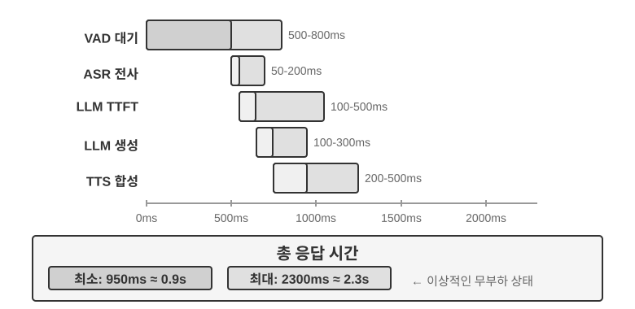
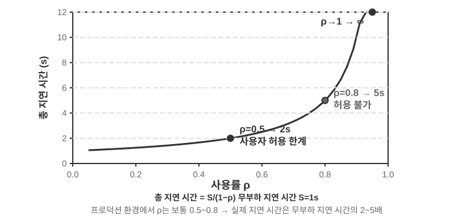
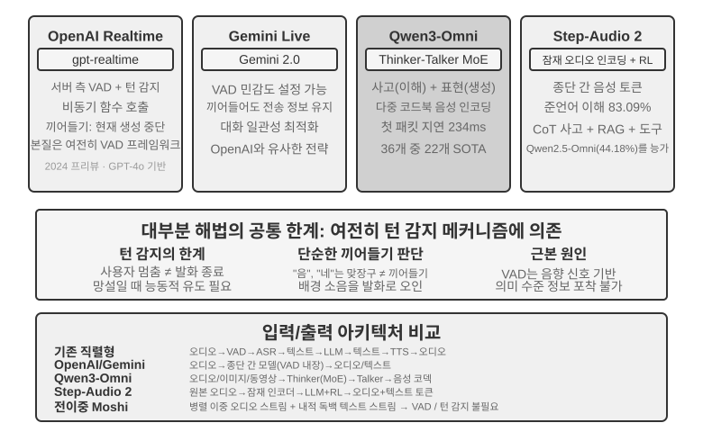
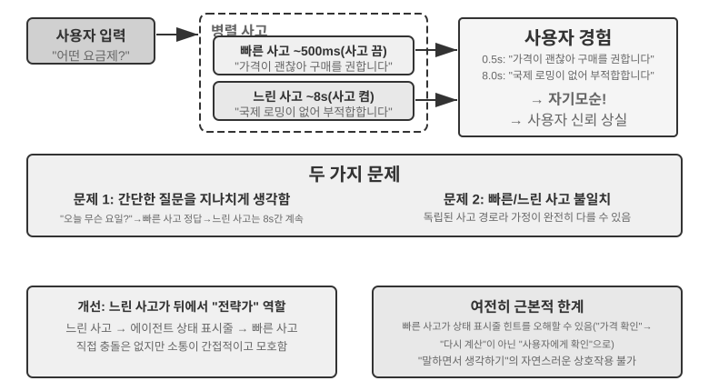
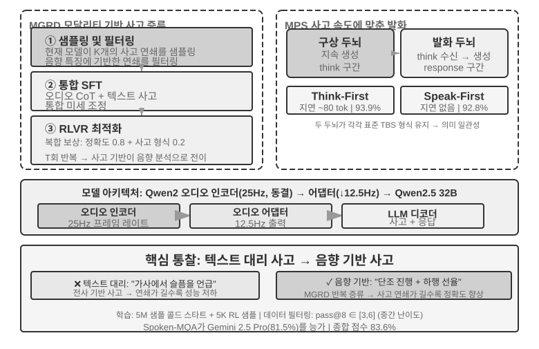
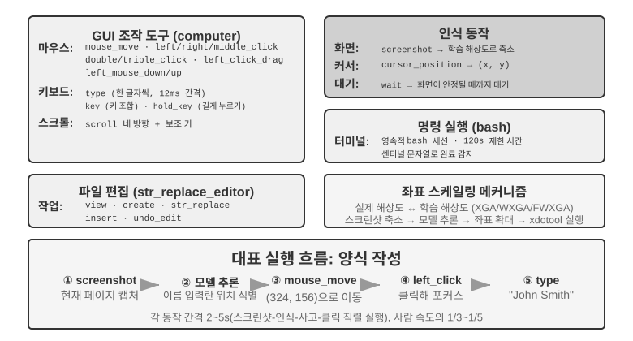
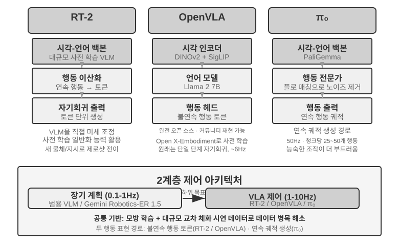
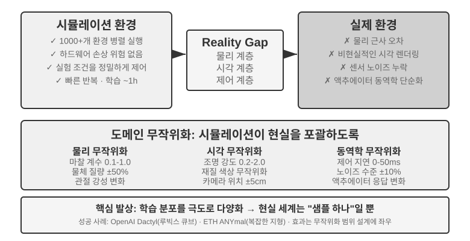
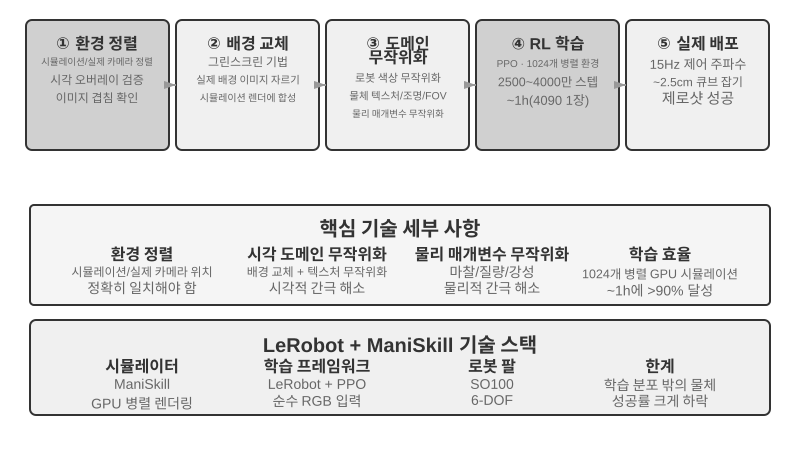

# 멀티모달리티와 실시간 상호작용

앞 장에서는 에이전트가 텍스트 기반 세계에서 컨텍스트, 도구, 코드를 통해 디지털 시스템과 상호작용하는 방식을 살펴봤습니다. 하지만 에이전트의 세계는 텍스트와 API를 넘어섭니다. 음성 명령을 이해하고, 화면에서 올바른 버튼을 찾아 클릭하고, 로봇 팔을 조종해 물체를 집어야 하는 순간 에이전트는 **멀티모달 실시간 상호작용**이라는 새로운 영역에 들어섭니다. 순수 텍스트 입출력에서 **멀티모달 인식과 실시간 응답**으로 전환하는 일은 에이전트를 ‘대화 상자’ 밖으로 이끄는 핵심 단계입니다. ‘멀티모달’은 텍스트만 처리하는 대신 텍스트, 음성, 이미지, 동영상, 행동처럼 여러 형태의 정보를 동시에 처리한다는 뜻입니다.

먼저 이 장의 범위를 정하겠습니다. 스크린샷을 살피고 차트를 읽고 PDF를 파싱하는 정적 이미지·문서 이해는 앞 장의 에이전트 워크플로에 이미 자연스럽게 포함되어 있습니다. 오늘날의 멀티모달 LLM에서 이러한 단일 입력 이해 업무는 비교적 성숙했으며 특별한 아키텍처가 필요하지 않습니다. 이 장은 다른 부류의 문제, 즉 **실시간 제약 때문에 멀티모달 문제가 어려워지는** 음성 대화, GUI 조작, 로봇 제어의 세 상황을 다룹니다. 이 환경에서는 입력이 계속 도착하고 출력은 엄격한 시간 예산을 지켜야 하므로 아키텍처가 근본적으로 달라집니다. 글을 쓰는 현재, 연속적인 시각 스트림 즉 동영상을 실시간으로 이해하는 일은 에이전트의 미해결 문제입니다. 컴퓨터 사용 절에서 프레임별 스크린샷의 한계를 살펴볼 때와 장 끝의 문제에서 다시 다루겠습니다. 경계를 하나 더 정하겠습니다. 이 책의 프레임워크에서 멀티모달 **생성**(이미지나 동영상 생성)은 5장의 멀티미디어 생성에서 다룬 평범한 도구 호출일 뿐입니다. 에이전트가 외부 도구로 사용하므로 여기서 다루는 실시간 상호작용 문제를 일으키지 않으며 이 장의 주된 흐름에서 제외합니다.

음성 상호작용, 컴퓨터 사용, 로봇 조작은 완전히 다른 세 분야처럼 보이지만 세 시스템 모두 놀랄 만큼 비슷한 문제를 겪습니다. 여러 모달리티를 동시에 처리해야 하고 지연 시간에 극도로 민감합니다. 음성 대화에서 2초 넘게 침묵하면 사람은 불안해지고, 로봇 제어에서 밀리초 수준의 지터가 발생하면 충돌할 수 있습니다. 이 제약은 세 상황의 아키텍처를 모두 **직렬 파이프라인**(앞 단계가 끝나야 다음 단계가 시작되는 공장 조립 라인)에서 **종단 간 모델**(중간 전달 없이 입력에서 출력으로 바로 가는 통합 모델)로 향하게 합니다.

이 장은 다음 순서로 전개됩니다.

1.  먼저 세 가지 음성 아키텍처 패러다임을 프레임으로 사용합니다. 캐스케이드(VAD-ASR-LLM-TTS 파이프라인), 종단 간 옴니모달(Omni, 단일 모델이지만 여전히 턴 교대에 의존), 전이중(Moshi와 GPT-Live, 듣기와 말하기를 동시에 수행)입니다. 각 패러다임이 불연속적인 턴이라는 VAD의 가정에서 얼마나 벗어났는지 물으며 지연 시간과 절충을 비교합니다. 캐스케이드 절에서는 VAD + ASR을 스트리밍 음성 인식으로 대체하는 방법도 설명합니다.
2.  이어서 사고 아키텍처가 ‘실시간 응답’과 ‘깊은 사고’의 충돌을 조율하는 방식을 살펴봅니다. 빠른 사고와 느린 사고의 단순 병렬화에서 시작해, 백그라운드 사고 모델이 ‘전략가’ 역할을 하는 분리 접근법(GPT-Live 위임, Pine AI 등), 하나의 모델이 ‘말하면서 생각하도록’ 사고를 ‘내재화’한 Step-Audio R1까지 이어집니다.
3.  다음으로 더 인간다운 음성 합성이 실행 계층을 최적화하는 방법을 논의합니다.
4.  마지막으로 관점을 컴퓨터 사용(AI가 사람처럼 컴퓨터 화면을 조작하는 것)과 로봇 조작으로 확장하여 같은 지연 시간·멀티모달리티 문제가 두 상황에서 어떻게 나타나는지 살펴봅니다.

이 상황을 가로지르는 이론적 주제 두 가지도 특별히 주목할 가치가 있습니다. **사고 아키텍처**(빠른 사고와 느린 사고가 협력하는 방식)와 여기서 나오는 **빠른-느린 인터페이스**, 즉 **잠재 브리지(Latent Bridge)**(빠른 모델과 느린 모델이 텍스트 외에 무엇을 주고받을 수 있는가)입니다. 음성 맥락에서 소개하지만 이 아이디어는 음성에 국한되지 않습니다. 컴퓨터 사용과 로봇공학 절에서도 느린 전략가에게 언제 문의해야 하는지 같은 질문이 등장하므로 두 주제를 기억해 두십시오.

## 음성: 가장 자연스러운 인간-기계 인터페이스

음성 에이전트의 아키텍처를 분석하기 전에 한 걸음 물러나 음성 자체의 가치를 생각해 보겠습니다. 사람이 컴퓨터와 상호작용하는 모든 방법 가운데 음성은 대역폭이 가장 높고 가장 자연스럽습니다. 보통 말하는 속도는 타이핑보다 약 네 배 빠르며 손과 눈을 차지하지 않습니다. 그래서 음성은 부차적인 입력 방식에서 많은 사람의 일상 업무를 위한 주 인터페이스로 발전하고 있습니다. 한 글자씩 타이핑하는 대신 하루 종일 에이전트와 대화하는 것입니다.

도구 수준에서는 이 경로에서 대략 두 종류의 제품이 나왔습니다. 하나는 **음성 받아쓰기 도구**(예: Typeless)입니다. 음성을 실시간으로 텍스트로 전사하여 어떤 애플리케이션에든 입력하는, 본질적으로 키보드를 대체하는 도구입니다. 다른 하나는 **음성 에이전트**(예: Pine, ChatGPT Voice)입니다. 사용자가 직접 대화하고 함께 일하며, 음성이 입력이자 상호작용 그 자체입니다. 두 유형의 가장 인상적인 고급 활용은 들어가며에서 언급한 **위스퍼 코딩(whisper coding)**, 즉 말로 코딩·연구 에이전트를 지휘하는 것입니다. 개발자가 의도를 말하고 에이전트와 구체화하면 에이전트가 코딩과 실험을 수행합니다. 이 책의 저자 팀은 십여 편의 논문을 바로 이 방식으로 완성했습니다.

시작하기 전에 한 가지 짚고 넘어가겠습니다. 아래의 음성 아키텍처는 사용자가 에이전트에게 말하는 방향(인간-기계 인터페이스로서의 음성)과 에이전트가 사용자를 대신해 외부에 말하는 방향(예: 협상을 위해 전화하는 것)을 모두 지원합니다. 양쪽 뒤에는 같은 실시간 음성 기술이 있습니다. 이제 음성 아키텍처의 세 패러다임부터 살펴보겠습니다.

## 음성 아키텍처의 세 패러다임

음성 에이전트의 기술적 진화를 이해하기에 유용한 틀은 OpenAI가 2026년 GPT-Live를 공개하며 제시한 세 분류입니다[^ch9-12]. ChatGPT Voice 자체가 거쳐 온 세 세대의 아키텍처와도 일치합니다.

1.  **캐스케이드(Cascaded):** 자동 음성 인식(ASR), 대규모 언어 모델(LLM), 음성 합성(TTS)이라는 세 모델을 파이프라인으로 이어 앞 모델이 다음 모델에 바통을 넘깁니다. 초기 ChatGPT Voice가 이 방식이었습니다. 처음으로 최전선 모델과 ‘말로 대화’할 수 있었지만 모델 간 전달 과정에서 정보가 손실되고 응답이 느리고 딱딱했습니다.
2.  **종단 간 옴니모달(End-to-End Omnimodal, Omni):** 하나의 모델이 직접 ‘오디오를 듣고, 답을 생각하고, 말로 출력’하여 세 단계를 하나로 합칩니다. 지연 시간이 더 짧고 운율과 감정 같은 비텍스트 정보를 보존합니다. 그러나 여전히 ‘턴 교대’를 가정합니다. 사용자가 멈출 때까지 모델이 기다리고 침묵 탐지에 의존해 턴을 바꿉니다. 잠깐의 멈춤이나 배경 소음을 ‘말을 끝냈다’고 잘못 판단하여 모델이 부적절하게 끼어들 수 있습니다. ChatGPT의 Advanced Voice Mode가 이 세대입니다. OpenAI는 ‘턴 기반 음성 모델’이라고 부르고 업계에서는 능력에 따라 ‘Omni’ 모델(예: Qwen3-Omni)이라고 더 흔히 부릅니다. 두 이름은 같은 대상을 가리킵니다.
3.  **전이중/상호작용형(Full-Duplex / Interactive):** 모델이 듣고 말하는 일을 동시에 수행하고 입출력을 병렬로 처리하며, 초당 여러 차례 ‘말할지, 들을지, 멈출지, 끼어들지, 도구를 호출할지’를 결정하여 ‘턴 교대’ 가정을 완전히 없앱니다. 2024년 Kyutai의 Moshi가 선구적인 연구였고 2026년 OpenAI의 GPT-Live가 이를 1억 5천만 명 규모로 확장했습니다.

세 세대를 관통하는 질문은 하나입니다. **‘차례로 말한다’는 가정, 즉 VAD(Voice Activity Detection, 음성 활동 감지)가 턴의 시작과 끝을 추측하게 하는 방식에서 어떻게 벗어날 것인가?** 캐스케이드와 Omni 아키텍처는 여전히 VAD에 의존해 턴을 나누며 전이중만이 턴이라는 개념을 완전히 해체합니다. 다음 세 절에서는 이 축을 따라갑니다. 세 패러다임은 단순히 새 접근법이 옛 접근법을 대체하는 관계가 아닙니다. 서로 다른 지연 시간과 비용 제약 아래의 설계 선택이며 2026년의 프로덕션 시스템에서도 공존합니다.

또한 GPT-Live는 ‘실시간 상호작용’과 ‘깊은 사고’를 분리하는 두 번째 구조적 변화도 도입했습니다. 검색이나 복잡한 사고가 필요한 문제를 만나면 상호작용 모델은 대화를 계속 이어 가면서 업무를 백그라운드의 최전선 모델(출시 당시 GPT-5.5)에 위임합니다. 이러한 ‘빠른-느린 역할 분담’은 뒤의 ‘사고 아키텍처의 절충’ 절에서 자세히 살펴봅니다.

[^ch9-12]: OpenAI. *Introducing GPT-Live.* 2026-07-08. https://openai.com/index/introducing-gpt-live/. 이 절의 ‘Cascaded / Turn-based / Full-Duplex’ 세 분류는 이 글이 요약한 ChatGPT Voice의 세 세대 진화에서 가져왔습니다. 본문의 ‘End-to-End Omnimodal(Omni)’은 글의 ‘turn-based voice models’ 범주에 해당합니다.

## 패러다임 1: 캐스케이드 파이프라인

스마트 스피커부터 고객 서비스 로봇까지 상용 음성 비서의 대다수는 직렬 파이프라인(그림 9-1)을 기반으로 합니다. 음성 활동 감지(VAD)가 사용자가 말을 끝냈는지 판단하고 → 자동 음성 인식(ASR)이 오디오를 텍스트로 변환하고 → 대규모 언어 모델(LLM)이 의도를 이해하고 답변을 생성하고 → 음성 합성(TTS)이 답변을 소리로 만듭니다. 릴레이 경주처럼 각 단계는 앞 단계가 끝나야 시작할 수 있습니다.


초기 음성 비서가 이 4단계 직렬 파이프라인을 사용한 이유는 단순합니다. 음성 인식, 언어 이해, 사고, 음성 합성을 동시에 처리할 수 있는 단일 모델이 없었기 때문입니다. 모듈식 아키텍처에서는 각 구성 요소를 독립적으로 개발하고 최적화할 수 있습니다. 하지만 모듈화에는 지연 시간이 누적되는 대가가 따릅니다. 각 단계가 시작하려면 앞 단계가 완료되기를 기다려야 합니다.

**VAD**는 파이프라인 시작점에서 오디오 스트림을 계속 모니터링합니다. 핵심 설계 선택은 발화 종료 탐지입니다. 일반적으로 500~800ms의 연속 침묵 임계값을 사용하며, 사용자가 0.5초 넘게 말을 멈추면 발화가 끝났다고 판단합니다. 여기서 첫 지연이 발생하고 어려운 절충이 생깁니다. 임계값이 너무 짧으면 생각하려는 멈춤을 발화 종료로 오해해 문장을 잘라 버리고, 너무 길면 사용자가 말을 끝낸 뒤 응답을 받기까지 거의 1초를 기다려야 합니다.

**ASR**은 오디오 파형을 텍스트로 변환합니다. Whisper와 SenseVoice 같은 소형·중형 모델을 GPU에 배포하여 5초 오디오를 전사하면 일반적으로 50~200ms가 걸리며, 더 큰 모델이나 자원이 부족한 배포에서는 200~500ms가 걸릴 수 있습니다(실험 9-3의 대조군이 후자에 해당합니다). 더 중요한 문제는 VAD가 기다리고 ASR이 전사하는 동안 후속 LLM이 완전히 유휴 상태라는 것입니다. 아무것도 받지 못했으므로 일찍 사고를 시작할 수 없습니다.

**LLM** 추론은 잘 최적화해도 컨텍스트 길이에 따라 첫 토큰까지 걸리는 시간(TTFT)이 흔히 100~500ms이고, 음성으로 만들 수 있는 첫 짧은 구간을 디코딩하는 데도 시간이 더 필요합니다. 사고 기능을 활성화하면 모델은 보이는 첫 토큰을 내기 전에 내부 사고를 완료하는 것이 일반적이라 대기 시간이 5~10초까지 길어질 수 있습니다. 전통적인 완전 직렬 구현은 LLM이 전체 답변을 끝낼 때까지 기다렸다가 텍스트를 TTS에 넘깁니다.

**TTS**는 답변 텍스트를 음성으로 변환하며 짧은 구간을 합성하는 데 일반적으로 200~500ms가 걸립니다. 그림 9-2는 사고를 끈 짧은 답변을 이용해 직렬 지연이 쌓이는 방식을 보여 줍니다. VAD(500~800ms) + ASR(50~200ms) + LLM TTFT(100~500ms) + LLM의 짧은 구간 생성(100~300ms) + TTS(200~500ms)로 총 약 0.95~2.3초입니다. 이는 일관된 측정 기준 아래의 예시 범위일 뿐입니다. 실제 지연 시간은 입력·답변 길이, 모델, 하드웨어, 네트워크, 부하에 따라서도 달라집니다.



프로덕션에 들어가면 큐 대기 시간이 상황을 더 악화합니다. 식당과 같습니다. 주방이 바쁠수록 더 오래 기다려야 하며 대기 시간은 선형으로 늘지 않고 급등합니다(그림 9-3). 앞에 대기열이 없을 때 요청의 처리 시간은 무대기 또는 유휴 지연 시간입니다. 하지만 요청이 동시에 여러 개 들어오면 나중 요청은 줄을 서야 합니다.

직관적으로 사용률이 올라갈수록 대기 시간은 더 가파르고 비선형적으로 증가합니다. 큐잉 이론은 다음과 같은 근사 관계를 제시합니다(직관을 위한 식이므로 엄밀한 유도는 필요하지 않습니다). 전체 지연 시간 ≈ 유휴 지연 시간 × 1/(1-사용률). 사용률은 서버가 바쁜 시간의 비율입니다. 예를 들어 사용률 50%라면 절반 동안 요청을 처리하고 절반 동안 유휴 상태라는 뜻입니다. 사용률 50%에서 지연 시간은 두 배, 80%에서는 유휴 지연 시간의 다섯 배가 됩니다. 서버를 높은 부하로 오래 운영할 수 없는 이유입니다.



> **실험 9-1 ★: 전통적인 음성 에이전트 구축**
>
> 이 실험에서는 완전한 실시간 음성 대화 시스템을 구축하여 사용자가 마이크를 통해 AI와 음성으로 상호작용하게 합니다. 시스템은 프런트엔드/백엔드 분리 아키텍처를 사용하고 WebSocket으로 실시간 통신합니다.
>
> 핵심 과정은 엄격한 직렬 패턴을 따릅니다. 프런트엔드가 마이크 입력을 캡처하여 WebSocket으로 백엔드에 실시간 전송합니다. 백엔드는 음성 활동 감지에 Silero VAD 모델을 실행합니다. 이 모델은 전통적인 음량 기반 탐지 방식보다 정확하고 잡음에 강합니다. 약 500ms의 연속 침묵을 탐지하면 후속 처리를 위해 오디오 구간을 추출합니다.
>
> ASR, LLM, TTS 단계는 각각 여러 제공자를 유연하게 전환할 수 있으므로 개발자는 지연 시간, 정확도, 지역별 네트워크 상태에 따라 최적의 조합을 선택할 수 있습니다.
>
> **실험 9-2 ★: PineClaw Voice API를 이용한 전화 에이전트 구축**
>
> 실험 9-1에서는 브라우저 내 음성 대화 시스템을 만들었지만 실제 에이전트 업무에는 실제 전화가 필요한 경우가 많습니다. 고객 센터에 연락해 요금을 협상하고, 식당을 예약하고, 주문을 확인합니다. 4장에서는 PineClaw의 채널 메커니즘을 통해 이벤트 기반 아키텍처가 전화 알림의 응답 지연을 분 단위에서 초 단위로 줄이는 방법을 보여 주었습니다. 이 실험은 음성 통화 자체를 구축하는 데 초점을 둡니다. 저자 팀이 개발한 [PineClaw Voice API](https://pineclaw.com/)를 예로 들면 이러한 프로덕션급 전화 음성 API는 일반적으로 전화 걸기, IVR 탐색(“문의는 1번, 상담원은 0번” 같은 전화 메뉴), 대화, 전사 전체를 캡슐화합니다. 에이전트가 전화번호, 목표, 컨텍스트 정보를 제공하면 음성 에이전트가 전체 통화를 완료하고 구조화된 통화 기록을 반환합니다.
>
> **실험 목표**: 실제 전화 통화로 업무를 완료할 수 있는 에이전트를 구축하고 PineClaw Voice를 도구로 ReAct 루프에 통합합니다.
>
> **기술적 접근법**: PineClaw Voice Python SDK(`pine-voice`)로 에이전트에 `make_phone_call` 도구를 제공합니다. 에이전트는 사용자의 업무 설명(예: “내일 오후 3시에 치과 검진을 예약해 줘”)을 받고 ReAct 사고를 통해 (1) 어떤 전화번호로 걸지, (2) 통화의 목표와 핵심 정보는 무엇인지, (3) 통화가 끝난 뒤 사용자에게 결과를 어떻게 보고할지 결정합니다.
>
> 에이전트의 워크플로: 사용자가 “병원에 전화해 내일 진료를 예약해 줘”라고 말합니다 → 에이전트가 필요한 정보(병원 전화번호, 예약 시간, 환자 이름)를 생각합니다 → 정보가 부족하면 사용자에게 확인합니다 → `make_phone_call` 도구를 호출합니다 → PineClaw가 전화를 걸고 상대방과 대화하여 예약을 완료합니다 → 에이전트가 통화 요약과 전사문을 받습니다 → 사용자에게 결과를 보고합니다.
>
> **통과 기준**: 테스트 통화를 성공적으로 수행합니다(연결 확인을 위해 먼저 자신의 전화로 걸어도 됩니다). 에이전트가 업무 설명을 바탕으로 통화 매개변수를 자율적으로 결정합니다. 통화가 끝난 뒤 핵심 정보(예약 시간, 확인 번호 등)를 올바르게 추출하여 사용자에게 보고합니다. API를 직접 사용할 때와 에이전트의 ReAct 루프를 통해 호출할 때의 차이를 비교합니다. 후자는 정보가 불완전한 상황(예: 사용자가 전화번호를 제공하지 않으면 검색)을 처리할 수 있습니다.
>
> 이 실험은 음성 에이전트의 중요한 활용 방향을 보여 줍니다. **에이전트는 사용자와 음성으로 대화할 뿐 아니라 사용자를 대신해 전화로 외부 세계와 상호작용할 수도 있습니다.** PineClaw의 음성 에이전트는 한 시간에 이르는 대기, 전화 메뉴 탐색, 복잡한 협상을 처리하도록 특별히 학습되었습니다. AI가 사용자를 대신해 통신사 고객 센터에 전화하고 상담원이 연결될 때까지 기다리는 모습을 상상해 보십시오. 바로 이런 상황에서 전통적인 직렬 음성 파이프라인은 어려움을 겪습니다.

### 캐스케이드 파이프라인의 전체 체인 스트리밍

그림 9-2는 각 단계가 끝난 뒤 바통을 넘기는 **완전 직렬** 상황을 가정합니다. 프로덕션 시스템은 보통 모듈식 VAD-ASR-LLM-TTS 구분을 유지하면서 각 단계가 가능한 한 빨리 증분 결과를 내게 하여 사용자가 첫 음절을 듣기까지의 시간을 줄입니다.

- **들으면서 전사하는 ASR:** 스트리밍 인식은 사용자가 말하는 동안 중간 전사문을 계속 내보내 대부분의 인식 계산 시간을 사용자 발화 뒤에 숨깁니다. 뒤의 맥락에 따라 중간 전사문이 수정될 수 있으므로 턴이 끝난 뒤에도 최종 텍스트를 확인해야 합니다.
- **LLM 출력 스트리밍과 텍스트 분할:** 모델이 생성하는 동안 구두점이나 의미를 기준으로 답변을 음성화할 수 있는 청크로 나누고, 전체 답변을 기다리지 않고 첫 청크를 TTS에 보냅니다. LLM의 TTFT를 줄이거나 사고를 건너뛰지는 않으며 나머지 응답이 끝나기를 기다리는 시간만 없앱니다.
- **TTS의 증분 오디오 합성:** TTS는 첫 텍스트 청크를 받으면 시작하고 전체 파형이 준비되기 전에 오디오 청크를 반환합니다. 그러면 TTS가 다음 음성을 합성하고 클라이언트가 이미 받은 오디오를 재생하는 동안 LLM은 나머지 텍스트를 생성할 수 있습니다.

하지만 모든 단계를 스트리밍으로 만든다고 해서 세 모델이 같은 턴에서 동시에 작업을 시작하는 것은 아닙니다. 표준적인 비추측 캐스케이드에는 여전히 의존성이 있습니다. ASR은 사용자가 말하는 동안 작동할 수 있지만 LLM은 턴이 끝나고 전사문이 안정된 뒤에야 최종 답변을 생성하고, TTS는 LLM이 음성화할 수 있는 첫 청크를 내놓은 뒤에야 시작합니다. 실제로 겹치는 부분은 사용자 발화와 ASR 전사, 그리고 LLM의 나머지 답변 생성과 TTS 합성·재생입니다. ASR, LLM, TTS가 처음부터 끝까지 완전히 병렬로 작동하는 것이 아닙니다.

더 공격적인 시스템은 **선점적/추측 생성**을 사용합니다. 충분히 안정된 부분 전사문으로 LLM을 시작하고 이후 전사문이 바뀌면 생성을 취소하거나 다시 시작하거나 수정합니다. 음성도 일찍 합성할 수 있지만 사용자가 아직 말을 끝내지 않았는데 에이전트가 덮어 말하지 않도록 보통 턴 확인 뒤에 재생합니다. LiveKit Agents와 Pipecat 같은 프레임워크는 일반적인 스트리밍 캐스케이드와 이러한 선점 전략을 모두 지원할 수 있습니다. ASR과 LLM이 실제로 겹쳐 작동하려면 부분 전사문 커밋, 무효화, 롤백을 명시적으로 구현해야 합니다. `stream` 옵션을 켠다고 자동으로 되는 것은 아닙니다.

일반 스트리밍도 **VAD의 침묵 대기와 턴 판단 자체**를 없애지는 못합니다. 스트리밍 ASR은 대기 중에도 이미 작동하며, 턴 탐지가 막는 것은 최종 전사문 커밋과 답변 재생입니다. 선점적 생성으로 이 계산 일부를 숨길 수 있지만 시스템은 여전히 언제 말해도 안전한지 판단해야 합니다. 지연을 더 줄이려면 프런트엔드 인식과 종단점 결정 자체를 개선해야 합니다.

### 스트리밍 음성 인식: VAD + ASR 대체

이 인식 프런트엔드는 두 단계로 이루어집니다. VAD가 사용자가 말을 끝냈는지 판단하고 ASR이 오디오를 텍스트로 전사합니다. 완전 직렬 아키텍처에서 둘은 함께 후속 파이프라인의 시작 시점과 입력을 결정합니다. 스트리밍 아키텍처에서는 ASR이 더 일찍 시작하지만 최종 텍스트를 커밋하고 답변 시점을 결정하는 일은 여전히 종단점 탐지의 제약을 받습니다. 전통적인 VAD + ASR 캐스케이드에는 세 가지 근본 문제가 있습니다.

1. **지연 시간 누적:** VAD는 미래를 예측할 수 없으므로 사용자가 말을 끝냈는지 확인하기 위해 500~800ms의 침묵을 기다려야 합니다. ‘정말 끝남’과 ‘생각하느라 잠깐 멈춤’을 구분하는 방법이 ‘기다리기’뿐입니다.
2. **정보 손실:** VAD는 ‘음성/침묵’ 같은 이진 신호만 출력합니다. 감정 변화, 말투 변화, 머뭇거리는 멈춤, 배경 분위기 같은 음향 세부 정보는 모두 사라집니다. 복잡한 환경에서는 오류가 특히 흔합니다. 조금 긴 멈춤을 발화 종료로 오해해 문장을 자르거나, 배경 소음이 거짓 시작을 일으켜 아무도 말하지 않는데 오디오 처리를 시작하거나, 사용자의 “응”이 끼어들기인지 맞장구인지 구분하지 못할 수 있습니다.
3. **정확도 저하:** VAD는 연속 오디오를 독립된 구간으로 자르고 각 구간을 ASR에 보내므로 맥락의 연속성이 깨집니다. 이메일 주소, 브랜드명, 사람 이름 같은 고유 명사처럼 맥락이 필요한 내용의 인식 오류가 크게 늘어납니다. 예를 들어 사용자가 “john dot smith at gmail dot com”이라고 말했는데 “john”과 “smith”가 다른 구간으로 잘리면 맥락 부족으로 “smith”를 “miss”로 잘못 인식할 수 있습니다.

**스트리밍 음성 인식 모델**은 근본적인 해결책을 제공합니다. 먼저 기술적으로 ‘스트리밍’이 무엇인지 명확히 하겠습니다. 음성 모델의 스트리밍 가능 여부는 **인코더가 인과적이거나 청크 기반인지**(이미 도착한 오디오에만 의존하고 전체 녹음을 요구하지 않음), **디코딩이 증분 방식인지**(작은 오디오 청크가 도착할 때마다 부분 결과를 출력함)에 달려 있습니다. Whisper가 스트리밍할 수 없는 이유는 어차피 자기회귀적인 디코딩 때문이 아니라, 시작하기 전에 완전한 오디오 구간(30초 고정, 짧으면 패딩)이 필요한 인코더 때문입니다. 또한 스트리밍 인식 자체는 새로운 것이 아닙니다. RNN-T와 스트리밍 Conformer로 대표되는 전통적인 스트리밍 ASR은 이미 오랫동안 업계에서 대규모로 배포되었습니다. 휴대전화의 실시간 자막과 키보드 앱의 음성 입력이 바로 이런 모델을 사용하며 LLM과는 관계가 없습니다.

이 절은 새로운 경로인 **LLM 기반 스트리밍 청각 인식**에 초점을 둡니다. 오픈 소스 LLM 백본을 사후 학습하여 연속 오디오 스트림에서 직접 의미 응답을 생성하게 하고 ‘인식’과 ‘이해’를 하나의 모델로 합칩니다. 스트리밍 기술을 새로 발명한 것이 아니라 전통적인 스트리밍 ASR을 업그레이드한 것입니다. 증분 인식 지연 시간은 여전히 한 단계 추론 시간 정도(수십~수백 밀리초)이지만 모델은 VAD가 자른 고립된 조각을 보지 않습니다. 대신 대화 시작부터 현재 순간까지 연속 오디오 스트림을 보고 전체 컨텍스트에 기반한 컨텍스트 내 학습을 수행하므로 개인정보, 전문 용어, 개인별 발음 패턴의 인식 정확도가 크게 높아집니다.

또 다른 핵심 장점은 이 경로가 LLM의 세계 지식과 상식적 사고 능력을 물려받는다는 점입니다. 백본 모델이 방대한 텍스트를 보았기 때문입니다. 예를 들어 모델은 “Apple” 뒤에 “event”가 오면 과일보다는 회사를 가리킬 가능성이 높다는 것을 압니다. 이런 지식 보강으로 금액, 지명, 브랜드명 같은 고가치 정보의 인식 정확도가 전통적인 ASR보다 훨씬 높아집니다. 이미 배포 가능한 모델도 있습니다. Fixie의 Ultravox는 오디오를 LLM 백본에 직접 넣고 텍스트와 의미 토큰을 출력합니다. 이 절의 실험에서 사용하는 Qwen2-Audio와 Alibaba의 Qwen2.5-Omni도 이 오디오 네이티브 모델 범주에 속합니다.

하지만 VAD를 대체하는 데 반드시 전체 규모의 오디오 LLM이 필요한 것은 아닙니다. 첫 번째 문제, 즉 **사용자가 말을 끝냈는지 판단하는 것**만 해결하는 것이 목표라면 더 가벼운 경로가 있습니다. 이 ‘턴 판단’을 인식기 자체에 직접 넣는 것입니다[^ch9-11]. 작은 오픈 소스 스트리밍 인식 모델에 LoRA 어댑터를 추가하여 전사하면서 **의미와 침묵을 함께 고려해** 문장이 완전한 생각을 표현했는지 판단하게 합니다. 턴 안의 멈춤(전화번호를 읊다가 한 박자 쉬는 것)이 턴 사이 간격보다 더 긴 경우가 흔하므로 침묵 임계값만으로는 양쪽 방향 모두 실패할 수밖에 없습니다. 더 흥미로운 발견도 있습니다. 모델이 턴을 가져갈지를 계속 망설이는 근본 원인은 보통 아키텍처가 아니라 **사후 정보를 보고 주석을 단 학습 라벨**입니다. 주석자가 결정 시점 뒤의 오디오를 사용했는데 온라인 모델은 그 오디오를 절대 볼 수 없습니다. 모든 라벨을 결정 순간에 이용할 수 있는 정보만으로 다시 주석 처리하면 거짓 망설임이 사라집니다. 이는 7장의 사후 학습에서 내린 판단, 즉 흔히 데이터가 아키텍처보다 중요하다는 점을 되풀이합니다. 이 가벼운 경로에도 프로덕션급 구현이 있습니다. Deepgram의 Flux와 AssemblyAI의 Universal-Streaming은 종단점 탐지와 턴 탐지를 음성 에이전트 전용 스트리밍 인식 모델에 직접 넣었고, 오픈 소스 쪽에서는 LiveKit과 Pipecat이 의미 기반 턴 탐지 모델을 제공합니다.

[^ch9-11]: 턴 판단을 인식기에 넣는 방법과 사후 정보 기반 라벨 문제에 대한 진단은 Bojie Li and Noah Shi. *The Trade-off Was in the Labels: Causal Supervision for Turn-Aware Streaming ASR.* 2026 (forthcoming)을 참고하십시오.

모델은 텍스트뿐 아니라 일련의 **음향 이벤트용 특수 마커**도 출력합니다. 모델 학습 중에 도입한 전용 토큰으로, 해당 음향 이벤트를 탐지하면 자동으로 출력하도록 학습합니다. 대표적인 유형은 다음과 같습니다.

- `<speak_start/end>`: 단순한 침묵 탐지가 아니라 의미와 음향을 종합적으로 판단해 발화 시작과 끝을 표시합니다.
- `<interrupt>`: 사용자가 정말 끼어들려는 것인지 단순히 맞장구치거나 배경 소음의 영향을 받은 것인지 구분합니다.
- `<emotion:happy/frustrated>`: 감정 마커입니다.
- `<laugh>` / `<sigh>`: 웃음과 한숨 같은 준언어 신호입니다.
- `<music>` / `<noise>`: 환경 소리입니다.

이 마커는 텍스트 토큰과 함께 사고 계층에 전달되는 통합 이벤트 스트림을 이룹니다.

```text
Input audio: "Um, actually I think... no wait, let me reconsider."
Model output stream:
  <speak_start> Um, <emotion:hesitant> actually I think...
  <silence:500ms> no wait, <emotion:confident> let me reconsider <speak_end>
```

모델은 텍스트 전사뿐 아니라 음성 이벤트 마커(발화 시작/끝, 감정 변화, 침묵 간격)도 출력합니다. 에이전트 프레임워크는 이 마커를 이용해 더 자연스럽게 상호작용할 수 있습니다. 예를 들어 사용자가 망설이는 것을 탐지하면 먼저 선택지를 제안할 수 있습니다.

> **실험 9-3 ★: Qwen2-Audio로 스트리밍 음성 인식 시뮬레이션**
>
> 먼저 실험 설계의 주의점을 설명하겠습니다. Qwen2-Audio 자체는 전체 구간을 입력으로 받는 비스트리밍 모델입니다. 이 실험은 **청크 입력으로 스트리밍 처리를 시뮬레이션**합니다. 연속 오디오 스트림을 고정 길이의 작은 청크로 자르고 누적된 오디오 컨텍스트와 함께 하나씩 모델에 보냅니다. 모델은 텍스트와 음향 이벤트 토큰(웃음, 멈춤, 기타 비언어 신호)을 점진적으로 생성하며, 실험에서는 각 청크 제출부터 텍스트 수신까지의 지연을 측정합니다. 이 접근법에는 중요한 비용이 있습니다. Qwen2-Audio의 인코더는 증분 방식이 아닙니다. 새 청크를 처리할 때마다 이전에 누적된 오디오 전체를 처음부터 다시 인코딩해야 합니다. 대화가 길어질수록 청크별 인코딩 지연도 늘어납니다. 이것이 ‘스트리밍 시뮬레이션’과 새로 도착한 오디오만 처리하는 증분·인과 인코더를 사용하는 ‘진정한 스트리밍’의 본질적인 차이입니다. 이 설계는 전체 컨텍스트를 이용한 연속 인식의 정확도 이점을 보여 주지만 지연 수치는 청크 크기와 추론 속도만 반영합니다. 청크 인코딩을 사용하는 Qwen3-Omni 같은 진정한 스트리밍용 모델의 첫 패킷 지연을 나타내지는 않습니다. 관심 있는 독자는 이러한 모델로 실험을 반복할 수 있습니다. 기준선은 전통적인 VAD + Whisper ASR 파이프라인입니다. 실험은 일반 대화, 멈춤이 있는 긴 문장, 배경 소음이 있는 대화라는 세 상황을 다룹니다.
>
> 결과: 청크 시뮬레이션 방식의 증분 인식 지연은 청크 길이와 하드웨어에 따라 100~200밀리초 수준으로 제어할 수 있습니다. 전통적인 방식은 VAD의 완료 확인(600ms)과 Whisper 추론(이 실험 구성에서 약 200~500ms)을 기다려야 하므로 총 800~1100ms가 걸립니다. 멈춤이 있는 상황에서는 VAD가 첫 긴 멈춤을 발화 종료로 잘못 판단해 문장을 두 구간으로 잘라 따로 인식했습니다. “大概两点左右”(“2시쯤”)를 “大概零点左右”(“자정쯤”)로 잘못 인식했습니다. 주변 맥락이 사라져 발음이 비슷한 两(liǎng, “둘”)를 零(líng, “0”)으로 들은 것입니다. 전체 컨텍스트를 유지한 청크 방식은 문장 전체를 올바르게 인식했습니다. 배경 소음 상황에서 Qwen2-Audio는 `<|noise|>` 토큰으로 소음의 존재를 표시하면서 인식을 중단하지 않았지만, 전통적인 VAD는 소음에 잘못 작동하여 인식 과정을 너무 일찍 시작했습니다.

## 패러다임 2: 종단 간 옴니모달 모델(Omni)

캐스케이드 파이프라인 전체를 다시 보겠습니다. 인식 프런트엔드를 스트리밍 음성 인식으로 업그레이드해도 듣기, 생각하기, 말하기를 불연속적인 인터페이스로 연결한 세 개의 독립 모델에 나누어 맡깁니다. 인터페이스를 아무리 넓혀도 소수의 의미 토큰과 가끔 나오는 음향 마커만 전달합니다. 화자의 감정, 말투, 억양, 배경의 소리나 음악은 전달 과정에서 대부분 사라집니다. 세 구간을 따로 학습하고 조정하므로 하나처럼 작동하기도 어렵습니다. 종단 간 옴니모달 모델(Omni)은 다른 길을 택합니다. 하나의 모델이 오디오를 직접 ‘듣고’, 답을 ‘생각하고’, ‘말로 출력’하여 세 구간을 하나로 합칩니다(그림 9-4). 학습 데이터가 충분하다면 모델의 내부 잠재 공간이 이 준언어 신호를 생성 측까지 그대로 전달하여 지연을 줄이면서 텍스트만으로는 보존할 수 없는 운율과 감정을 유지할 수 있습니다. 절충은 다음과 같습니다. **캐스케이드 파이프라인**은 모듈이 명확하고 구간별 조정이 가능하며 해석성이 좋습니다. **종단 간 모델**은 더 많은 학습 데이터와 낮은 해석성을 대가로 더 짧은 지연과 비텍스트 정보의 충실도를 얻습니다.

흔히 간과하는 차원이 하나 있습니다. 종단 간 모델의 주요 장점은 **지연 시간**이지 반드시 **정확도**까지 더 좋은 것은 아닙니다. 유용한 비교 대상은 **자기 캐스케이드(self-cascade)**입니다. 같은 모델이 먼저 오디오를 구조화된 텍스트로 전사하고 그 텍스트를 바탕으로 사고합니다. 자기 캐스케이드와 단일 종단 간 패스 중 어느 쪽이 더 정확한지는 업무에 따라 다르며 패턴은 분명합니다. 답이 주로 의미 내용(‘무슨 말을 했는가’)에 달려 있고 중간 텍스트가 업무 관련 정보를 담을 수 있다면, 특히 인식 능력이 약한 모델에서 자기 캐스케이드가 종단 간 방식과 비슷하거나 더 낫습니다. 답이 텍스트로 표현하기 어려운 비언어 단서(말투, 감정, 환경음)에 달려 있으면 종단 간 방식이 확실히 앞섭니다. 더 중요한 점은 ‘종단 간 방식이 더 발전했다’고 치부하는 대신 업무의 성격을 보고 **어느 쪽이 이길지 미리 예측**할 수 있다는 것입니다. 여기서 설계 원칙이 나옵니다. 보통 성능을 결정하는 것은 중간 표현, 즉 **병목**의 존재 여부가 아니라 병목이 어떤 정보를 전달하는가입니다. 단순 전사를 감정, 말하기 속도, 환경음 같은 준언어 마커가 있는 구조화된 표현으로 업그레이드하면 종단 간 모델의 정확도 우위가 줄어드는 경우가 많습니다. 이는 앞의 ‘스트리밍 음성 인식’에서 제시한 주장, 즉 인식 계층이 평문 텍스트만 출력해서는 안 된다는 말과 같습니다[^ch9-13].

Omni가 아무리 강력해져도 세 모델을 하나로 합쳤을 뿐 **‘턴을 교대한다’는 가정을 버리지는 않았습니다.** 여전히 VAD에 의존해 발언권을 배분합니다. 사용자의 발화를 탐지하면 곧바로 침묵하고 사용자가 조용해지면 말을 시작합니다. 그래서 익숙한 실패가 다시 나타납니다. 사용자가 숫자를 읊다가 잠깐 쉬면 Omni는 끝났다고 판단하고 끼어듭니다. 앞서 설명한 스트리밍 음성 인식은 턴 판단을 침묵 길이에서 의미 수준으로 끌어올려 이런 오작동을 크게 줄이지만 여전히 턴 교대 프레임워크 안의 국소 패치이지 턴 교대 자체의 끝은 아닙니다. **완전히** 벗어나려면 프레임워크 안에서 패치하기를 멈춰야 합니다. 모델이 듣고 말하는 일을 동시에 하며 ‘누구 차례인가’를 하드 스위치로 정하지 않고 스스로 말할 시점을 결정하게 해야 합니다.

[^ch9-13]: 캐스케이드와 종단 간 방식의 정확도 우위가 뒤집히는 시점과 업무 성격(중간 표현이 업무 관련 정보를 충분히 담을 수 있는가)에 따라 방향을 예측하는 방법을 완전히 교차 모달로 측정한 내용은 Bojie Li and Noah Shi. *The Cascade Gap: When and Why Self-Cascades Help Multimodal Agents.* 2026 (forthcoming)을 참고하십시오.





모델 수준에서 **OpenAI Realtime API**는 오디오를 네이티브로 처리하므로 종단 간 방식에 가깝습니다. 하지만 상호작용 제어 수준에서는 여전히 전통적인 VAD에 의존하여 완전한 종단 간 시스템으로 가는 중간 단계입니다. 2024년 프리뷰는 처음 GPT-4o에서 실행됐고 2025년 API가 정식 출시되면서 GPT-4o의 모드가 아니라 실시간 음성에 최적화된 전용 모델 **gpt-realtime**로 바뀌었습니다. API는 기본적으로 서버 측 VAD를 활성화하고 사용자의 발화 시작과 종료를 자동 판단합니다. 끼어들기도 지원합니다. 사용자가 말을 시작하면 API가 현재 음성 생성을 즉시 멈춥니다. 대면 대화에서 상대방이 끼어들면 자연스럽게 말을 멈추는 것과 같습니다. gpt-realtime은 비동기 함수 호출도 도입하여 도구 결과를 기다리는 동안 모델이 계속 말하고 도구 지연을 대화 속에 숨길 수 있습니다. 이러한 개선은 경험을 향상하지만 여전히 VAD 프레임워크 안의 최적화입니다. **Gemini Live API**도 비슷한 접근법을 사용하여 VAD 민감도를 설정할 수 있고 끼어들기 뒤에도 이미 보낸 정보를 보존하여 대화의 일관성을 유지합니다.

**Qwen3-Omni**는 Thinker-Talker 아키텍처를 사용합니다. 사고(이해와 사고)와 표현(음성 생성)을 두 전문 모듈로 나누고 텍스트, 이미지, 오디오, 동영상의 인식과 생성을 통합합니다.

높은 능력을 유지하면서 계산 비용을 통제하기 위해 Qwen3-Omni는 MoE(Mixture of Experts, 전문가 혼합) 아키텍처를 사용합니다. ‘필요할 때 전문가 팀을 부르는 것’으로 생각할 수 있습니다. 내부에 여러 작은 전문가 네트워크가 있고 추론할 때마다 현재 업무와 가장 관련 있는 소수만 활성화하며 나머지는 계산에 참여하지 않습니다. 예를 들어 음성을 처리할 때는 주로 음성 관련 전문가를, 이미지를 처리할 때는 주로 시각 관련 전문가를 활성화합니다. 따라서 전체 매개변수 수를 아주 크게 유지해 높은 능력을 확보하면서 토큰당 실제 계산량은 아주 작게 유지하여 추론 처리량을 높이고 높은 부하에서 큐 대기 시간을 줄일 수 있습니다.

구분해야 할 점이 있습니다. MoE는 단위 계산 자원이 처리할 수 있는 요청 수, 즉 처리량을 높입니다. 첫 오디오 패킷을 얼마나 빨리 내보낼 수 있는지는 직접 결정하지 않으며, 첫 패킷 지연은 생성 아키텍처에 달려 있습니다. Qwen3-Omni의 짧은 첫 패킷 지연은 Talker 모듈에서 나옵니다. 다중 코드북 자기회귀로 오디오 토큰을 증분 생성하고 인과 코덱이 이를 증분 디코딩해 파형으로 만듭니다. 사고 모듈이 텍스트를 생성하는 즉시 Talker는 전체 답변을 기다리지 않고 음성 스트리밍을 시작할 수 있습니다. 공식 보고서에 따르면 이론적인 콜드 스타트 첫 패킷 지연은 약 234ms입니다. 19개 언어의 이해와 10개 언어의 생성을 지원하며 36개 오디오-동영상 벤치마크 가운데 22개에서 선두를 기록했습니다.

**Step-Audio 2**는 다른 길을 택합니다. 원시 오디오 입력을 직접 처리하고 텍스트와 오디오를 모두 출력하여 진정한 종단 간 음성 대화를 구현합니다. *무엇을* 말했는지(의미 정보)뿐 아니라 *어떻게* 말했는지도 인식할 수 있습니다. 화자의 감정이 기쁜지 화가 났는지, 말하기 속도가 빠른지 망설이는지, 억양이 올라가는지 내려가는지 같은 준언어 정보와 배경의 환경음·음악을 인식합니다. 사고와 강화 학습을 통해 표현력 있는 응답을 만들며 RAG 메커니즘과 외부 도구(웹 검색, 오디오 검색)도 통합합니다. Step-Audio 2 논문에 따르면 저자들이 제안한 준언어 이해용 StepEval-Audio-Paralinguistic 벤치마크에서 정확도 83.09%를 달성하여 당시 오픈 소스 옴니모달 모델 Qwen2.5-Omni(44.18%)보다 크게 앞섰고 GPT-4o Audio(43.45%)와 Kimi-Audio(49.64%)도 능가했습니다.

Step-Audio R1은 Step-Audio 시리즈의 후속 모델입니다. Step-Audio 2의 종단 간 음성 대화 아키텍처 위에서 사고 능력을 오디오 모델에 직접 더 깊이 내재화합니다. 두 모델은 같은 기술 경로를 따라 점진적으로 진화한 관계입니다.

## 패러다임 3: 전이중/상호작용형 모델

패러다임 2는 세 모델을 하나로 합쳤지만 사용자 아니면 모델이 말하고 VAD나 의미가 전환점을 추측하는 턴 교대 가정을 여전히 고수합니다. 어떤 상황에는 ‘네 문장 다음 내 문장’이 들어설 여지가 전혀 없습니다. **동시통역**이 대표적입니다. 통역사는 문장 전체가 끝나기를 기다리지 않고 듣는 동시에 문장을 구성하며 의미 단위가 대략 완성되는 즉시 옮깁니다. 듣기와 번역이 항상 겹칩니다. **음악의 박자에 맞춰 북을 치는 리듬 게임**은 더 극단적입니다. 귀는 끊기지 않는 음악 스트림을 따라가고 손은 정확한 순간에 박자를 치며 머리는 다음 박자를 예상해야 합니다. 여기에는 ‘턴’이 없고 끝없는 입력 스트림만 있습니다. 이런 업무는 턴 단위 모델의 뿌리에 도전합니다. 듣기, 사고, 행동이 동시에 이루어져야 하지만 턴 기반 모델은 세 가지를 별도의 시간 구간에 넣는 것을 전제로 하기 때문입니다. 전이중 모델은 ‘VAD 제거’ 경로를 논리적 종착점까지 밀어붙입니다. 턴 교대 가정을 버리고 모델이 **계속 동시에 듣고 말하게** 합니다.

이 분야의 선구적인 연구는 Kyutai의 **Moshi**(2024)입니다. 사용자 음성과 모델 자신의 음성이라는 두 오디오 스트림을 병렬로 모델링하고 ‘내적 독백’ 텍스트 스트림을 더해 생성 음성의 언어 품질을 높입니다. 항상 듣고 있으므로 겹치는 발화와 끼어들기가 자연스러운 행동이 되며 명시적인 끼어들기 탐지 로직이 필요하지 않습니다. 종단 간 지연은 약 200ms로 자연스러운 인간 대화의 리듬에 가깝습니다.

2026년 Mira Murati가 설립한 **Thinking Machines Lab**은 **상호작용 모델(Interaction Model)**이라는 새로운 범주의 프리뷰를 공개하고[^ch9-14], 상호작용성은 모델을 둘러싼 VAD 같은 외부 하네스가 아니라 모델 자체에 내장되어야 한다고 명시적으로 주장했습니다. “상호작용성이 지능과 함께 확장되려면 모델 자체의 일부가 되어야 한다”고 표현했습니다. 아키텍처상 이는 **마이크로 턴**으로 구현됩니다. 전체 턴이 끝나기를 기다리지 않고 약 200ms 구간으로 작동하여 200ms의 입력을 계속 처리하고 200ms의 출력을 생성하므로 오디오, 동영상, 텍스트 스트림이 서로 섞여 함께 진행됩니다. 이 세밀도는 의도적인 절충입니다. 침묵, 겹침, 끼어들기를 인위적인 턴 경계 없이 모델의 컨텍스트 안에 연속 스트림으로 보존할 만큼 세밀하면서, 여러 모달리티를 청크 단위로 병렬 처리하여 지연을 체감상 실시간 범위 안에 유지할 만큼 거칩니다. 상호작용이 모델 안에 있으므로 예전에는 특수 하네스로 조립해야 했던 말하면서 듣기, 보면서 끼어들기 같은 행동이 이제 모델의 업무 일부가 되고 모델과 함께 강화됩니다. 첫 모델인 TML-Interaction-Small은 세 스트림 모두를 처음부터 공동 학습했습니다. 사용자가 버그 있는 코드를 작성하거나 누군가 화면 안으로 들어오는 것을 발견하면 지시하지 않아도 먼저 말할 수 있습니다.

‘느린 사고’에 대한 접근법도 대표적입니다. 상호작용 모델 자체는 대화를 온라인 상태로 유지하는 일만 담당합니다. 깊은 사고나 도구 호출이 필요한 문제를 만나면 백그라운드의 더 강한 사고 모델에 위임합니다. 이때 넘기는 것은 고립된 질의가 아니라 **전체 대화 컨텍스트**입니다. 백그라운드 모델이 사고하는 동안 결과는 점진적으로 돌아옵니다. 상호작용 모델은 그동안 계속 응답하고 후속 질문에 답하고 발언권을 유지하면서 사용자를 방해하지 않는 순간을 골라 결과를 대화에 자연스럽게 녹입니다. 이렇게 ‘사고 모델의 계획·도구·에이전트 능력’을 ‘비사고 모델의 지연 시간’으로 제공합니다. 공식 보고서에 따르면 TML-Interaction-Small(총 276B 매개변수, 활성 매개변수 12B의 MoE)은 턴 전환 지연이 약 0.40초까지 낮습니다(GPT-realtime-2.0은 약 1.18초). 시각적 능동성 벤치마크에서는 거의 0점에 가까운 경쟁 모델을 크게 앞섰습니다. 글을 쓰는 현재는 아직 연구 프리뷰 단계입니다.

[^ch9-14]: Thinking Machines Lab, "Interaction Models: A Scalable Approach to Human-AI Collaboration," 2026-05. https://thinkingmachines.ai/blog/interaction-models/

같은 해 OpenAI의 **GPT-Live**는 전이중 방식을 프로덕션 규모로 가져와 ChatGPT의 새로운 기본 음성 모델로 전 세계에 배포했습니다. 더 이상 대화를 불연속적인 메시지 턴의 연속으로 다루지 않고 **입력을 계속 처리하면서 출력을 계속 생성**합니다. 따라서 초당 여러 차례 말하기 시작할지, 계속 들을지, 잠시 멈출지, 끼어들지, 도구를 호출할지 결정할 수 있습니다. 그 결과 사용자가 생각하는 동안 끼어드는 대신 조용히 기다리고, “음”, “맞아요” 같은 맞장구로 듣고 있음을 표현하며, 듣기와 말하기를 동시에 해야 하는 실시간 번역 같은 업무도 수행할 수 있습니다.

GPT-Live도 빠른 과정과 느린 과정을 분리하는 같은 길, 즉 **‘실시간 상호작용’과 ‘깊은 사고’의 분리**를 따릅니다. 검색, 사고, 더 복잡한 에이전트 작업이 필요한 업무를 만나면 상호작용형 GPT-Live가 백그라운드의 최전선 모델(출시 당시 GPT-5.5)에 업무를 위임하면서 스스로 대화의 흐름을 계속 유지합니다. 백그라운드 모델이 결과를 만들면 GPT-Live가 대화에 통합합니다. GPT-Live-1과 mini 버전은 백그라운드에서 GPT-5.5 Instant를 사용하고 Medium·High 등급은 사고 기능을 활성화한 GPT-5.5를 호출하여 사용자가 필요에 따라 ‘빠르게’와 ‘깊게’를 선택할 수 있습니다. 이 ‘빠른-느린 역할 분담’이 바로 다음 절 ‘사고 아키텍처의 절충’에서 확장할 주제입니다.

이 장의 ‘VAD 대체’ 흐름을 되돌아보겠습니다. VAD는 침묵 임계값으로 턴 전환 시점을 추측합니다. 스트리밍 인식(앞의 패러다임 1 ‘스트리밍 음성 인식’ 절)은 전환 판단을 의미 수준으로 높입니다. 전이중 모델은 ‘전환’ 개념 자체를 완전히 해체합니다. 항상 듣고 있으므로 ‘끼어들기’가 더 이상 별도 처리가 필요한 이벤트가 아니며 바지인 처리 체인이 아키텍처상 대부분 사라집니다. 글을 쓰는 시점에서 이것이 ‘VAD 대체’ 흐름의 종착점입니다.

## 사고 아키텍처의 절충: 분리에서 통합으로

진짜 과제는 **실시간 응답과 깊은 사고 사이의 긴장**입니다. 사용자는 밀리초 수준의 응답을 기대하지만 복잡한 문제는 몇 초 동안 생각해야 합니다. 짧은 지연 시간을 유지하면서 모델이 충분히 깊이 생각하게 하려면 어떻게 해야 할까요? 이 긴장은 종단 간 아키텍처에만 있는 것이 아니라 캐스케이드 파이프라인도 마주합니다.

아래의 세 해법은 선형적인 발전 단계를 나타내지 않습니다. 서로 다른 제약에 대한 설계 절충이며 실제로 공존합니다. 올바른 선택은 애플리케이션의 지연 시간 요구와 필요한 사고 깊이에 달려 있습니다. 핵심 차이는 이렇습니다. 해법 1과 2는 동시에 실행되는 빠른 모델과 느린 모델이라는 두 독립 모델에 업무를 나눕니다. 종단 간 아키텍처가 필요하지 않으며 캐스케이드 파이프라인 위에 얹을 수도 있습니다. 해법 3만이 사고를 종단 간 모델 안에 실제로 내재화합니다.

2026년에는 ‘빠른-느린 분리’ 경로가 최전선 음성 제품의 주류 선택이 되었고 고유한 이름도 얻었습니다. Thinking Machines Lab은 실시간 상호작용 모델과 비동기 백그라운드 사고 모델을 결합한 ‘상호작용 모델’이라고 부릅니다. xAI Grok Voice의 ‘Think Fast’, Pine AI의 음성 에이전트, 앞 절의 GPT-Live ‘위임’ 모두 ‘프런트의 빠른 모델이 대화를 유지하고 백그라운드의 느린 모델이 깊이 사고’하는 같은 경로를 따릅니다. ‘전능한 단일 모델을 학습’하는 대신 분리하는 데는 실용적인 이유가 있습니다. 최전선 사고 모델은 몇 달마다 개선되지만 실시간 상호작용 능력에는 특수한 데이터와 학습 목표가 필요합니다. 둘을 같은 모델에 넣으면 움직이는 표적을 쫓아야 하고 가장 가치 있는 사고 능력을 희석할 수도 있습니다[^ch9-8]. 반대로 가장 강한 사고 모델은 백그라운드에 그대로 두고 프런트의 가벼운 상호작용 모델만 학습하면 언제나 현재 가장 강한 ‘두뇌’를 사용할 수 있습니다. GPT-Live가 ‘최신 최전선 모델로 지속 가능하게 교체’할 수 있음을 강조하는 이유입니다. 이제 조율 메커니즘이 강해지는 순서로 세 해법을 살펴보겠습니다.

### 해법 1: 빠른 사고는 추임새, 느린 사고는 답변

빠른 사고와 느린 사고를 병렬로 실행합니다(그림 9-5). 빠른 사고는 500ms 안에 짧은 대기 답변(사람이 먼저 “잠깐 생각해 볼게요”라고 말하는 것)을 내고, 느린 사고는 백그라운드에서 5~10초 동안 사고한 뒤 전체 답변을 전달합니다. 느린 사고 뒤의 기술은 ‘테스트 시점 스케일링’입니다. 쉽게 말해 답하기 전에 모델이 조금 더 오래 생각하게 합니다. 한 단계 만에 답으로 뛰어들지 않고 사람이 수학 문제를 풀듯 접근법을 잡고 단계별로 유도하고 결과를 확인하여 더 많은 계산과 더 나은 답을 맞바꿉니다.



**문제 1: 간단한 질문을 지나치게 생각함.** 사용자가 “오늘 무슨 요일이야?”라고 묻습니다. 빠른 사고는 500ms 안에 “수요일입니다”라고 정확히 답하지만 느린 사고는 여전히 10초를 모두 사용해 생각한 뒤 “수요일입니다”를 반복합니다. 계산 자원을 낭비할 뿐 아니라 더 중요한 대화 리듬을 깨뜨립니다. 사용자는 이미 답을 얻고 다음으로 넘어가려는데 반복된 응답이 끼어듭니다. **문제 2: 빠른 사고와 느린 사고의 불일치.** 둘은 독립적으로 병렬 실행됩니다. 같은 컨텍스트를 보지만 사고 경로가 완전히 갈릴 수 있습니다. 빠른 사고는 한 가정에 따라 답하고, 느린 사고는 그 가정이 틀렸음을 발견해 반대 결론에 도달할 수 있습니다. 사용자는 몇 초 만에 시스템이 자기모순하는 말을 듣고 즉시 신뢰를 잃습니다. 근본 원인은 해법 1이 대화를 하나의 일관된 인지 활동이 아닌 두 독립 사고 과정으로 나누며 빠른 사고와 느린 사고 사이에 조율 메커니즘이 없다는 것입니다.

```text
<user>이 요금제가 저에게 맞나요?</user>
<!-- 빠른 사고: 0.5초 후 -->
<assistant (빠른 사고)>가격이 매우 저렴하니 구매를 권합니다.</assistant>
<user>좋아요, 그럼 저는...</user>
<!-- 느린 사고: 8초 후 완료 -->
<assistant (느린 사고)>잠시만요. 필요한 국제 로밍 기능이 없어 적합하지 않을 수 있습니다.</assistant>
<user>(화남) 대체 사라는 건가요, 말라는 건가요?!</user>
```

### 해법 2: 빠른 사고는 상호작용, 느린 사고는 조언

해법 2에서는 느린 사고가 빠른 사고의 출력을 볼 수 있습니다. 사용자에게 직접 말하는 대신 에이전트 상태 표시줄(2장에서 소개한 동적 메타정보 주입 메커니즘)을 통해 제안합니다. 해법 1보다 두 가지가 개선됩니다. 느린 사고는 백그라운드에서 비동기로 실행되어 발화 사이의 틈에도 사고를 계속합니다. 또한 빠른 사고의 출력을 볼 수 있으므로 직접 모순되는 말을 피하고 보이지 않는 곳의 ‘전략가’ 역할을 합니다. 앞서 언급한 GPT-Live 위임과 Pine AI 음성 에이전트가 해법 2의 프로덕션 사례입니다. 백그라운드 사고 모델이 간결한 텍스트 채널을 통해 결론을 프런트 상호작용 모델에 보내고, 프런트 모델이 언제 어떻게 사용자에게 제시할지 결정합니다.

하지만 이 해법에도 근본적인 한계가 있습니다. **빠른 사고가 지시를 따르지 않을 수 있습니다.** 두 독립 사고 과정의 소통은 간접적이고 모호합니다. 빠른 사고는 “가격을 다시 확인해야 함”이라는 에이전트 상태 표시줄 업데이트를 “이 가격을 받아들일 수 있는지 사용자에게 묻기”로 잘못 해석할 수 있습니다. 의도는 “가격 계산이 틀렸으니 다시 계산하기”였는데도 말입니다. **중간 사고를 볼 수 없습니다.** 느린 사고가 10초 동안 귀중한 중간 결론을 만들더라도 빠른 사고는 하나도 보지 못하고 최종 상태 업데이트를 기다릴 수밖에 없습니다. 느린 사고가 끝나기 전에 사용자가 다른 질문을 하거나 끼어들면 빠른 사고는 자신의 제한된 이해만으로 답해야 합니다. 두 사람이 함께 문제를 풀지만 서로의 풀이 노트는 보지 못하고 쪽지만 주고받는 것과 같습니다.

해법 2에는 또 하나의 근본적인 이론 문제가 있습니다. **‘말하면서 생각하기’를 구현할 수 없습니다.** 사람은 복잡한 문제를 마주했을 때 머릿속에서 완전한 답을 만든 다음 한꺼번에 말하지 않습니다. “흥미로운 질문이네요… (생각하느라 멈춤) 먼저 이것을 고려해야 합니다… (계속 생각함) 둘째로…”처럼 구간별로 생각하고 말합니다. 해법 2에서 빠른 사고는 느린 사고를 기다리며 추임새만 낼 수 있고 사고 과정을 대화에 자연스럽게 엮을 방법이 없습니다.

### 해법 3: 사고와 표현의 종단 간 통합(Step-Audio R1 사례)

해법 2는 사용자가 느린 사고를 기다릴 필요를 줄이지만 아키텍처상 여전히 ‘먼저 생각하고 나중에 말하는’ 방식입니다. 사고와 표현이 서로 다른 두 과정으로 남아 사람처럼 ‘말하면서 생각하기’를 구현할 수 없습니다. 이 근본 한계를 깨려면 사고 능력을 모델에 직접 내재화해야 합니다.

Step-Audio R1은 이 방향에서 근본적으로 다른 해법을 제안합니다. 사고 능력을 종단 간 오디오 언어 모델에 직접 내재화하고 이중 두뇌 아키텍처로 진정한 ‘말하면서 생각하기’를 구현합니다. 실제로는 서로 다른 문제를 해결하는 두 가지 상호 보완 메커니즘으로 구성됩니다. **모달리티 기반 사고 증류(Modality-Grounded Reasoning Distillation, MGRD)**가 먼저 ‘올바르게 생각하기’를 해결하여 모델이 텍스트 전사문이 아니라 음향 특징을 바탕으로 실제 사고하게 합니다. 이어서 **MPS 이중 두뇌 아키텍처**가 ‘제때 말하기’를 해결하여 사고와 표현을 병렬 실행하고 짧은 지연으로 말하면서 생각하게 합니다. 전자는 후자의 전제 조건입니다. 사고가 소리에 뿌리를 두어야 말하면서 생각하는 일이 가치 있습니다. 차례로 살펴보겠습니다.

**텍스트 대리 사고 문제.** 이상적으로 음성 모델은 음높이, 리듬, 억양 같은 음향 특징을 직접 분석하여 화자의 감정이나 의도를 이해해야 합니다. 하지만 실제로 많은 모델은 지름길을 택합니다. 기존 오디오 언어 모델에서는 사고 연쇄가 길수록 성능이 나빠지는 직관에 어긋나는 현상이 나타납니다. Step-Audio R1 팀은 근본 원인을 ‘텍스트 대리 사고(Textual Surrogate Reasoning)’, 즉 분석할 때 텍스트 정보로 음향 정보를 ‘대신’하는 현상으로 파악했습니다. 모델이 ‘생각’할 때 실제로는 음향 특징을 분석하지 않고 텍스트 전사문에 기반해 의미 사고를 수행합니다. 예를 들어 노래의 감정을 판단하라는 질문에 “단조 선율과 내려가는 음높이 윤곽이 슬픔을 전달한다”가 아니라 “가사에서 슬픔을 언급한다”고 분석합니다. 이런 모달리티 불일치는 학습 데이터에서 비롯됩니다. 대부분의 오디오 모델 CoT(Chain-of-Thought) 데이터는 텍스트 모델이 생성하므로 자연스럽게 순수 텍스트 사고 패턴을 물려받습니다.

**모달리티 기반 사고 증류**(MGRD)는 반복적인 자기 개선으로 이 문제를 해결합니다(그림 9-6). 이름은 길지만 핵심 발상은 직관적입니다. 실제로 소리를 듣고 있는 사고 과정만 골라 그것으로 모델을 학습합니다. 교정자가 가사를 훑듯 분석하는 대신 음악 교사처럼 귀로 분석하도록 가르칩니다. 세 단계로 이루어집니다.

1.  현재 모델이 같은 오디오 구간에 대해 서로 다른 사고 과정을 여러 개 생성하게 하고 실제로 음향 특징에 근거한 것만 남깁니다. 어떻게 구분할까요? 사고가 구체적인 소리 매개변수를 언급하는지 확인합니다. 예를 들어 화난 목소리 입력에서 텍스트 기반 사고는 “사용자가 ‘정말 나쁘다’ 같은 부정적인 단어를 말했으므로 분노라고 판단한다”처럼 텍스트 내용만 분석합니다. 음향 특징 기반 사고는 “말하기 속도가 평소보다 40% 빠르고 음량이 크게 높으며 음높이가 더 날카롭다”고 하여 실제로 소리를 ‘듣습니다.’ MGRD는 후자를 선택합니다.
2.  이 고품질 사고 궤적으로 모델을 다시 학습해 ‘귀로 생각하는’ 능력을 강화합니다.
3.  모델이 사고 과정을 건너뛰고 답을 바로 추측하는 지름길을 택하지 않도록 강화 학습으로 더 최적화합니다.

여러 차례 반복하면 사고의 토대가 텍스트 추상화에서 음향 분석으로 점차 바뀝니다. 모델은 “화자가 불쾌해 보인다”고 모호하게 말하는 대신 “1.2초에 음높이 윤곽이 급격히 내려간다”는 데 주목하기 시작합니다.

**MPS 이중 두뇌 아키텍처**(Mind-Paced Speaking)는 사고 지연과 음성 출력 사이의 긴장을 해결합니다(그림 9-6). 사고와 언어 생성을 담당하는 영역이 분리되어 병렬로 작동하는 인간 두뇌의 역할 분담에서 영감을 얻었습니다. 우리는 앞 문장을 말하면서 다음 문장을 만들 수 있습니다. MPS는 두 모델로 이를 모방합니다. **구상 두뇌(Formulation Brain)**는 계속 사고하며 사고 구간을 생성합니다. **발화 두뇌(Articulation Brain)**는 새 구간을 받을 때마다 앞선 사고 구간과 지금까지 생성한 답변을 결합하여 음성으로 바꿉니다.

둘은 병렬로 실행됩니다. 발화 두뇌가 말하기 시작하기 위해 구상 두뇌가 사고를 끝낼 필요는 없습니다. 예를 들어 구상 두뇌가 t=0ms에 사용자 질문을 분석하기 시작하고 t=200ms에 텍스트 토큰 시퀀스인 첫 사고 구간을 생성합니다. 발화 두뇌는 그 구간을 받고 지금까지 생성한 답변과 결합하여 t=350ms에 해당 음성 토큰을 생성하기 시작합니다. 모듈이 병렬 파이프라인으로 작동하므로 사용자는 불과 350ms 뒤 첫 음절을 들을 수 있습니다.



> **실험 9-4 ★★★: Step-Audio R1을 이용한 종단 간 음성 사고**
>
> 이 실험은 Step-Audio R1을 사용해 음성 사고와 대화 업무에서 여러 구성을 비교합니다. 모델은 오디오 인코더, 오디오 어댑터, Qwen2.5 32B 디코더로 구성되며 다중 GPU 배포가 필요합니다.
>
> 두 업무를 평가합니다. **Spoken-MQA**(Spoken Math Questions)는 구두로 제시된 문제를 듣고 모델이 다단계 수학 사고를 수행할 수 있는지 시험합니다. **URO-Bench**(중국어 구두 대화 벤치마크)는 개방형 대화의 품질을 평가합니다.
>
> 테스트 구성은 두 차원으로 나뉩니다. 첫째는 **사고 시점(Thinking Timing)**입니다. 지연에 제약이 없는 대조 기준선인 완전한 **TBS**(Think-Before-Speak) 구성은 말하기 전에 모든 사고를 생성합니다. 지연을 줄이기 위해 MPS는 두 가지 ‘말하면서 생각하기’ 변형을 제공합니다. **Speak-First**(spkfirst라고도 함, 지연 없음, 말하기와 사고를 동시에 시작)와 **Think-First**(thkfirst라고도 함, 사고 두뇌가 첫 구간을 만들 때까지 기다린 뒤 말하며 지연은 약 80토큰)입니다. 둘째 차원은 **아키텍처**로, MPS의 병렬 이중 두뇌 아키텍처와 전통적인 단일 모델 TBS를 비교합니다.
>
> 표 9-1은 서로 다른 시점·아키텍처 구성의 수학 정확도와 대화 점수를 비교합니다.
>
> 표 9-1 Step-Audio R1 음성 사고 구성 비교
>
> | 구성 | Spoken-MQA | URO-Bench |
> |------|-----------|-----------|
> | 사고 없이 바로 답변(기준선) | 70.6% | 77.4 |
> | MPS Speak-First(지연 없음) | 92.8% | 82.5 |
> | MPS Think-First(지연 약 80 tok) | 93.9% | 84.8 |
> | 완전한 TBS(지연 제약 없음) | 93.0% | — |
>
> 흥미로운 발견은 Speak-First가 사고 업무에 미치는 영향이 아주 작다는 것입니다(92.8%로 완전한 TBS 구성의 93.0%와 비슷합니다). **CoT**(Chain-of-Thought)의 시작 부분은 보통 문제 내용을 다시 말할 뿐 아직 실제 사고에 들어가지 않기 때문입니다. 따라서 모델이 말하기와 동시에 사고를 시작해도 최종 정확도에는 거의 영향이 없습니다. Think-First(93.9%)가 지연 제약 없는 완전한 TBS 구성(93.0%)보다 약간 높다는 점도 눈에 띕니다. 사고를 구간별로 생성하고 한 구간씩 음성으로 바꾸는 방식이 단계별 감독처럼 작용하여 성능을 높였을 가능성이 있습니다. 하지만 차이는 오차 범위 안에 있으므로 지나치게 해석해서는 안 됩니다.
>

해법 3은 사고를 단일 모델에 내재화합니다. ‘말하면서 생각하기’를 가장 우아하게 구현하지만 대가는 이 절의 시작에서 말한 ‘움직이는 표적’입니다. 한 모델이 가장 강한 사고자이면서 실시간 화자여야 하고 두 능력이 빠르게 진화하므로 통합 경로는 속도를 맞추기 위해 반복해서 다시 학습해야 합니다. 그래서 글을 쓰는 시점의 업계가 나뉩니다. 최신 두뇌를 자유롭게 교체하고 싶은 최전선 제품(GPT-Live, Grok Voice, Pine AI)은 주로 해법 2의 분리에 베팅합니다. 해법 3은 궁극적인 자연스러움을 추구하고 특수 학습 비용을 감당할 수 있는 제품에 적합합니다. 어느 쪽도 다른 쪽을 대체하지 않습니다. 사고 모델 교체 가능성과 더 긴밀하게 통합된 사고·음성 사이의 절충입니다.

### 빠른 모델과 느린 모델의 인터페이스: 텍스트 외에 무엇을 전달할 수 있는가

(이 절은 음성이라는 장의 주된 초점에서 잠시 벗어나 여러 상황을 함께 논의합니다.) 해법 2는 놓치기 쉬운 설계 차원을 드러냅니다. 느린 사고가 빠른 사고에 메시지를 보낼 때 **텍스트** 채널(상태 표시줄을 통한 제안)을 사용합니다. 텍스트는 이해하고 디버깅하기 쉽지만 좁은 채널입니다. 느린 사고자의 풍부한 중간 상태가 몇 문장으로 압축됩니다. 그렇다면 빠른 모델과 느린 모델 사이의 인터페이스는 반드시 텍스트여야 할까요?

시점 민감도가 가장 높은 환경 가운데 하나인 실시간 게임에서는 더 직접적인 접근법인 잠재 브리지(Latent Bridge)[^ch9-8]가 가능합니다. 빠른 반응을 담당해 초당 수십 번 행동을 내는 작은 모델과 초당 한 번 사고를 내는 느린 사고 모델을 모두 고정한 뒤, 그 사이에 수천만 매개변수 규모의 작은 ‘브리지’만 학습합니다. 이 브리지는 느린 모델의 은닉 상태 결론을 몇 개의 ‘잠재 토큰’으로 직접 투영하여 멀티모달 모델이 시각 토큰을 삽입하듯 빠른 모델의 입력에 삽입합니다. 아이디어를 텍스트로 바꾼 다음 다시 내부 표현으로 되돌리는 왕복을 건너뜁니다. 여러 Atari 게임에서 잠재 공간 채널은 전통적인 텍스트 채널보다 크게 높은 성능(일부 게임에서 +26~+82%)을 보이면서 단계당 약 5밀리초만 추가하여 실시간 요구를 충족했습니다.

같은 연구는 솔직한 경계도 제시합니다. **빠른-느린 협업이 유용한지는 업무의 병목이 ‘생각해 내지 못함’인지 ‘제때 반응하지 못함’인지에 달려 있습니다.** 느린 사고자가 빠른 반응자보다 실제로 뛰어난 경우에만 브리지가 이득을 줍니다(게임 전반에서 이 상관관계는 r≈0.9까지 높습니다). 업무가 순전히 반응 속도 경쟁이라면 아무리 훌륭한 브리지도 소용없습니다. 이 판단은 게임을 넘어 적용됩니다. 이 장의 뒤에서 컴퓨터 사용이 마주할 질문을 미리 보여 줍니다. ‘느린 전략가’를 부를 가치가 있는 때는 언제이고 단지 지연만 늘리는 때는 언제일까요?

[^ch9-8]: 고정된 두 모델 사이의 잠재 공간 브리지만 학습하는 방법과 ‘느린 전략가를 부를 가치가 있는 때’에 대한 전체 분석은 Bojie Li and Noah Shi. *The Latent Bridge: A Continuous Slow-Fast Channel for Real-Time Game Agents.* arXiv:2606.24470, 2026을 참고하십시오.

종단 간이든 모듈식이든 인식과 실행 계층의 품질은 여전히 중요합니다. 종단 간 모델은 아키텍처 수준에서 지연을 해결하지만 정확하게 듣기와 자연스럽게 말하기라는 두 기초가 아키텍처를 바꾼다고 저절로 해결되지는 않습니다. 정확한 듣기는 패러다임 1의 스트리밍 음성 인식에 해당합니다. 이제 자연스럽게 말하기 위한 실행 계층, 즉 더 인간다운 음성 합성을 살펴보겠습니다.

## 더 인간다운 음성 합성

전통적인 TTS의 ‘완벽함’이 바로 문제입니다. 멈춤이나 추임새가 전혀 없이 완벽하게 유창한 말은 누가 들어도 기계가 만들었다는 느낌을 줍니다. 멈춤, “음”, “어”, “그러니까” 같은 추임새, 간혹 반복하는 말처럼 인간 발화의 ‘불완전함’은 결함이 아니라 사고 과정을 나타내는 자연스러운 신호입니다. 듣는 사람에게 “생각하고 있다”거나 “완전히 확신하지는 않는다”고 알려 줍니다. 반면 AI는 답변을 소리 내어 읽는 것보다 빠르게 생성할 수 있고 출력은 유창하고 완전한 상태로 도착합니다. 그대로 합성하면 인공적인 성격이 분명히 드러납니다.

**해법:** 어디서 멈추고 어떤 말투를 사용할지 주 LLM이 결정하게 합니다. LLM은 텍스트뿐 아니라 제어 토큰도 출력합니다. `[THINKING]`은 1~2초 동안 생각하느라 멈추고 추임새(“음…”)를 내라는 뜻입니다. `[SEARCHING]`은 더 짧게 멈추며 머뭇거리는 표현(“그러니까…”, “어떻게 말해야 할까요”)을 내라는 뜻입니다. `[EMO:happy]`는 말투와 운율을 조정하고 `[SPEED:0.8x]`는 말하기 속도를 제어합니다. 복잡한 질문을 처리하느라 멈춰야 하는지, 사용자가 조급해져 속도를 높여야 하는지, 한가한 대화라 활기차게 말해야 하는지는 LLM만이 압니다.

이 방식에서 TTS는 텍스트 + 제어 토큰을 입력으로 받고 오디오를 출력하는 멀티모달 생성기 역할을 합니다. 일반 텍스트는 평범하게 음성으로 합성하고 제어 토큰에는 대응하는 비언어 오디오를 생성합니다. `[THINKING]`은 길게 끄는 “음…”을, `[SIGH]`는 한숨을, `[LAUGH:small]`은 가벼운 웃음을, `[BREATH]`는 숨을 들이쉬는 소리를 생성합니다.

구현 경로는 두 가지입니다. 하나는 제어 토큰을 네이티브로 지원하는 독자 TTS를 개발하는 것입니다. 가장 유연하지만 전문 팀이 필요합니다. 다른 하나는 음성 복제를 사용합니다. 같은 가상 인물에 대해 서로 다른 감정, 속도, 스타일을 아우르는 참조 클립 수십 개를 준비한 다음 ElevenLabs나 Fish Audio 같은 TTS API를 호출할 때 각 제어 토큰 조합에 가장 잘 맞는 클립을 선택합니다. 이 방식은 몇 주 안에 배포할 수 있습니다.

> **실험 9-5 ★★: Fish Audio 기반 제어 토큰 구동 TTS**
>
> Fish Audio S1의 음성 복제 능력(같은 음색을 제로샷으로 복제하는 데 참조 오디오 3~10초만 필요)을 사용합니다. 감정(중립/기쁨/좌절/생각) × 속도(보통/빠름/느림) × 스타일(격식/편안함)을 아우르는 약 5초 길이의 참조 오디오 클립 24개로 라이브러리를 만듭니다.
>
> LLM 출력 예시: `[EMO:happy][SPEED:fast]좋습니다! 주문이 확정되었습니다.[THINKING]음, 배송 시간을 확인해 볼게요...[EMO:neutral][SPEED:normal]내일 오후에 도착할 예정입니다.`
>
> 실행 계층은 토큰을 파싱해 해당 참조 오디오에 매핑합니다. `[EMO:happy][SPEED:fast]`는 “기쁨+빠름+편안함” 참조에, `[THINKING]`은 멈춤의 리듬과 머뭇거리는 말투가 있는 “생각+느림+격식” 참조에, `[EMO:neutral][SPEED:normal]`은 “중립+보통+격식” 참조에 매핑합니다. Fish Audio는 참조 클립 사이에서 음색은 일관되게 유지하고 운율과 감정만 바꿉니다.
>
> 세 구성을 비교합니다. 제어 토큰이 없는 구성(유창하지만 로봇 같고 AI 생성임이 분명함), 단일 참조 클립(자연스럽지만 감정이 단조로움), 다중 참조 라이브러리(정보를 확인할 때 밝고 빠르며 설명 전에 자연스럽게 멈추고 전체적으로 사람 고객 서비스 담당자와 비슷하게 말함)입니다.

## 컴퓨터 사용: GUI 자동화 에이전트

이 장이 뒤의 두 상황보다 음성에 훨씬 많은 지면을 할애했다는 점을 눈치챘을 것입니다. 의도적인 구성입니다. 실시간 멀티모달 시스템 가운데 음성 기술이 가장 많이 발전하여 최고의 참조점이 되기 때문입니다. 직렬 파이프라인의 과도한 지연이라는 최초 문제에서 시작해 종단 간 모델, 전이중 상호작용, 말하면서 생각하기를 거쳐 오늘날의 비교적 성숙한 설계에 이르는 전체 궤적을 그렸습니다. 그래서 그 이야기를 완전히 전달했습니다. 컴퓨터 사용과 로봇공학 절을 읽으며 이 궤적과 비교해 보십시오. 각 분야는 어디까지 발전했고 어디에서 여전히 막혀 있을까요?

세 상황은 서로 달라 보이지만 실시간 인식, 짧은 지연의 의사 결정, 지속적 상호작용이라는 같은 핵심 과제를 마주합니다. 이제 청각에서 시각 모달리티로 관점을 넓혀 시각적 상호작용, 즉 컴퓨터 사용을 살펴보겠습니다. 에이전트가 음성을 이해할 뿐 아니라 화면을 ‘보고’ 그래픽 인터페이스를 조작할 수 있다면 어떨까요?

GUI 자동화라고도 하는 컴퓨터 사용은 AI가 화면을 관찰하고 마우스와 키보드를 조작하여 사람처럼 소프트웨어를 사용하게 합니다. 예를 들어 브라우저를 열어 정보를 검색하고, 스프레드시트 애플리케이션에 데이터를 입력하고, 시스템 설정을 조정합니다. 핵심은 **인식-사고-행동** 루프입니다(그림 9-7).

1.  에이전트가 현재 화면의 스크린샷을 찍습니다.
2.  멀티모달 모델이 스크린샷과 업무 지시를 받고 사고와 구체적인 행동을 출력합니다.
3.  실행 계층이 실제 환경에서 행동(마우스 이동, 클릭, 텍스트 입력 등)을 수행합니다.
4.  인터페이스의 응답을 기다리고 다시 스크린샷을 찍어 다음 루프 반복에 들어갑니다.


이 루프에는 세 가지 핵심 설계 차원이 있습니다. **행동 공간**(에이전트가 수행할 수 있는 작업), **시각적 그라운딩**(스크린샷에서 대상 요소를 찾는 방법), **모델 아키텍처**(스크린샷에서 올바른 행동을 생성하는 방법)입니다.

### 행동 공간 설계

Anthropic은 완전한 상호작용 능력을 이루는 세 가지 도구 유형을 정의합니다(그림 9-8).



**GUI 조작 도구**(`computer` 도구): 마우스 작업에는 이동(`mouse_move`), 왼쪽/오른쪽/가운데 클릭, 두 번 또는 세 번 클릭, 드래그(`left_click_drag`), 더 정밀한 누르기/놓기(`left_mouse_down`, `left_mouse_up`)가 있습니다. 스크롤(`scroll`)은 네 방향을 지원하고 보조 키와 조합할 수 있습니다. 키보드 작업에는 글자별 입력(`type`, 실제 타이핑을 모방해 글자 사이에 12ms 간격), 키 조합(`key`, 예: `Ctrl+C`), 키 누르고 있기(`hold_key`)가 있습니다. 인식 행동에는 스크린샷 찍기, 커서 위치 가져오기(`cursor_position`), 기다리기(`wait`)가 있습니다.

**명령 실행 도구**(bash 도구): 120초 제한 시간이 있는 영속적 bash 터미널 세션을 제공합니다. 센티널 문자열로 명령 완료를 탐지하고 여러 호출에 걸쳐 환경 상태를 유지합니다(예: 한 디렉터리로 `cd`하면 다음 호출도 그 디렉터리에 머뭅니다).

**파일 편집 도구**(`str_replace_editor`): 문자열 매칭으로 안전하게 편집하며 보기, 생성, 바꾸기, 삽입, 실행 취소를 지원합니다. 파일 전체를 덮어쓰는 것보다 정확하고 관련 없는 내용을 실수로 수정할 가능성이 작습니다.

> **실험 9-6 ★: Anthropic 컴퓨터 사용 데모 실행**
>
> 컨테이너에는 브라우저, 터미널, 기타 일반 도구가 있는 완전한 Ubuntu 데스크톱 환경이 포함됩니다. 프런트엔드가 업무 지시를 받고 백엔드가 지시와 스크린샷을 Claude에 보내면 모델이 마우스 이동, 클릭, 타이핑 같은 행동을 반환합니다. 시스템은 가상 데스크톱에서 이 행동을 실행합니다.
>
> 핵심 관찰: 행동 주기마다 2~5초가 걸려 시스템이 사람보다 훨씬 느립니다. 그래도 흔한 업무에서 훌륭한 계획 능력을 보여 주며 합리적인 행동 순서로 자율 분해합니다.
>

### 시각적 그라운딩

루프를 반복할 때마다 모델은 스크린샷에서 대상 요소를 정확하게 찾아야 합니다. “검색 상자는 어디에 있는가?”, “제출 버튼의 좌표는 무엇인가?”가 시각적 그라운딩 문제입니다. 현재 **두 가지 주요 접근법**이 있습니다. 하나는 위치 찾기를 **객관식 문제**로 바꾸는 것입니다. 먼저 인터페이스 요소에 번호를 붙이고 모델은 하나만 고릅니다. 다른 하나는 **순수 좌표 예측**으로, 사람이 하듯 모델이 스크린샷을 ‘보고’ 좌표를 직접 보고합니다. 객관식 접근법에는 두 가지 구현이 있습니다. **순수 시각 주석**(원래의 Set-of-Mark, 분할 모델로 이미지의 후보 영역을 나눔)과 **구조화된 요소 색인**(DOM/접근성 트리에서 인터페이스 고유 구조를 직접 읽음)입니다. 객관식 접근법의 공통 장점은 ‘스크린샷에서 버튼을 찾아 좌표를 예측하라’는 열린 문제를 ‘이미 주석이 붙은 요소 중 하나를 고르라’는 닫힌 문제로 바꾼다는 것입니다. 시험에서 빈칸 채우기보다 객관식이 맞히기 쉽듯 모델은 “화면 왼쪽 위에서 오른쪽으로 약 200픽셀 떨어진 파란 버튼을 클릭하라”가 아니라 “`[123]`을 클릭하라”고만 말하면 됩니다.

**Set-of-Mark: 시각 주석 방식.**

원래 Set-of-Mark(SoM)는 GPT-4V의 시각적 그라운딩 능력을 끌어내기 위해 Microsoft Research가 2023년에 제안했습니다. **순수 시각** 방식입니다. 이미지 분할 모델(SAM, SEEM 등)로 스크린샷의 후보 영역을 자동 분할하고 각 영역에 번호 마커를 겹쳐 그리면 모델은 번호가 있는 이미지를 봅니다. 모델은 번호만 보고하면 되고 시스템이 해당 영역의 중심 좌표로 변환합니다. 전체 과정에 DOM이나 내부 인터페이스 구조가 필요하지 않으므로 분할 모델이 후보 영역을 식별할 수 있다면 네이티브 데스크톱 소프트웨어와 게임 인터페이스에도 똑같이 적용할 수 있습니다.

**구조화된 요소 색인: 웹에서 SoM 발상을 구조적으로 구현한 방식.**

인터페이스 자체가 구조화된 정보를 제공하면 주석을 더 정확하게 만들 수 있습니다. 현대 웹페이지는 렌더링 전에 완전한 요소 구조(DOM 트리)와 버튼·입력 필드·기타 컨트롤을 식별하는 의미 역할을 정의합니다. 접근성 트리는 많은 데스크톱 애플리케이션에 비슷한 정보를 제공합니다. 분할 모델에 픽셀만 보고 어느 영역이 버튼인지 추측하게 하는 대신 시스템이 인터페이스에 클릭 가능한 요소를 직접 질의할 수 있습니다. `browser-use` 같은 웹 에이전트 시스템이 바로 이 방식을 사용하여 DOM의 상호작용 요소를 나열하고 번호를 붙입니다. 웹에서 SoM 발상을 구조적으로 구현한 것입니다(그림 9-9). 과정은 네 단계입니다.

1. 브라우저 디버깅 인터페이스(CDP, Chrome DevTools Protocol)를 통해 페이지의 구조화된 표현(DOM 트리)과 접근성 정보를 가져옵니다.
2. 상호작용할 수 있는 요소(버튼, 입력 상자, 링크 등)를 자동 탐지합니다.
3. 각 상호작용 요소에 고유 ID를 붙이고 스크린샷에 경계 상자를 그립니다.
4. 각 ID에 해당하는 요소를 설명하는 텍스트 목록도 동시에 생성합니다.

```text
스크린샷: [이미지의 주요 요소에 [1], [2], [3], [4] 같은 ID가 표시됨]

요소:
[1] <input type="text" placeholder="Search" aria-label="Search" />
[2] <button id="submit-btn" aria-label="Submit form" />
[3] <input type="text" placeholder="Enter your name" value="" />
[4] <a href="/docs" aria-label="Documentation" />
```

모델은 ID만 출력하면 되고 시스템이 해당 요소의 중심을 자동 클릭합니다. 모든 주석 데이터를 여전히 모델에 보내야 하므로 토큰을 절약하지는 않지만, 분할 모델이 일으킬 수 있는 누락 탐지와 거짓 양성을 피하면서 정확하고 안정적인 위치 찾기를 제공합니다.


**순수 좌표 예측.**

세 번째 경로는 주석을 건너뛰고 모델에 좌표를 직접 출력하게 합니다. **SeeClick**과 Claude의 컴퓨터 사용 같은 시스템은 GUI 스크린샷과 요소 위치 쌍으로 이루어진 방대한 데이터셋에서 학습한 시각 모델을 사용합니다. 이 모델은 자연어 설명(예: “제출 버튼을 클릭하라”)을 정확한 스크린샷 좌표로 직접 매핑하는 법을 배워 사람 사용자처럼 시각 인식에 의존합니다.

좌표 예측 방식에서 모델의 좌표 이해는 학습에 사용한 해상도에 크게 의존합니다(그림 9-10). Claude는 XGA(1024×768), WXGA(1280×800), FWXGA(1366×768)를 사용해 학습했습니다. 입력 스크린샷 해상도가 맞지 않으면 모델의 예측 좌표가 체계적으로 이동합니다. 작은 지도에서 거리를 잰 뒤 큰 지도에 그대로 적용하는 것과 같습니다. 따라서 도구 계층에 양방향 좌표 스케일링 메커니즘을 구현해야 하며, 이미지가 불균일하게 늘어나 좌표 판단이 편향되지 않도록 종횡비에 따라 대상 해상도를 **선택**해야 합니다. 예를 들어 실제 화면 해상도가 2560×1440(16:9)이면 Claude가 지원하는 세 선택지 가운데 종횡비가 16:9에 가장 가까운 FWXGA(1366×768)가 가장 적합합니다. 스크린샷을 1366×768로 비례 축소해 모델에 넣고 모델이 클릭 좌표 (683, 384)를 출력하면 실제 좌표 (683×2560/1366, 384×1440/768) ≈ (1280, 720)으로 역매핑합니다. 반대로 16:9 이미지를 4:3인 1024×768에 억지로 늘리면 이미지가 가로로 압축되어 모델의 예측 좌표가 체계적으로 이동합니다.


세 경로의 선택은 다음과 같이 요약할 수 있습니다. **구조화된 정보가 있다면 DOM/접근성 트리 색인을 우선**하여 가장 정확하고 안정적으로 위치를 찾으십시오. Photoshop 같은 네이티브 데스크톱 소프트웨어, canvas/WebGL 렌더링 인터페이스, 게임처럼 **구조화된 정보가 없다면 시각 주석(원래 SoM 경로)이나 좌표 예측을 사용**하십시오. 시각 주석은 위치 찾기를 객관식 문제로 바꾸므로 특수 학습을 받지 않은 범용 모델에 더 친화적입니다. GUI 위치 찾기를 특별히 학습한 모델에는 주석 단계를 없앤 좌표 예측이 더 직접적입니다. 두 접근법 모두 작은 요소와 밀집된 인터페이스에서는 여전히 어려움을 겪습니다.

> **실험 9-7 ★: browser-use로 브라우저 작업 자동화 구현**
>
> 브라우저 자동화 프레임워크 Playwright와 멀티모달 모델을 결합하여 자연어 지시로 구동되는 브라우저 작업을 구현합니다. SoM 시각화를 활성화하고 의사 결정 전에 경계 상자 주석이 있는 스크린샷을 저장합니다.
>
> 테스트 업무 “Google을 열고 샌프란시스코 날씨를 검색하라”: 시스템을 시작하면 Google 검색 페이지 스크린샷에 모든 상호작용 요소가 빨간 경계 상자와 ID 번호(주소 표시줄 `[1]`, 검색 상자 `[2]`, 검색 버튼 `[3]`, “I'm Feeling Lucky” 버튼 `[4]` 등)로 표시됩니다 → 모델이 분석하여 `[2]`(검색 상자)를 클릭합니다 → 검색 상자에 포커스가 생기고 모델이 “San Francisco weather today”를 입력합니다 → 모델이 `[3]`(검색 버튼)을 클릭합니다 → 검색 결과 페이지로 이동하며 다음 스크린샷은 날씨 카드 안의 요소에 주석을 표시하여 모델이 온도와 날씨 상태 같은 정보를 식별하고 추출할 수 있게 합니다. 전체 과정은 5단계이며 약 20초 걸립니다.

### 애니메이션을 보고 소리를 들을 수 있는 컴퓨터 사용 에이전트

지금까지 컴퓨터 사용 인식에는 암묵적인 가정이 있었습니다. **화면이 정적**이라는 것입니다. 스크린샷을 찍고, 다음 단계를 생각하고, 클릭하고, 다음 스크린샷을 찍습니다. 실제 화면은 동영상을 재생하고 몇 초 뒤 사라지는 알림을 깜빡이며 회의 오디오를 들려줍니다. 3~5초마다 한 번만 눈을 뜨고 귀는 전혀 없는 에이전트는 두 프레임 사이에 일어나는 모든 일에 눈멀고 귀먹은 상태입니다. 화면 녹화를 보고, 회의에 참여하고, 음성 안내를 따르고, 사라지기 전에 대화 상자를 포착하는 일상적인 컴퓨터 업무 전체가 오늘날 컴퓨터 사용 에이전트에는 사실상 금지되어 있습니다.

여기서 진정 다시 설계해야 하는 것은 ‘행동 인터페이스’가 아니라 **‘관찰 인터페이스’**입니다[^ch9-9]. 핵심 발상은 **관찰**(연속적, 적응적, 멀티모달)과 **행동**(불연속적)을 분리하고, 재학습 없이 환경과 기성 컴퓨터 사용 모델 사이에 놓을 인식 미들웨어 계층을 만드는 것입니다. 이를 에이전트-컴퓨터 관찰 인터페이스(Agent–Computer Observation Interface, AOI)라고 부를 수 있습니다. 세 가지 ‘게이트’ 구성 요소가 있습니다. 첫째, **프레임 간 키프레임 캡처**입니다. 아주 저렴한 픽셀 게이트로 거의 바뀌지 않은 프레임을 건너뛴 다음 작은 모델로 의미 있는 변화가 있었는지 판단하고 변화가 있을 때만 프레임을 캡처하여 정적 화면의 비용을 거의 0으로 만듭니다. 둘째, **음량 게이트 음성 전사**입니다. 소리가 있을 때만 음성 인식을 호출하여 처음으로 에이전트에 ‘귀’를 제공합니다. 셋째이자 가장 중요한 것은 **관찰을 영속적 텍스트 설명으로 변환**하는 것입니다. 모델이 캡처한 프레임을 한 문장으로 설명하게 합니다(예: “방금 팝업에서 릴리스 날짜가 4월 28일로 바뀌었다고 했습니다”). **원래 이미지가 나중에 컨텍스트에서 지워져도 이 텍스트는 메모리에 남아** 동적 정보를 텍스트 형태로 전달합니다.

직관에 어긋나는 발견은 정말 중요한 것이 프레임 선택이 아니라 선택한 프레임을 영속적인 텍스트로 변환하는 일이라는 점입니다. 텍스트가 LLM 에이전트가 가장 잘 처리하는 모달리티이기 때문입니다. 7B 매개변수 모델부터 최전선 규모 시스템까지 여덟 모델에서 이 미들웨어는 재학습 없이 +17~+48%포인트의 향상을 보였으며 음성 업무에서 격차가 가장 컸습니다. 인식 계층이 생기자 에이전트는 마침내 ‘들리지만 행동할 수 없었던’ 음성 업무를 완료할 수 있었습니다. 다만 모든 경우에 맞는 구성은 아닙니다. 일부 최신 모델에서는 이미지 토큰을 너무 많이 넣으면 사고 공간을 밀어내 성능이 떨어집니다. 따라서 모든 구성 요소를 한꺼번에 켜지 말고 **모델별로 선택**해야 합니다. Set-of-Mark와 좌표 예측의 절충과 같은 교훈입니다. 인식 방식에 만능 해법은 없으며 모델의 성향에 맞게 구성해야 합니다.

[^ch9-9]: 게이트 키프레임, 주문형 전사, 프레임을 영속 텍스트로 설명하는 세 구성 요소의 전체 메커니즘과 모델별 제거 실험은 Bojie Li and Noah Shi. *Agent-Computer Observation Interfaces Enable Dynamic Computer Use.* arXiv:2606.29472, 2026을 참고하십시오.

### 모바일: 기술보다 어려운 생태계 장벽

컴퓨터 사용은 모바일 기기로도 확장되고 있습니다. 모바일과 데스크톱 시스템에는 기술적 차이가 있습니다. 모바일 행동 공간은 마우스 좌표와 키보드 입력 대신 일반적으로 시스템의 접근성 서비스 API(예: Android의 `AccessibilityService`)를 사용해 인터페이스 요소를 읽고 클릭이나 텍스트 입력을 수행합니다. 상호작용도 마우스 포인터에서 터치 제스처로 바뀌어 좌표의 의미가 달라집니다. 같은 `(x, y)` 위치가 탭, 길게 누르기, 스와이프 시작점을 뜻할 수 있으므로 행동에 제스처 유형도 지정해야 합니다. 6장에서 소개한 AndroidWorld 같은 모바일 벤치마크는 이 행동 공간에서 실제 애플리케이션의 업무를 완료하는 에이전트의 능력을 평가합니다.

하지만 모바일 컴퓨터 사용을 실제로 막는 것은 이런 기술적 차이보다 생태계 장벽인 경우가 많습니다. 일부 휴대전화 제조사는 AI 비서를 소비자용 휴대전화에 통합하여 WeChat, Taobao, Alipay 같은 일상 앱을 자동 조작하게 하려고 했지만 곧 플랫폼 제한에 부딪혔습니다.

이는 컴퓨터 사용의 고유한 과제인 **생태계 장벽**을 드러냅니다. 이러한 제한의 근본 원인은 비즈니스 모델의 충돌입니다. 전통적인 인터넷 애플리케이션의 핵심 수익화 논리는 **트래픽과 관심**입니다. 사용자는 피드를 스크롤하며 광고를 보고, 상품을 검색하며 추천 알고리즘의 안내를 받고, 페이지를 둘러보다 충동구매합니다. 에이전트가 사용자를 대신하면 이 수익화 사슬 전체를 우회합니다. AI는 광고를 무시하고 충동구매하지 않으며 곧바로 목표로 향해 업무를 끝내고 떠납니다. 광고와 트래픽으로 사는 플랫폼에서 에이전트의 모든 조작은 비즈니스 모델의 기반을 침식합니다.

따라서 컴퓨터 사용은 CAPTCHA 같은 기술적 대응뿐 아니라 **구조적인 이해 충돌**도 마주합니다. 이 갈등은 단기간에 해결하기 어렵고 순수 기술 문제보다 소비자 도입에 더 큰 장애물이 됩니다.

### 실시간 성능: 해결되지 않은 핵심 과제

6장에서 평가 방법론을 설명한 **OSWorld**는 실제 Ubuntu/Windows/macOS 환경에서 애플리케이션 간 업무를 완료하는 에이전트의 능력을 시험하는 널리 쓰이는 컴퓨터 사용 벤치마크입니다. 초기 범용 모델의 성공률은 약 20%에 불과했습니다. 이후 특화 모델과 더 강력한 범용 모델이 성공률을 계속 높여 글을 쓰는 시점에는 점차 사람 수준 성능에 다가가고 있습니다. 하지만 성공률은 결승선과 거리가 멉니다. 진짜 병목은 ‘올바르게 할 수 있는가?’에서 ‘빠르게 할 수 있는가?’로 이동했습니다.

**OSWorld-Human** 효율 연구는 정신이 번쩍 드는 결과를 보여 줍니다. 최종적으로 업무에 성공하더라도 에이전트는 사람보다 훨씬 많은 단계를 필요로 하고, 업무가 진행될수록 단계별 추론 지연이 계속 늘어납니다. 컨텍스트가 길어질수록 모델의 결정이 느려져 후반 단계는 초반보다 훨씬 오래 걸리는 경우가 많습니다. 사람이 수십 초 안에 하는 문서 서식 조정을 에이전트는 몇 분 동안 수행할 수 있습니다. **사람 수준 정확도가 실용적 사용성을 뜻하지 않으며 효율이 진정한 병목입니다.**

근본 원인은 음성 상황과 비슷합니다. 직렬 ‘스크린샷-사고-클릭’ 루프에서는 모든 단계를 극한까지 최적화해도 단계마다 쌓이는 지연을 받아들일 수 없습니다. 더 깊은 문제는 오늘날의 컴퓨터 사용이 전혀 미리 생각하지 못한다는 것입니다. 에이전트가 현재 행동을 실행하면서 다음 행동을 예측할 수 있다면, 즉 페이지가 로드되는 동안 다음 클릭 위치를 알아낼 수 있다면 사고와 실행을 겹쳐 전체 지연을 크게 줄일 수 있습니다. 앞서 다룬 말하면서 생각하기, 4장의 ‘지속적 사고’ 비동기 에이전트와 같은 요구를 여기서는 조작하면서 생각하기로 바꾼 것입니다.

음성 분야와 달리 현재 컴퓨터 사용 자체의 실시간 성능, 즉 ‘스크린샷-사고-클릭’ 루프를 빠르게 만드는 체계적인 해법은 없으며 프레임별 스크린샷의 불연속 루프에 머물러 있습니다. 하지만 이 장에서 반복해서 등장한 빠른-느린 분리를 이용한 우회 방법은 이미 효과가 입증됐습니다. 느린 컴퓨터 사용 에이전트를 빠르게 만들기 어렵다면 **사용자가 기다리지 않게 하십시오.** 음성을 위한 빠른 모델과 컴퓨터 조작을 위한 느린 모델을 병렬로 사용합니다[^ch9-10]. 빠른 모델은 실시간 음성 대화를 담당하고 최전선 VLM은 브라우저를 단계별로 조작합니다. 둘은 최소한의 ‘평문 텍스트 계약’만으로 소통합니다. 느린 에이전트는 행동할 때마다 롤링 상태 요약(“양식을 작성 중이며 생년월일이 더 필요합니다”)을 업데이트합니다. 빠른 에이전트는 이를 사용해 실시간으로 사용자에게 답하고 사용자가 말로 제공하는 새 정보를 느린 에이전트에 전달합니다. 결정적으로 **상태 요약이 완료를 확인하기 전에는 빠른 에이전트가 절대 ‘끝났다’고 말해서는 안 됩니다.** ‘전화로 대화하는 동안 컴퓨터는 스스로 조작되는’ 상황입니다. 실험에서 이 분리는 조작과 말하기를 동시에 하는 단일 모델보다 음성 응답을 약 15배 빠르게 했고(지연 중앙값 0.58초 대 8.64초) 업무 성공률 손실도 없었습니다. 빠른 모델과 느린 모델 사이의 텍스트 채널을 제거하면 성공률이 0으로 무너집니다. 사용자가 말로 제공하는 핵심 정보가 더 이상 브라우저에 도달할 수 없기 때문입니다. 앞의 잠재 브리지, 음성 상황의 말하면서 생각하기와 같은 발상입니다. 한 구성 요소가 본질적으로 느리다면 빠른 구성 요소가 사용자의 대기 시간을 채우게 합니다. 그 ‘평문 텍스트 계약’은 근본적으로 2장에서 소개한 에이전트 상태 표시줄 개념입니다. 컴퓨터 사용 루프 자체의 가속은 다음으로 중요한 연구 방향일 수 있지만 빠른-느린 분리 뒤에 느림을 숨기는 방식은 이미 실용적인 답입니다.

[^ch9-10]: 음성-조작 빠른-느린 분리와 ‘평문 텍스트 계약’의 전체 설계는 Bojie Li and Noah Shi. *Talking While Acting: Real-Time Voice for Slow Computer-Use Agents.* 2026 (forthcoming)을 참고하십시오.

## 로봇 조작: 실시간 제어에서 학습과 일반화까지

> **읽기 안내**: 이 절은 로봇 제어를 다룹니다. 실험 9-10은 시뮬레이션에서 현실로 전이하는 방법을 보여 줍니다. **시뮬레이션 학습 부분(3~4단계)은 GPU 서버만으로 완료할 수 있지만**, 실제 배포 단계를 포함한 전체 파이프라인을 종단 간 재현하려면 SO100 로봇 팔 같은 실제 하드웨어가 필요합니다. 현재 로봇공학에 관심이 없다면 이 절을 건너뛰어도 다른 장을 읽는 데 지장이 없습니다.

음성 에이전트는 청각 모달리티에서 지연과 싸우고 컴퓨터 사용은 시각 모달리티에서 싸웁니다. 에이전트가 물리 세계의 로봇을 제어해야 하면 지연과 멀티모달리티의 영향이 더 거셉니다. 행동은 되돌릴 수 없는 결과를 낳고 한 번의 충돌로 물체나 로봇 자체가 손상될 수 있습니다. 이 절에서는 먼저 로봇이 2계층 아키텍처와 행동 청킹으로 실시간 제어 문제를 다루는 방법을 보여 줍니다. 이어서 오늘날 더 어려운 문제인 학습과 일반화, 즉 데이터가 어디서 오고 모델이 업무와 플랫폼 사이에서 어떻게 전이되는지 살펴봅니다.

### 병목은 하드웨어가 아니라 알고리즘

개방형 범용 환경에 로봇이 널리 도입되지 않은 이유는 무엇일까요? 병목은 하드웨어일까요, 알고리즘일까요? XLeRobot 프로젝트는 설득력 있는 반례를 제공합니다. 사람이 VR 헤드셋으로 원격 조작하면 1,000달러 미만의 양팔 바퀴형 로봇도 다양한 가사 업무를 부드럽게 수행할 수 있습니다. Unitree 로봇도 사람이 조작하면 능숙한 손이 필요한 더 복잡한 가사 업무를 처리할 수 있습니다. 원격 조작 지연은 약 100~200ms로 물리적 상호작용에 필요한 응답 시간에 가깝습니다. 오늘날의 저비용 플랫폼에서 센서 해상도, 액추에이터 정밀도, 제어 주파수(로봇이 초당 행동 명령을 업데이트하는 횟수)는 이미 실용 업무에 충분합니다. 제어 주파수가 낮으면 움직임이 덜 유연하고 지터나 대상 궤적의 이탈이 늘어납니다.

이 주장에는 명확한 경계가 필요합니다. 원격 조작 사례가 보여 주는 것은 기존 저비용 하드웨어와 인간 지능의 결합이 **주로 시각 피드백에 의존하는 가사 조작 업무**에 충분하다는 것뿐입니다. 모든 측면에서 하드웨어가 충분하다는 뜻은 아닙니다. 촉각 감지의 부재, 능숙한 손의 비용과 신뢰성은 여전히 잘 알려진 한계입니다. 정밀한 힘 제어와 촉각 피드백에 크게 의존하는 업무에서는 실제로 하드웨어가 병목일 수 있습니다. 따라서 ‘하드웨어가 병목이 아니다’라는 말은 이 절에서 다루는 업무 부류에 한정됩니다.

이 업무에서 진짜 격차는 알고리즘 계층에 있으며 다음 두 하위 절에서 자세히 설명합니다.

> **실험 9-8 ★: XLeRobot 원격 조작 체험**
>
> XLeRobot은 키보드, Xbox 컨트롤러, Nintendo Switch Joy-Con, VR 헤드셋 등 여러 원격 조작 방법을 지원합니다. 로봇을 수동으로 제어하여 물체를 집어 옮기거나 표면을 닦고 응답 지연, 움직임 정밀도, 업무 완료 품질을 관찰합니다. 이 직접 체험은 하드웨어 능력에 대한 직관을 형성합니다. 사람이 제어할 때 로봇은 예상보다 훨씬 다양한 업무를 수행할 수 있으며, 현재 병목이 하드웨어가 아니라 알고리즘임을 시사합니다.[^ch9-1]
>
[^ch9-1]: XLeRobot, "Teleop Documentation." https://xlerobot.readthedocs.io/en/latest/software/getting_started/XLeRobot_teleop.html

### 2계층 아키텍처: 계획과 제어의 분리

로봇은 복잡한 가사 업무를 완료하기 위해 서로 다른 두 시간 규모에서 의사 결정해야 합니다. 첫 계층은 더 느린 **장기 계획**으로, ‘주방을 청소하라’ 같은 상위 지시를 일련의 하위 목표(조리대 비우기, 식기세척기에 그릇 넣기, 표면 닦기)로 나눕니다. 환경의 의미를 이해하고 업무 의존성을 사고하고 다단계 행동 순서를 계획해야 합니다. 사람이 시작 전에 ‘먼저 무엇을 하고 다음에 무엇을 할지’ 생각하는 것과 비슷합니다. 둘째 계층은 더 빠른 **VLA 제어**(Vision-Language-Action 모델)입니다. 각 구체적인 작업(“싱크대로 이동”, “천 집기”, “조리대 닦기”)을 실행하고 현재 시각 입력과 언어 지시를 바탕으로 제어 신호를 계속 출력하여 로봇이 부드럽고 일관되게 움직이게 합니다.

이 2계층 아키텍처는 책임을 효과적으로 나눕니다. 장기 계획은 ‘무엇을 할지’를, VLA 제어는 ‘어떻게 할지’를 담당합니다. 느린 상위 의사 결정과 빠른 하위 실행의 결합은 앞서 음성에서 설명한 빠른-느린 아키텍처와 매우 비슷합니다. 둘 다 복잡한 사고와 실시간 응답을 서로 다른 모듈에 맡깁니다. 하지만 계획/제어 분리는 느리고 깊은 사고와 빠른 실시간 응답에 해당하며 해법 3의 MPS 구상 두뇌와 발화 두뇌 사이의 사고/표현 분리와는 다릅니다. MPS는 사고와 말하기를 나누고 로봇공학 아키텍처는 전역 계획과 실시간 실행을 나눕니다. 따라서 두 아키텍처는 서로 다른 차원에서 업무를 분담합니다.

실시간 제약은 사라진 것이 아니라 VLA 제어 계층으로 밀려났으며, 여기서 **행동 청킹(Action Chunking)**이 완화를 돕습니다(아래 ‘VLA 제어’ 하위 절 참고). 모델은 한 번의 추론으로 짧은 미래 행동 시퀀스를 생성하고 제어 스레드가 이를 높은 빈도로 재생하여 전체 시퀀스의 실행에 추론 지연을 분산합니다. 이 방식에는 부드러움과 반응성 사이의 피할 수 없는 절충이 있습니다. 청크가 길면 더 많은 행동에 지연이 분산되어 움직임이 부드러워지지만 그동안 모델은 새 시각 입력을 받지 못하므로 물체가 움직이거나 손이 앞을 막는 갑작스러운 변화에 더 느리게 반응합니다. 2계층 아키텍처는 이 긴장을 없애지 않고 위치만 옮깁니다.

이제 이 장의 초점이 바뀝니다. 로봇공학에서는 2계층 분리와 행동 청킹이 실시간 긴장을 부분적으로 완화했고, 충분한 시연 데이터를 얻고 모델이 업무와 플랫폼을 넘어 일반화하게 하는 **학습과 일반화**가 핵심 관심사가 되었습니다. 다음 하위 절은 6장의 시뮬레이션 환경과 7장의 강화 학습이라는 주제를 물리 세계로 확장합니다.

이 새로운 과제는 주로 VLA 제어 계층에 놓입니다. VLA를 ‘VLM + 행동 출력’이라고 생각해 보십시오. **VLM**(Vision-Language Model, 이미지와 텍스트를 모두 이해하는 대규모 모델)은 인식과 사고를 담당하고, VLA는 행동까지 해야 합니다. 진짜 어려움은 행동에 있습니다. 오늘날 VLA 제어 계층은 주로 인간 시연의 대규모 모음에서 관찰을 행동으로 매핑하는 법을 배우는 모방 학습, 즉 **행동 복제**로 학습합니다. OpenVLA, RT-2, π₀가 모두 이 범주에 속합니다. 강화 학습은 최근에 보완 기법으로 등장했습니다. RL로 학습한 VLA는 개별 업무에서 좋은 성능을 낼 수 있지만 일반화는 흔히 부족합니다. 예를 들어 7장의 SimpleVLA-RL은 LIBERO의 단일 업무에서 강한 결과를 보고하지만 모든 업무에 제로샷 일반화하는 하나의 통합 모델이 아니라 업무마다 따로 학습합니다. 업무당 한 번의 학습이라는 패턴에서는 새로운 업무마다 데이터를 새로 모으고 다시 학습해야 합니다.

다음 두 절에서는 장기 계획과 VLA 제어의 구체적인 기술 해법을 각각 자세히 살펴봅니다.

### 장기 계획: VLM에서 특화된 체화 사고 모델로

범용 VLM도 이미 상당한 체화 사고 능력이 있습니다. Google DeepMind의 **Gemini Robotics-ER 1.5**는 물리 세계에서 물체의 위치, 움직임, 인과관계를 이해하는 체화 사고(Embodied Reasoning)에 특별히 최적화되었습니다. 15개 학술 벤치마크(Point-Bench, RefSpatial, RoboSpatial, BLINK 등)에서 평균 62.8%를 달성하여 GPT-4o(60.6%)와 Gemini 2.5 Pro(59.3%)를 앞섰습니다. 고급 공간 이해와 물체 위치 찾기, 시간적 사고(“이 컵을 밀면 어떻게 되는가?” 같은 행동 결과 예측), 업무 순서 정하기(상위 지시를 더 작은 단계로 분해), 사고 메커니즘과 도구 호출의 네이티브 지원이 주요 장점입니다.[^ch9-2]

[^ch9-2]: Google DeepMind, "Gemini Robotics-ER 1.5." https://deepmind.google/models/gemini-robotics/gemini-robotics-er/

> **실험 9-9 ★★: Gemini Robotics-ER 1.5로 XLeRobot 자율 주행 구동**
>
> Gemini Robotics-ER 1.5를 장기 계획 모델로 삼아 RoboCrew 라이브러리를 사용하고 카메라 이미지에 각도 눈금 주석을 겹쳐 표시합니다. 시스템은 앞으로 이동, 좌회전, 우회전이라는 간단한 도구 세 가지만 제공합니다. “주방을 찾아 그곳으로 이동하라”는 업무가 주어지면 모델은 0.5~1Hz로 결정합니다. 복도, 문, 가구 같은 시각 특징을 식별하고 주방이 왼쪽에 있을 수 있다고 판단하여 회전합니다. 이어서 앞에 냉장고가 보이면 계속 전진합니다. 깨우기 단어로 새 업무를 시작하는 음성 제어를 추가할 수도 있습니다. 이 실험은 장기 계획에서 VLM의 한계를 드러냅니다. 공간적 사고와 업무 분해는 이미 강하지만 복잡한 환경의 견고성과 여러 사고 단계에 걸친 일관성은 여전히 개선해야 합니다.[^ch9-3]
>
[^ch9-3]: XLeRobot, "LLM Agent Control." https://xlerobot.readthedocs.io/en/latest/software/getting_started/LLM_agent.html

### VLA 제어: 시연 데이터에서 서로 다른 로봇 형태 간 일반화까지

2계층 아키텍처의 실행 계층에서 RT-2, OpenVLA, π₀라는 세 대표 모델은 모두 VLA 제어, 즉 카메라 이미지와 언어 지시에 따라 로봇 행동을 실시간으로 출력하는 데 초점을 둡니다(그림 9-11). 행동 표현에는 불연속 행동 토큰과 연속 궤적 생성이라는 서로 다른 두 접근법이 있습니다.





**RT-2와 OpenVLA: 불연속 행동 토큰 경로.**

**RT-2**가 이 경로를 개척했습니다. 대규모 시각-언어 모델을 직접 미세 조정하고 로봇의 연속 행동을 토큰으로 이산화한 뒤 텍스트를 생성하듯 하나씩 자기회귀적으로 출력합니다. 사전 학습 모델의 일반화 능력을 활용하여 새로운 물체와 지시에 대한 제로샷 전이를 높입니다. **OpenVLA**는 RT-2의 행동 표현 방식을 따라 언어 모델과 시각 인코더를 하나의 아키텍처로 통합합니다. 이미지와 텍스트 지시를 입력으로 받고 행동 토큰을 출력합니다. 학습은 두 단계로 진행됩니다. 먼저 20개가 넘는 로봇 플랫폼의 실제 조작 시연을 포함하는 대규모 크로스 플랫폼 데이터셋 Open X-Embodiment로 사전 학습하여 일반 조작 지식을 배웁니다(‘잡기’, ‘놓기’ 같은 행동 패턴은 로봇이 달라도 공통적입니다). 둘째, 특정 플랫폼의 소량 데이터로 미세 조정합니다. 행동 표현은 비슷하므로 여기서 강조하는 실용적 차이는 개방성과 엔지니어링 선택에 있습니다. RT-2와 학습 데이터는 Google 내부에 있지만 OpenVLA는 완전히 오픈 소스입니다. 오픈 소스 백본 모델(Llama 2 + 시각 인코더)을 공개 데이터셋과 결합하여 더 넓은 커뮤니티가 OpenVLA 스택을 재현하고 확장할 수 있습니다.

**행동 청킹: VLA 분야의 범용 주파수 보상 기법.**

대규모 모델 추론이 느리기 때문에 VLA의 추론 주파수는 전통적인 로봇 제어기의 작동 주파수보다 훨씬 낮습니다. 전통적인 제어는 보통 50~1,000Hz로 작동하지만 VLA 추론은 대개 약 1~10Hz에 불과하여 차이가 한 자릿수에서 세 자릿수 배에 이를 수 있습니다. 원래 OpenVLA가 이 문제를 잘 보여 줍니다. 단일 단계 자기회귀 예측으로 추론당 행동 하나만 약 6Hz로 출력하며 뚝뚝 끊기는 움직임이 가장 많이 비판받은 단점 가운데 하나입니다. **행동 청킹**은 이 격차를 메우는 범용 기법입니다. ACT(Zhao et al., 2023)가 처음 제안했고 이후 π₀, OpenVLA-OFT 등이 채택했습니다. 모델이 추론마다 행동 하나가 아니라 짧은 미래 행동 시퀀스를 생성합니다. 예를 들어 일반적인 π₀ 구성은 50Hz 제어 주파수에서 25~50개 행동을 포함하는 0.5~1초 청크를 생성합니다. 제어 스레드는 이 행동을 높은 빈도로 순서대로 실행하고 모델은 백그라운드에서 다음 배치를 비동기 생성합니다. 현재 행동 배치의 실행이 끝나기 전에 추론만 완료되면 로봇은 연속적이고 부드럽게 움직일 수 있습니다. 동영상을 미리 로드해 재생 끊김을 막는 버퍼링과 비슷합니다.

**π₀: 연속 궤적 생성 경로.**

행동 표현의 진정한 구분은 RT-2와 OpenVLA 사이가 아니라 **불연속 토큰과 연속 궤적 생성** 사이에 있습니다. **π₀**는 후자의 경로를 따릅니다. 불연속 행동 토큰을 하나씩 예측하는 대신 확산 모델과 관련 있는 연속 생성 방법인 플로 매칭을 사용하여 무작위 잡음에서 시작해 반복적으로 ‘잡음을 제거’하여 부드러운 연속 행동 궤적으로 만듭니다. 이 표현은 행동 청킹과 자연스럽게 어울리고 정밀하고 유연한 움직임이 필요한 능숙한 조작 같은 업무에서 더 좋은 성능을 냅니다. 비유하자면 불연속 토큰 접근법은 메뉴에서 ‘왼쪽으로 5도’, ‘앞으로 3cm’ 같은 명령을 하나씩 고르는 것과 같습니다. 연속 궤적 생성은 예술가가 전체 곡선을 스케치한 다음 한 획씩 다듬는 것과 비슷합니다.

### Sim2Real 전이: 시뮬레이션에서 현실까지의 간극

6장의 시뮬레이션 절에서 이미 시뮬레이션-현실 간극이 생기는 이유와 도메인 무작위화로 대응하는 방법을 설명했으므로 여기서는 반복하지 않습니다. 요약하면 시뮬레이션은 실제 세계의 물리, 시각, 하드웨어를 완벽히 재현할 수 없으므로 학습 중 해당 매개변수를 넓은 범위에서 무작위화하여 정책이 이러한 변화에 견고한 표현을 배우게 합니다(그림 9-12). 이제 그 원칙을 실제 로봇 팔에 적용하는 방법을 살펴보겠습니다.



이 접근법은 여러 주목할 만한 성공을 낳았습니다. OpenAI의 Dactyl 프로젝트는 손 안에서 큐브 방향 바꾸기를 달성했고 후속 연구는 자동 도메인 무작위화(ADR)로 한 손으로 루빅스 큐브를 맞췄습니다. ETH Zurich의 ANYmal 4족 보행 로봇은 눈과 자갈 같은 어려운 야외 지형에서 견고한 이동을 보여 주었습니다.

이 장에서는 도메인 무작위화를 실제 로봇에 적용할 때 건너뛸 수 없는 두 엔지니어링 단계를 추가합니다. 첫째는 **무작위화 범위 보정**입니다. 감으로 범위를 정할 수 없습니다. 너무 좁으면 현실의 변화를 놓치고, 너무 넓으면 학습이 어려워져 ‘모든 것을 다루지만 아무것도 숙달하지 못한’ 차선의 정책이 됩니다. 실제로는 먼저 실제 데이터에서 주요 매개변수(마찰 계수, 모터 응답 지연)의 분포를 **측정하고 보정**하여 그 범위에서 샘플링합니다. 시뮬레이션 학습 정책의 실제 로봇 성능이 눈에 띄게 떨어지면 시뮬레이션-현실 간극이 허용 가능한 수준으로 수렴할 때까지 범위를 단계적으로 넓힙니다. 둘째는 **시각 정렬**입니다. 시뮬레이션과 현실의 카메라 자세를 정확히 보정하고(환경 정렬), 실제 배경 이미지를 시뮬레이션 렌더에 무작위로 합성하여(그린스크린 배경 교체) 시뮬레이션을 실제 로봇이 보는 장면과 최대한 비슷하게 만듭니다. 실험 9-10이 두 단계를 모두 보여 줍니다.

> **실험 9-10 ★★★: 제로샷 RGB Sim2Real 로봇 잡기**
>
> LeRobot + ManiSkill 시뮬레이터를 사용하여 깊이 센서나 힘 센서에 의존하지 않고 RGB 카메라 이미지만으로 학습한 뒤, 추가 조정 없이 제로샷으로 실제 SO100 로봇 팔에 직접 배포합니다. 과정은 다섯 단계입니다.
>
> 1. **환경 정렬:** 시뮬레이션과 실제 환경의 카메라 위치를 조정하고 시각적 오버레이로 양쪽 이미지가 정렬되는지 확인합니다.
> 2. **배경 교체(그린스크린):** 실제 환경에서 캡처한 배경 이미지를 무작위로 잘라 시뮬레이션 렌더 위에 겹쳐 시뮬레이션 배경을 현실에 가깝게 만듭니다.
> 3. **도메인 무작위화:** 로봇 색상, 물체 질감, 조명 조건, 카메라 시야각 같은 매개변수를 무작위화합니다.
> 4. **RL 학습:** 대규모 병렬 시뮬레이션 환경에서 PPO 알고리즘으로 시뮬레이션 성공률이 90%를 넘을 때까지 학습합니다.
> 5. **실제 배포:** 실제 로봇에서 제로샷으로 잡기 업무를 성공적으로 완료합니다.
>
> 핵심 성공 요인은 정확한 환경 정렬, 시각적 도메인 무작위화, 물리 매개변수 무작위화이며 세 가지가 모두 필수입니다. 한계: 실제 물체의 모양, 크기, 재질이 학습 분포를 벗어나면 성공률이 크게 떨어집니다.[^ch9-6]
>
[^ch9-6]: LeRobot, "Sim2Real Tutorial". https://github.com/StoneT2000/lerobot-sim2real/blob/main/docs/zero_shot_rgb_sim2real.md
>
>
> 
>

## 장 요약

겉으로는 세 상황이 더 다를 수 없을 만큼 달라 보이지만 지연 시간과 멀티모달리티라는 두 장애물이 모두를 따라다닙니다. 음성 에이전트는 직렬 파이프라인에서 종단 간·전이중 시스템으로, 분리된 빠른 사고와 느린 사고에서 말하면서 생각하기로 발전했습니다. 컴퓨터 사용은 OSWorld 같은 벤치마크에서 사람의 정확도에 다가가고 있지만 사람보다 훨씬 많은 단계가 필요하고 업무가 진행될수록 각 단계가 오래 걸립니다. 이 효율 격차에는 아직 체계적인 해법이 없습니다. 시각적 안내에 따라 물체를 조작하는 로봇에서는 병목이 하드웨어에서 VLA 제어 계층의 업무 간 일반화 능력으로 이동했습니다(촉각 감지와 능숙한 손은 해결되지 않은 하드웨어 한계로 남아 있습니다). 다음 장에서는 다른 차원의 과제인 여러 에이전트의 협업을 살펴봅니다.

## 생각해 볼 문제

1. ★★ 음성 에이전트의 종단 간 모델은 ASR-LLM-TTS를 단일 모델로 합쳐 지연을 줄이지만 모듈성을 잃습니다. 종단 간 모델이 특정 단계(예: 음성 인식)에서 오류를 내면 직렬 파이프라인보다 디버깅하고 수정하기 훨씬 어렵습니다. 종단 간 음성 에이전트의 관측 가능성 시스템을 어떻게 설계하겠습니까?
2. ★ Step-Audio R1은 MPS 이중 두뇌 아키텍처로 ‘말하면서 생각하기’를 구현합니다. 하지만 사람은 ‘말하면서 생각할’ 때 충분히 생각하지 않은 말을 하거나 스스로 고치거나 추임새를 쓰곤 합니다. 에이전트의 ‘말하면서 생각하기’도 이런 인간적 특성을 모방해야 할까요?
3. ★★ SoM(Set-of-Mark)과 그 구조화된 변형(DOM 요소 색인)은 컴퓨터 사용의 시각적 위치 찾기를 열린 좌표 예측에서 닫힌 ID 선택으로 바꾸지만, 분할 모델이나 DOM으로 먼저 UI 요소를 탐지하고 주석을 붙여야 합니다. 인터페이스에 비표준 컨트롤이나 동적으로 변하는 요소가 있으면 주석이 불완전하거나 부정확할 수 있습니다. 이 경우 좌표 예측으로 폴백해야 할까요?
4. ★★ XLeRobot 같은 1,000달러 규모 로봇 플랫폼은 원격 조작 데이터 수집 비용을 낮춥니다. 하지만 원격 조작 데이터의 품질은 조작자의 숙련도에 크게 의존합니다. 미숙한 조작자의 저품질 데이터는 VLA 모델 학습에 어떤 영향을 줄까요? 데이터 수집 단계에서 저품질 데이터를 어떻게 자동으로 걸러 낼 수 있을까요?
5. ★★★ 이 장은 음성, 컴퓨터 사용, 로봇공학이라는 세 상호작용 모달리티를 다룹니다. 직렬 파이프라인에서 종단 간 모델로 진화한다는 공통 추세가 있습니다. 이 추세가 계속된다면 5년 뒤 에이전트 상호작용 계층은 어떤 모습일까요?
6. ★★★ 현재 컴퓨터 사용은 각 관찰이 정적 프레임인 불연속 ‘스크린샷 → 행동 → 스크린샷’ 루프로 작동합니다. 하지만 사람이 화면을 인식하는 방식은 연속적입니다. 애니메이션 재생을 보고 로딩 진행 상황을 관찰하며 동영상 내용을 이해합니다. 따라서 오늘날의 컴퓨터 사용은 시간적 시각 이해가 필요한 업무를 처리할 수 없습니다. 연속 시각 스트림을 이해하도록 인식 계층을 어떻게 다시 설계하겠습니까?
7. ★★ DOM/접근성 트리 요소 색인은 표준 웹 애플리케이션에서 잘 작동하지만 점점 많은 소프트웨어 인터페이스(Canvas/WebGL 렌더링, 크로스 플랫폼 사용자 정의 컨트롤)가 접근 가능한 구조화된 정보를 제공하지 않아 시각 주석이나 좌표 예측에만 의존합니다. 컴퓨터 사용은 순수 시각 접근법에 베팅해야 할까요, 아니면 구조적·시각적 경로를 모두 유지해야 할까요? 두 경로를 모두 유지하는 비용과 이점은 무엇일까요?
8. ★★ VLA 모델은 행동 청킹을 사용합니다. 본문에서 언급했듯 π₀의 일반적인 구성은 50Hz로 미래 행동 25~50개를 생성하여 실행 시간 안에 추론 지연을 숨깁니다. 하지만 실행 중 환경이 갑자기 바뀌면(예: 물체가 이동함) 미리 생성한 행동 시퀀스가 무효가 됩니다. 행동 청킹의 효율 이점과 환경 변화에 대한 반응성 요구를 어떻게 조율할 수 있을까요?
9. ★★★ 이 장의 세 상황(음성, 컴퓨터 사용, 로봇공학)은 모두 ‘인식-사고-행동’ 루프의 지연 문제를 겪으며 병렬화된 빠른 사고와 느린 사고로 진화하고 있습니다. 음성에서는 ‘말을 잘못한 뒤 고치기’, 컴퓨터 사용에서는 ‘먼저 클릭하고 나중에 보기’, 로봇공학에서는 ‘한 걸음 내디딘 뒤 보기’로 나타납니다. 빠른 사고에 기반한 이런 행동이 되돌릴 수 없는 결과를 낳지 않도록 어떻게 보장할 수 있을까요?
